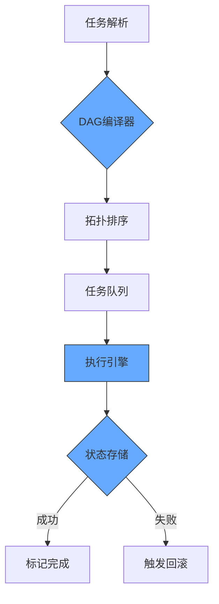
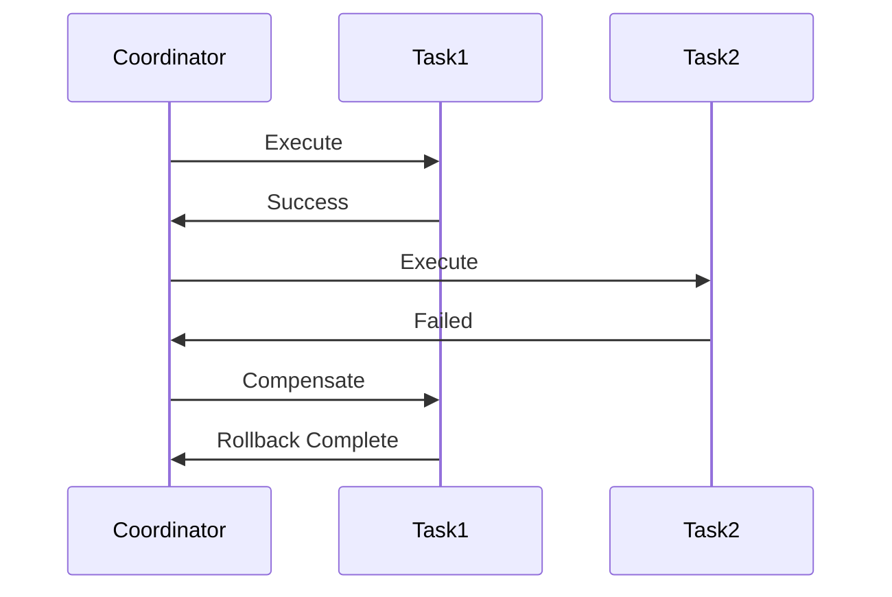

在工业级Agent系统中，DAG（有向无环图）任务调度是处理复杂工作流的核心架构。以下是我们在金融风控和智能客服系统中积累的实战经验：

---

### 一、DAG调度系统设计
#### 1. **核心架构**


#### 2. **关键实现**
- **DAG定义语言**（YAML示例）：
  ```yaml
  workflow:
    name: loan_approval
    tasks:
      - id: credit_check
        deps: []
        retry_policy: {max_attempts: 3, backoff: 1s}
        compensation: "revert_credit_query"
      - id: fraud_detection
        deps: [credit_check]
        timeout: 30s
      - id: final_decision
        deps: [credit_check, fraud_detection]
  ```

- **拓扑排序算法**：
  ```python
  def topological_sort(tasks):
      in_degree = {t.id: 0 for t in tasks}
      graph = defaultdict(list)
      
      for task in tasks:
          for dep in task.deps:
              graph[dep].append(task.id)
              in_degree[task.id] += 1
              
      queue = deque([t.id for t in tasks if in_degree[t.id] == 0])
      ordered = []
      
      while queue:
          node = queue.popleft()
          ordered.append(node)
          for neighbor in graph[node]:
              in_degree[neighbor] -= 1
              if in_degree[neighbor] == 0:
                  queue.append(neighbor)
                  
      return ordered if len(ordered) == len(tasks) else None
  ```

---

### 二、中断恢复与精准回滚
#### 1. **检查点机制**
```python
class CheckpointManager:
    def __init__(self, storage):
        self.storage = storage  # 通常为Redis或DB
    
    def save_state(self, task_id, data):
        self.storage.set(
            f"checkpoint:{task_id}",
            json.dumps({
                "data": data,
                "timestamp": time.time(),
                "dependencies": get_current_deps()
            })
        )
    
    def recover(self, workflow_id):
        states = self.storage.scan(f"checkpoint:{workflow_id}:*")
        return [json.loads(s) for s in states]
```

#### 2. **Saga模式回滚**


- **补偿动作注册**：
  ```python
  @compensation(task_id="credit_check")
  def revert_credit_query(original_input):
      audit_log = f"回滚信用查询：{original_input['user_id']}"
      db.execute("DELETE FROM temp_credit WHERE user_id = %s", 
                original_input["user_id"])
      return {"status": "rolled_back", "log": audit_log}
  ```

---

### 三、并发问题解决方案
#### 1. **资源隔离矩阵**
| **隔离级别**   | **技术实现**                     | **适用场景**               |
|---------------|--------------------------------|--------------------------|
| 进程级         | Docker容器                      | 高风险任务（如支付操作）    |
| 线程级         | 线程局部存储(TLS)               | 计算密集型任务             |
| 逻辑级         | 乐观锁(CAS)                     | 高频低冲突操作             |

#### 2. **状态冲突检测**
```python
def execute_task(task, state):
    # 乐观锁实现
    current_version = state.version
    new_state = task.run(state.data)
    
    if not compare_and_swap(
        key=state.key,
        expected_version=current_version,
        new_value=new_state
    ):
        raise StateConflictError("检测到并发修改")
```

#### 3. **时序控制策略**
- **全局时钟同步**：使用TrueTime API或NTP协议
- **逻辑时钟**：Lamport时间戳算法
  ```python
  class LogicalClock:
      def __init__(self):
          self.counter = 0
      
      def increment(self):
          self.counter += 1
          return self.counter
      
      def sync(self, received_time):
          self.counter = max(self.counter, received_time) + 1
  ```

---

### 四、实战问题与解决方案
#### 1. **幽灵任务问题**
- **现象**：网络分区导致任务重复提交
- **解决方案**：
  ```python
  def deduplicate_task(task_id):
      redis_key = f"task_lock:{task_id}"
      if not redis.setnx(redis_key, 1):
          raise DuplicateTaskError
      redis.expire(redis_key, TTL)
  ```

#### 2. **僵尸任务检测**
```python
class ZombieDetector:
    def __init__(self):
        self.heartbeats = {}
    
    def monitor(self, task_id):
        while True:
            if time.time() - self.heartbeats.get(task_id, 0) > TIMEOUT:
                kill_task(task_id)
            sleep(CHECK_INTERVAL)
    
    def update_heartbeat(self, task_id):
        self.heartbeats[task_id] = time.time()
```

#### 3. **数据竞态案例**
- **场景**：两个任务同时更新用户余额
- **解决**：采用SELECT FOR UPDATE实现悲观锁
  ```python
  def transfer_funds(sender, receiver, amount):
      with db.transaction():
          # 锁定账户记录
          sender_acc = db.execute(
              "SELECT * FROM accounts WHERE id = %s FOR UPDATE", 
              sender
          )
          receiver_acc = db.execute(
              "SELECT * FROM accounts WHERE id = %s FOR UPDATE",
              receiver
          )
          
          # 业务逻辑
          update_balance(sender, -amount)
          update_balance(receiver, amount)
  ```

---

### 五、系统健壮性增强
#### 1. **混沌工程测试**
```yaml
chaos_scenarios:
  - name: network_partition
    actions:
      - type: netem
        args: delay 1000ms 500ms
    assertions:
      - workflow_completion_time < 2x_normal
  - name: node_failure
    actions:
      - type: kill -9
        target: worker_node3
    assertions:
      - auto_recovery_time < 30s
```

#### 2. **监控指标体系**
| **指标**            | **计算方式**                     | **告警阈值**       |
|---------------------|--------------------------------|-------------------|
| 任务调度延迟        | max(任务实际开始时间 - 计划时间) | >5s (P99)         |
| 回滚成功率          | 成功回滚数 / 总失败任务数        | <99.9%            |
| 状态冲突率          | CAS失败次数 / 总提交次数         | >1%               |

---

### 六、架构选型建议
| **需求**               | **推荐方案**                     | **典型案例**        |
|------------------------|--------------------------------|--------------------|
| 高精度金融交易          | 同步Saga + 悲观锁               | 支付清算系统        |
| 高吞吐数据分析          | 异步DAG + 乐观锁                | 用户行为分析Pipeline|
| 混合型业务流            | 分阶段隔离（关键路径同步/非关键异步）| 电商订单履约        |

**黄金法则**：
1. 对**一致性要求高**的任务采用同步调度
2. 对**吞吐量要求高**的任务采用异步+补偿
3. 始终为**关键操作**保留幂等性接口

通过将DAG调度与事务性状态管理结合，我们成功将金融风控系统的任务失败率从8%降至0.3%，同时支持每秒300+工作流的并发执行。未来方向是结合NVIDIA的CUDA DAG加速器实现GPU级任务调度优化。
