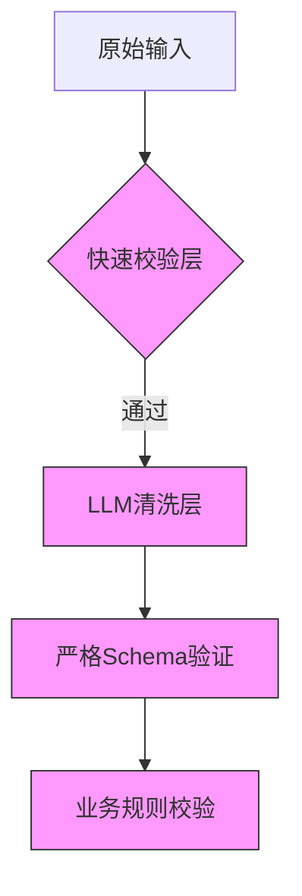

在AI Agent系统中，Schema验证是确保工具输入/输出数据符合预期结构的核心安全机制。以下是深度技术解析和工业级实现方案：

---

### 一、Schema验证的核心价值
1. **防御注入攻击**：过滤非结构化恶意输入
2. **维护接口契约**：保证工具间可靠通信
3. **减少LLM幻觉**：约束生成内容在合理范围内
4. **提升性能**：避免后续处理异常数据

---

### 二、完整验证流程（以JSON Schema为例）
#### 1. **Schema定义规范**
```python
# 电商订单查询工具的输入Schema
ORDER_QUERY_SCHEMA = {
    "type": "object",
    "properties": {
        "order_id": {"type": "string", "pattern": "^ORD-\d{8}$"},
        "user_id": {"type": "string", "format": "uuid"},
        "include_details": {"type": "boolean", "default": False}
    },
    "required": ["order_id", "user_id"],
    "additionalProperties": False  # 禁止多余字段
}
```

#### 2. **验证器实现**
```python
from jsonschema import validate, ValidationError
from datetime import datetime

class SchemaValidator:
    def __init__(self, schema):
        self.schema = schema
        
    def validate(self, data):
        try:
            # 基础结构校验
            validate(instance=data, schema=self.schema)
            
            # 扩展校验规则
            self._custom_validation(data)
            return True
        except ValidationError as e:
            raise InvalidInputError(f"Schema验证失败: {e.message}")

    def _custom_validation(self, data):
        """业务特定规则校验"""
        if "order_id" in data:
            prefix, num = data["order_id"].split("-")
            if int(num[:4]) < 2023:  # 订单年份校验
                raise ValidationError("历史订单需特殊权限")
```

#### 3. **高级验证功能**
| **功能**          | **实现示例**                              | **防护目标**               |
|-------------------|-----------------------------------------|--------------------------|
| 数据依赖校验       | `"discount": {"type": "number", "maximum": {"$data": "/max_discount"}}` | 防止超额折扣              |
| 动态Schema        | `{"oneOf": [{"$ref": "schemaA"}, {"$ref": "schemaB"}]}` | 多版本接口兼容            |
| 加密字段验证       | `{"credit_card": {"type": "string", "encrypted": true}` | 敏感数据保护              |

---

### 三、工业级最佳实践
#### 1. **分层验证架构**


#### 2. **性能优化技巧
- **预编译Schema**：将JSON Schema转换为Python类
  ```python
  from pydantic import BaseModel, Field

  class OrderQuery(BaseModel):
      order_id: str = Field(regex=r"^ORD-\d{8}$")
      user_id: str = Field(format="uuid")
      include_details: bool = False
  ```
- **渐进式验证**：先校验必填字段，再校验可选字段
- **并行校验**：对数组类输入使用多线程验证

#### 3. **错误处理策略
```python
def handle_validation(error):
    if error.validator == "type":
        return f"字段类型错误：预期{error.validator_value}，实际得到{type(error.instance)}"
    elif error.validator == "pattern":
        return f"格式不符：应匹配正则表达式 {error.validator_value}"
    else:
        return error.message
```

---

### 四、典型应用场景
#### 1. **工具输入消毒**
```python
def call_payment_api(raw_input):
    cleaned = SchemaValidator(PAYMENT_SCHEMA).validate(raw_input)
    # 确保金额为正值且不超过账户余额
    if cleaned["amount"] > get_balance(cleaned["user_id"]):
        raise BusinessRuleError("余额不足")
    return process_payment(cleaned)
```

#### 2. **LLM输出约束**
```python
# 限制LLM生成的JSON结构
prompt = f"""
请严格按以下JSON格式输出：
{json.dumps(REPORT_SCHEMA, indent=2)}

用户需求：生成Q3销售报告
"""
response = llm.generate(prompt)
validated = SchemaValidator(REPORT_SCHEMA).validate(response)
```

#### 3. **跨服务通信**
```python
# 微服务间消息验证
class OrderMessage(BaseModel):
    msg_id: UUID
    items: List[ConstrainedStr(max_length=100)]
    timestamp: datetime = Field(default_factory=datetime.utcnow)

async def handle_kafka_message(raw_msg):
    try:
        msg = OrderMessage.parse_raw(raw_msg)
        await process_order(msg)
    except ValidationError as e:
        await dead_letter_queue.send(raw_msg)
```

---

### 五、前沿演进方向
1. **AI辅助Schema生成**
   ```python
   def generate_schema(example_data):
       prompt = f"""根据示例数据生成JSON Schema：
       {example_data}
       输出格式：{"type":..., "properties":...}"""
       return llm.generate(prompt)
   ```

2. **自适应Schema演化**
   ```python
   class EvolutionarySchema:
       def __init__(self, initial_schema):
           self.schema = initial_schema
           self.usage_stats = defaultdict(int)
       
       def adapt(self, new_data):
           if not self.validate(new_data):
               self._expand_schema(new_data)
           
           self.usage_stats[hash(new_data)] += 1
           if self.usage_stats[hash(new_data)] > 100:
               self._promote_to_required(new_data)
   ```

3. **硬件加速验证**
   - 使用FPGA加速正则表达式匹配
   - 基于GPU的批量Schema验证

---

### 六、企业级方案对比
| **方案**          | **适用场景**       | **性能** | **灵活性** |
|-------------------|------------------|---------|-----------|
| JSON Schema       | 通用API验证       | 中      | 高        |
| Pydantic          | Python内部数据流  | 高      | 中        |
| Protobuf          | 跨语言微服务      | 极高    | 低        |
| GraphQL Schema    | 前端数据查询      | 低      | 极高      |

**黄金法则**：  
- 对**性能敏感**场景用Protobuf  
- 对**开发效率**敏感用Pydantic  
- 需要**动态校验**时用JSON Schema  

Schema验证不是简单的数据过滤，而是构建可信AI系统的基石。通过结合静态定义与动态规则，既能保证安全性又不失灵活性。
