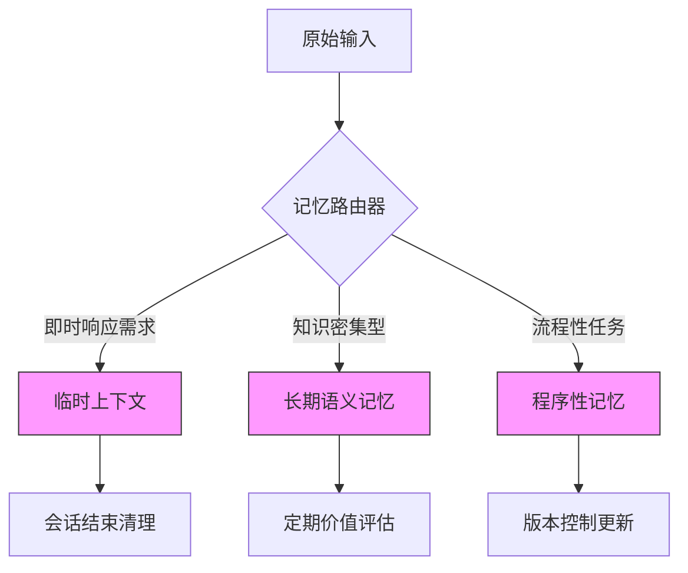

在Agent系统中，记忆架构设计直接决定了智能体的认知连续性和适应能力。以下是针对上下文与记忆架构的深度解析，涵盖临时/长期记忆管理、新型组织方式及实践策略：

---

### **1. 记忆层级划分与生命周期管理**
#### （1）记忆类型对比
| **记忆类型**       | **存储形式**          | **生命周期**    | **典型用例**                     | **技术实现**                  |
|--------------------|----------------------|---------------|---------------------------------|-----------------------------|
| **临时上下文**      | 对话级键值对          | 单次会话       | 当前对话状态维护                 | Redis / 内存字典             |
| **短期工作记忆**    | 结构化事件序列        | 会话保持期     | 多轮任务中间结果                 | 时间序列数据库（如InfluxDB） |
| **长期语义记忆**    | 向量化知识片段        | 永久（可衰减） | 领域知识、用户偏好               | 向量数据库（Pinecone/Weaviate）|
| **程序性记忆**      | 可执行代码模板        | 条件触发更新   | 常用工具调用组合                 | 版本化代码仓库               |

#### （2）写入/清理策略
- **写入控制**  
  ```python
  class MemoryWriter:
      def write(self, memory_type, content):
          if memory_type == "长期记忆":
              # 基于信息熵的过滤
              if self._calculate_entropy(content) > threshold:
                  self.vector_db.add(content)
          elif memory_type == "临时上下文":
              self.redis.setex(f"ctx:{session_id}", ttl=3600, value=content)
  ```
- **清理机制**  
  - **时间驱动**：LRU缓存淘汰（适合短期记忆）
  - **事件驱动**：当检测到知识冲突时触发清理（如`用户纠正信息后删除错误记忆`）
  - **价值评估**：基于记忆使用频率和时效性计算保留权重  
    ```python
    def retention_score(memory):
        return alpha * frequency_use + (1-alpha) * freshness
    ```

---

### **2. 新型记忆组织方式**
#### （1）Agentic Memory
**核心特征**：  
- **目标导向记忆检索**：根据当前任务动态激活相关记忆（而非简单相似度搜索）  
- **记忆重组能力**：将碎片化记忆组合成新的知识结构  

**实现示例**：  
```python
class AgenticMemory:
    def retrieve(self, query, current_goal):
        # 结合任务目标调整检索策略
        goal_embedding = embed(current_goal)
        memories = self.vector_db.search(embed(query))
        return sorted(memories, 
                     key=lambda m: cosine_sim(m.embedding, goal_embedding))
    
    def reorganize(self, fragments):
        # 使用LLM重组记忆片段
        prompt = f"基于以下信息生成新知识：{fragments}"
        return llm.generate(prompt)
```

#### （2）KV Memory（键值记忆）
**创新点**：  
- **结构化存取**：将记忆存储为<key, value, metadata>三元组  
- **高效索引**：支持多维查询（时间戳、置信度、来源等）  

**典型应用**：  
```python
# 使用FAISS实现带元数据的KV存储
class KVMemory:
    def __init__(self):
        self.keys = faiss.IndexFlatL2(768)  # 向量键索引
        self.values = {}  # 值存储
        self.meta = {}    # 元数据（创建时间、置信度等）

    def add(self, key_vec, value, meta):
        key_id = self.keys.ntotal
        self.keys.add(np.array([key_vec]))
        self.values[key_id] = value
        self.meta[key_id] = meta
```

---

### **3. 混合记忆架构设计**
#### （1）分层记忆系统


#### （2）关键设计决策
1. **写入策略选择**  
   - **临时记忆**：全量写入（低延迟优先）  
   - **长期记忆**：通过LLM提炼后写入（如`从10条对话中提取1条核心知识`）  

2. **检索优化**  
   - **混合检索**：结合向量搜索（语义） + 图遍历（逻辑关联）  
     ```python
     def hybrid_retrieve(query):
         vector_results = vector_db.search(query)
         graph_results = knowledge_graph.query(query)
         return rerank(vector_results + graph_results)
     ```

3. **记忆衰减机制**  
   - **指数衰减公式**：  
     ```
     记忆权重 = 初始权重 * e^(-λ * Δt) 
     λ: 衰减系数（业务调整）
     Δt: 距最后访问时间
     ```

---

### **4. 前沿实践案例**
#### （1）Self-Reflective Memory
**Meta的CICERO系统**采用反思驱动记忆更新：  
1. 每次行动后生成反思报告  
2. 提取失败模式存入"错误记忆"专用库  
3. 执行前优先检索相关错误记忆进行预防  

#### （2）Diffusion Memory
**Anthropic的扩散记忆**创新点：  
- 将记忆视为"知识粒子"在向量空间中扩散  
- 通过注意力机制控制记忆激活范围  
- 数学表示：  
  ```
  m_t = m_{t-1} + α∇·(D∇m) - βm
  D: 扩散系数（控制记忆关联强度）
  ```

---

### **5. 陷阱与解决方案**
| **问题**                | **现象**                          | **解决方案**                     |
|-------------------------|----------------------------------|--------------------------------|
| **记忆污染**            | 错误知识被长期存储                | 引入人工审核层 + 置信度阈值      |
| **记忆爆炸**            | 存储量指数增长                    | 实施记忆压缩（如聚类去重）       |
| **检索偏差**            | 总是返回相似记忆                  | 多样性采样 + 负例增强检索        |
| **上下文坍塌**          | 长对话中早期记忆丢失              | 滑动窗口摘要（生成对话阶段性摘要）|

---

### **总结建议**
1. **业务适配选择**  
   - 客服机器人：强化短期对话记忆 + 用户画像长期记忆  
   - 数据分析Agent：侧重程序性记忆（查询模板） + 领域知识库  

2. **技术选型组合**  
   ```python
   # 推荐技术栈示例
   memory_system = {
       "临时": RedisJSON（支持结构化TTL）,
       "长期": Weaviate（向量+图混合存储）,
       "元管理": LangChain记忆抽象层
   }
   ```

3. **演进方向**  
   - 动态记忆网络（DMN）：根据任务自动调整记忆结构  
   - 神经符号记忆：结合LLM的模糊推理与知识图谱的精确关联  

通过精细化的记忆架构设计，可使Agent系统在保持响应速度的同时，具备人类般的知识积累和演化能力。
