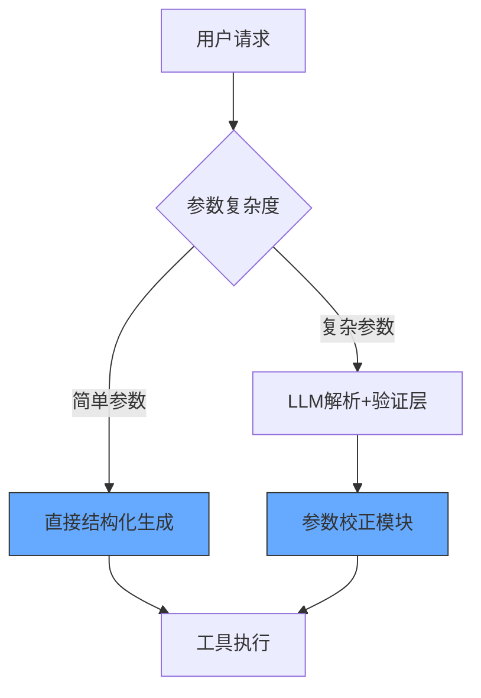
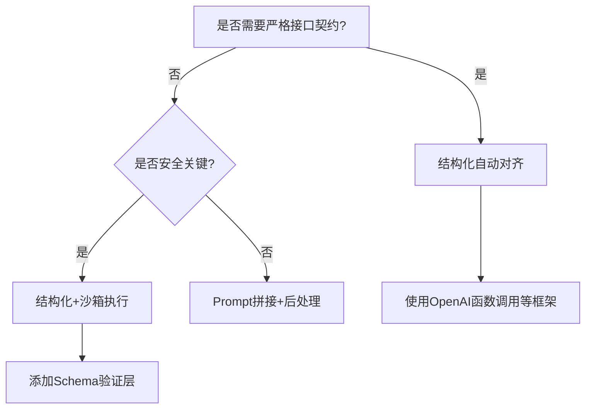

在Agent系统中，参数传递机制的设计直接影响工具的可靠性和易用性。以下是针对prompt拼接与结构化自动对齐两种方式的深度对比及混合实践方案：

---

### **1. Prompt拼接（自然语言参数化）**
#### ▶ 核心原理
通过LLM生成符合工具要求的自然语言指令，需人工或后续解析器转换为结构化参数。

```python
# 示例：通过prompt描述工具调用
prompt = f"""
请根据用户需求调用工具：
用户问：查询上海到东京3天后的机票
工具格式：flight_search(departure_city, arrival_city, date)
输出：flight_search('上海', '东京', '2024-03-20')
"""
response = llm.generate(prompt)  # 输出可能不标准
```

#### ▶ 典型问题
1. **格式漂移**：LLM可能输出`flight_search(上海, 东京, 三天后)`等非标准形式
2. **多轮修正**：需要额外prompt进行规范化（增加延迟和成本）
3. **安全风险**：未过滤的文本直接拼接可能导致SQL注入等攻击

#### ▶ 适用场景
- 快速原型开发
- 非结构化工具（如自然语言转数据库查询）
- 人类可读性优先的场景

---

### **2. 结构化自动对齐**
#### ▶ 核心原理
强制LLM输出与工具接口Schema严格匹配的结构化数据（JSON/Protobuf等）。

```python
# 示例：使用Pydantic模型约束输出
from pydantic import BaseModel

class FlightSearchInput(BaseModel):
    departure_city: str
    arrival_city: str 
    date: str  # ISO 8601格式

# 在prompt中嵌入schema约束
prompt = f"""
请严格按以下JSON格式输出：
{json.dumps(FlightSearchInput.schema())}
用户需求：查询上海到东京3天后的机票
"""
response = llm.generate(prompt)  # 强制输出标准JSON
```

#### ▶ 技术实现
1. **Schema引导生成**：
   - 使用OpenAI的`function calling`或Anthropic的`tool use`
   ```python
   # OpenAI函数调用示例
   response = openai.ChatCompletion.create(
       functions=[{
           "name": "flight_search",
           "parameters": FlightSearchInput.schema()
       }],
       function_call={"name": "flight_search"}
   )
   ```
2. **后置验证**：
   ```python
   try:
       params = FlightSearchInput.parse_raw(llm_output)
   except ValidationError as e:
       trigger_retry_prompt(f"参数错误：{e}")
   ```

#### ▶ 优势对比
| **维度**         | Prompt拼接          | 结构化对齐         |
|------------------|--------------------|-------------------|
| 可靠性           | ❌ 依赖LLM自由发挥  | ✅ 强制符合接口规范 |
| 开发效率         | ✅ 快速实现         | ⚠️ 需定义Schema   |
| 安全防护         | ❌ 易受注入攻击     | ✅ 类型安全检查    |
| 多工具组合       | ❌ 难维护           | ✅ 清晰接口契约    |

---

### **3. 混合架构实践**
#### ▶ 分层参数处理方案


#### ▶ 关键组件实现
1. **智能路由决策**：
   ```python
   def route_parameterization(user_input):
       # 使用轻量级模型判断参数复杂度
       complexity = judge_complexity(user_input)
       if complexity < THRESHOLD:
           return generate_structured(user_input)
       else:
           return generate_and_validate(user_input)
   ```

2. **渐进式修正机制**：
   ```python
   def auto_correct_params(initial_output, schema):
       for _ in range(MAX_RETRY):
           try:
               return schema.parse_raw(initial_output)
           except ValidationError as e:
               initial_output = llm.generate(
                   f"修正以下JSON错误：{e}\n原内容：{initial_output}"
               )
       raise ParamGenerationError
   ```

#### ▶ 行业案例
- **AWS Bedrock Agents**：采用Schema优先策略，自动将自然语言映射到Lambda函数参数
- **Microsoft Semantic Kernel**：通过`KernelFunction`装饰器实现Python函数到LLM可调用工具的自动转换
- **LangChain**：支持`StructuredTool`与自由格式工具的混合使用

---

### **4. 前沿演进方向**
1. **动态Schema推导**：
   ```python
   def infer_schema_from_tool(func):
       # 通过函数源码分析生成Schema
       sig = inspect.signature(func)
       return {
           "name": func.__name__,
           "parameters": {
               p.name: infer_type(p.annotation)
               for p in sig.parameters.values()
           }
       }
   ```

2. **参数生成RLHF**：
   - 对LLM的参数生成结果进行人工评分
   - 训练奖励模型自动优化prompt模板

3. **多模态参数扩展**：
   ```python
   # 支持图像等复杂参数类型
   class ImageProcessingInput(BaseModel):
       image: ImageFile  # 自定义类型
       operations: List[str]
   ```

---

### **5. 选型决策树**


**黄金法则**：
1. **核心业务工具**必须采用结构化对齐
2. **探索性功能**可接受prompt拼接
3. 始终为动态生成的内容设置**执行隔离区**
