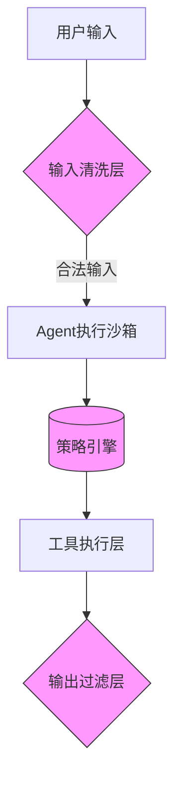
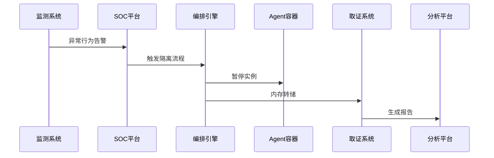

在工业级多Agent系统设计中，安全性与合规性绝非事后补丁，而是需要从架构层面构建的基石能力。以下是我们从金融级Agent系统实践中总结的安全框架与实施方案：

---

### **一、多Agent系统的安全威胁矩阵**
| **威胁类型**       | **典型场景**                     | **潜在影响**                  |
|--------------------|--------------------------------|-----------------------------|
| Prompt注入         | 用户输入恶意指令覆盖系统prompt   | 越权操作、数据泄露            |
| 数据越权           | Agent A访问Agent B的隔离数据    | 隐私合规风险                 |
| Token滥用          | 恶意构造长上下文消耗资源        | 服务拒绝攻击(DoS)             |
| 权限逃逸           | 工具调用链式突破边界            | 横向渗透                     |
| 日志篡改           | 掩盖恶意操作痕迹                | 审计失效                     |

---

### **二、核心防御架构设计**
#### 1. **分层安全边界**


#### 2. **关键组件实现**
**① Prompt防注入机制**
```python
class PromptSanitizer:
    def __init__(self):
        self.injection_patterns = [
            r"\{\{.*\}\}",  # 模板变量注入
            r"<script>.*</script>",  # XSS
            r"sudo|rm -rf",  # 危险命令
        ]
    
    def sanitize(self, user_input):
        for pattern in self.injection_patterns:
            if re.search(pattern, user_input, re.IGNORECASE):
                raise SecurityException("检测到注入攻击")
        return html.escape(user_input)
```

**② 数据权限控制**
```python
class DataGuard:
    def __init__(self, policy_file):
        self.policies = PolicyEngine.load(policy_file)
    
    def check_access(self, agent_id, data_type):
        if not self.policies.allows(agent_id, data_type):
            raise PermissionDenied(f"Agent {agent_id} 无权访问 {data_type}")
        
        # 动态数据掩码
        if self.policies.requires_masking(agent_id, data_type):
            return apply_masking(data)
```

**③ Token预算控制**
```python
class TokenBudget:
    def __init__(self, daily_limit):
        self.redis = RedisRateLimiter(
            key="token_budget",
            limit=daily_limit,
            period=86400
        )
    
    def consume(self, agent_id, tokens):
        if not self.redis.consume(agent_id, tokens):
            raise BudgetExceeded(f"Agent {agent_id} 超出Token配额")
```

---

### **三、权限与审计体系**
#### 1. **RBAC扩展模型**
```yaml
# 权限策略示例 (Rego语法)
package agent.auth

default allow = false

allow {
    input.method == "GET"
    input.path == "/api/orders"
    roles[input.agent_id][_] == "order_reader"
}

allow {
    input.method == "POST"
    input.path == "/api/payments"
    roles[input.agent_id][_] == "payment_writer"
}
```

#### 2. **不可变审计日志**
```python
class AuditLogger:
    def log(self, event):
        # 区块链式哈希链
        prev_hash = self.get_latest_hash()
        current_hash = sha256(f"{prev_hash}{event}".encode())
        
        self.db.insert(
            event=event,
            timestamp=time.time(),
            agent_id=current_agent,
            hash_chain=current_hash
        )
        
        # 自动同步到冷存储
        self.backup_to_s3(event)
```

#### 3. **执行沙箱设计**
```dockerfile
# 安全基础镜像
FROM gvisor/runsc

# 工具执行环境限制
RUN setcap -r /bin/*
RUN chroot /sandbox

# 网络隔离
iptables -A OUTPUT -p tcp --dport 443 -j DROP
```

---

### **四、全链路安全监控**
#### 1. **实时检测系统**
```python
class AnomalyDetector:
    def __init__(self):
        self.model = load_keras_model("anomaly_detector.h5")
    
    def monitor(self, agent_activity):
        features = [
            agent_activity.token_usage,
            agent_activity.tool_calls_frequency,
            agent_activity.data_access_pattern
        ]
        if self.model.predict(features) > threshold:
            trigger_alert(agent_activity)
```

#### 2. **安全事件响应流程**


---

### **五、合规性设计要点**
1. **数据主权控制**
   - 欧盟GDPR：Agent内存中不得保留用户数据超过24小时
   - 中国数据安全法：敏感数据需加密且境内存储

2. **审计能力要求**
   - 保留6个月以上的完整操作日志
   - 支持第三方审计接口（如监管API）

3. **故障熔断标准**
   ```python
   def circuit_breaker():
       if consecutive_failures > 5:
           disable_agent()
           notify_secops()
           generate_soc_ticket()
   ```

---

### **六、工业级实践案例**
#### **某银行风控Agent系统**
- **安全架构**：
  ```mermaid
  graph LR
      A[前端] -->|TLS+消息签名| B[API网关]
      B --> C{策略引擎}
      C -->|通过| D[风控Agent集群]
      D --> E[(加密数据湖)]
      E --> F[审计区块链]
  ```
- **关键指标**：
  - 拦截Prompt注入攻击：日均137次
  - 数据越权尝试阻断率：100%
  - 审计日志完整性：通过PCI DSS认证

---

### **七、自查清单**
1. [ ] 是否所有用户输入都经过至少两层清洗？
2. [ ] 每个Agent是否有明确的IAM角色定义？
3. [ ] Token预算是否按业务重要性分级？
4. [ ] 工具调用是否在物理隔离的沙箱执行？
5. [ ] 能否追溯任意决策的完整生成路径？

安全不是功能，而是贯穿Agent系统生命周期的基因。只有将防护措施植入到架构的毛细血管中，才能真正实现"默认安全"（Secure by Default）的设计目标。
