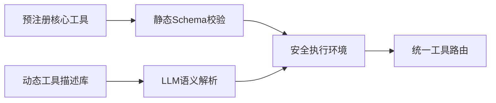

在Agent系统中，工具（Tools）的注入机制是决定其灵活性和扩展性的关键设计。以下是静态Schema定义与动态LLM注册两种方式的深度对比及混合实践方案：

---

### **1. 静态Schema定义式注入**
#### （1）核心特征
- **预定义接口**：工具以固定格式（如OpenAPI Spec）提前注册
- **强类型约束**：明确的输入/输出Schema验证
- **开发阶段绑定**：Agent启动时完成工具装载

#### （2）典型实现
```python
# 示例：基于LangChain的静态工具注册
from langchain.tools import Tool

def search_api(query: str) -> str:
    """商品搜索接口"""
    return db.query(f"SELECT * FROM products WHERE name LIKE '%{query}%'")

# 显式定义工具Schema
tools = [
    Tool(
        name="ProductSearch",
        func=search_api,
        description="根据名称搜索商品，输入为查询字符串，输出为JSON列表"
    )
]

agent = initialize_agent(tools, llm)
```

#### （3）优劣分析
| **优势**                          | **劣势**                          |
|-----------------------------------|-----------------------------------|
| 1. 运行时可预测性高               | 1. 新增工具需重新部署             |
| 2. 接口安全性强（类型检查）       | 2. 无法处理未预见的工具需求       |
| 3. 工具文档可自动化生成           | 3. 工具组合灵活性低               |

---

### **2. 动态LLM注册式注入**
#### （1）核心特征
- **运行时发现**：Agent通过LLM理解自然语言描述的工具能力
- **自适应绑定**：根据任务需求动态加载工具
- **弱类型约束**：依赖LLM的参数转换能力

#### （2）典型实现
```python
# 示例：AutoGPT风格的动态工具注册
dynamic_tools = []

def register_tool(tool_description: str):
    # LLM解析工具描述并生成调用逻辑
    prompt = f"""将以下工具描述转换为Python函数：
    {tool_description}
    输出格式：def tool_name(params) -> return_type:..."""
    
    generated_code = llm.generate(prompt)
    # 动态执行生成的代码
    exec(generated_code, globals())
    dynamic_tools.append(locals()["tool_name"])

# 动态注册新工具
register_tool("""
  工具名称：汇率转换
  功能：将金额从A货币转换为B货币
  输入：{"amount": float, "from_currency": str, "to_currency": str}
  输出：转换后的金额（float）
""")
```

#### （3）优劣分析
| **优势**                          | **劣势**                          |
|-----------------------------------|-----------------------------------|
| 1. 支持热插拔新工具               | 1. 运行时错误风险高               |
| 2. 适应未知任务场景               | 2. 需额外安全沙箱                |
| 3. 自然语言交互更友好             | 3. 工具发现效率较低               |

---

### **3. 混合注入策略（现代主流方案）**
#### （1）架构设计


#### （2）关键实现
1. **分层工具管理**：
   ```python
   class HybridToolManager:
       def __init__(self):
           self.static_tools = load_predefined_tools()  # 加载OpenAPI等规范工具
           self.dynamic_registry = VectorDB()  # 存储动态工具描述
       
       def register_dynamic(self, description):
           # 向量化存储工具描述
           embedding = embed(description)
           self.dynamic_registry.add(embedding, description)
       
       def find_tool(self, task_desc):
           # 先尝试精确匹配静态工具
           static_match = self._match_static(task_desc)
           if static_match: return static_match
           
           # 语义搜索动态工具库
           query_embed = embed(task_desc)
           dynamic_tools = self.dynamic_registry.search(query_embed)
           return self._llm_select_best(dynamic_tools)
   ```

2. **安全执行网关**：
   ```python
   def safe_execute(tool_call):
       # 静态工具直接执行
       if tool_call in registered_static_tools:
           return registered_static_tools[tool_call].execute()
       
       # 动态工具需通过沙箱
       sandbox = ToolSandbox(
           allowed_modules=["math", "datetime"],
           max_runtime=5000  # 毫秒
       )
       return sandbox.run(tool_call.code)
   ```

#### （3）典型应用场景
- **CRM系统**：
  - 静态工具：客户数据查询（严格类型检查）
  - 动态工具：临时数据分析脚本（销售自定义）

- **智能家居**：
  - 静态工具：设备控制API（安全关键）
  - 动态工具：场景组合规则（用户自定义）

---

### **4. 前沿演进方向**
1. **工具链学习（Toolchain Learning）**：
   - 通过强化学习自动记录高频工具组合模式
   - 示例：AutoGPT的`command_registry`优化工具调用顺序

2. **神经符号工具**：
   - 将传统工具封装为可微分操作
   - 如PyTorch中`torch.fx`实现的动态计算图工具

3. **工具进化机制**：
   ```python
   def tool_evolution(tool_usage_stats):
       # 根据使用数据自动优化工具
       for tool in tools:
           if tool.error_rate > 0.2:
               new_version = llm.generate(f"优化以下工具：{tool.code}")
               deploy_new_version(new_version)
   ```

---

### **5. 选型建议**
| **考量维度**       | **推荐方案**                      | **典型案例**                     |
|--------------------|----------------------------------|----------------------------------|
| 安全关键领域       | 静态Schema + 人工审核            | 金融交易系统                     |
| 快速迭代场景       | 动态注册 + 自动沙箱              | 内部数据分析平台                 |
| 复杂企业环境       | 混合模式 + 工具版本控制          | 智能客服中台                     |

**黄金法则**：  
- 对**可靠性要求高**的工具采用静态注册  
- 对**灵活性要求高**的工具采用动态发现  
- 始终通过**安全隔离层**执行动态工具
