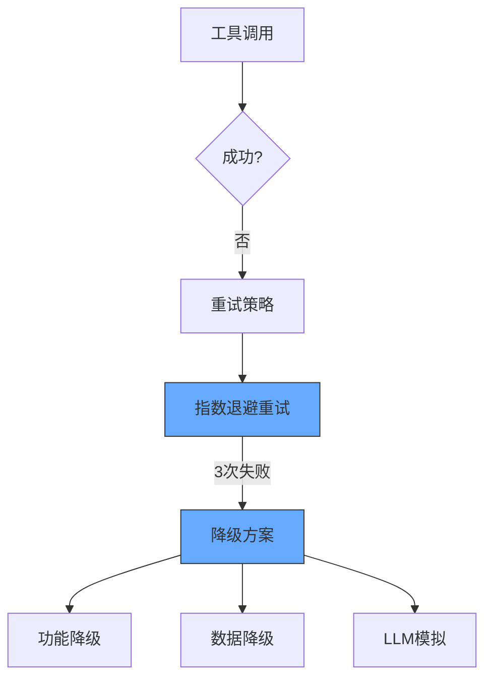
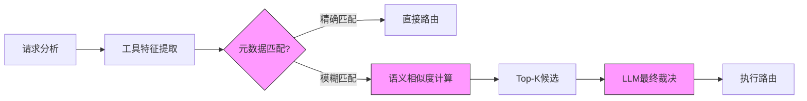

在Agent系统中，工具调用失败的处理机制和系统架构设计直接决定了系统的鲁棒性和可维护性。以下从故障处理、路由架构到系统化设计三个层次进行深度解析：

---

### 一、工具调用失败的全链路处理策略
#### 1. **分层Fallback机制**

- **技术实现示例**：
  ```python
  def execute_with_fallback(tool_call, max_retries=3):
      for attempt in range(max_retries):
          try:
              return tool_call.execute()
          except RateLimitError:
              sleep(2 ** attempt)  # 指数退避
          except Exception as e:
              if attempt == max_retries - 1:
                  return self._activate_fallback(tool_call, e)
  
  def _activate_fallback(self, tool_call, error):
      if isinstance(error, TimeoutError):
          return self.llm.simulate(tool_call)  # LLM模拟结果
      elif isinstance(error, DependencyError):
          return cached_result  # 返回缓存
      else:
          raise ToolExecutionError(error)
  ```

#### 2. **输出结构比对与自愈**
- **Schema校验矩阵**：
  | 异常类型         | 比对机制                | 自愈策略                     |
  |------------------|------------------------|----------------------------|
  | 字段缺失         | 差异分析→LLM补全       | 动态生成默认值              |
  | 类型不匹配       | 强制类型转换           | 值转换+日志告警             |
  | 数据越界         | 范围检查→裁剪          | 使用边界值                  |

  ```python
  def validate_output(output, schema):
      for field in schema.required_fields:
          if field not in output:
              output[field] = llm.generate(f"根据上下文生成{field}的合理值")
      return output
  ```

---

### 二、智能化工具路由系统设计
#### 1. **工具选择器的核心架构**


#### 2. **关键技术实现**
- **工具指纹生成**：
  ```python
  class ToolSelector:
      def __init__(self, tools):
          self.tool_embeddings = {
              t.name: embed(t.description + str(t.input_schema))
              for t in tools
          }
      
      def select(self, query):
          query_embed = embed(query)
          scores = {
              name: cosine_sim(query_embed, emb)
              for name, emb in self.tool_embeddings.items()
          }
          return sorted(scores.items(), key=lambda x: -x[1])[:3]
  ```

- **动态优先级调整**：
  ```python
  class PriorityController:
      def update_priority(self, tool_name, success_rate):
          # 根据历史表现动态调整权重
          new_priority = success_rate * base_priority[tool_name]
          self.redis.zadd('tool_priority', {tool_name: new_priority})
  ```

#### 3. **行业最佳实践对比**
| 方案                | 优势                          | 适用场景              |
|---------------------|-----------------------------|---------------------|
| **基于规则的路由**   | 确定性高，性能好             | 工具数量少(<10)      |
| **向量检索路由**     | 支持自然语言理解             | 工具频繁变更         |
| **强化学习路由**     | 自适应优化                   | 超大规模工具库(50+) |

---

### 三、工具执行系统的本质差异
#### 1. **临时工具调用 vs 系统化设计**
```diff
# 临时调用模式（脆弱）
def handle_request(query):
    if "搜索" in query:
        return search_tool(query)
    else:
        return llm(query)

# 系统化设计（鲁棒）
class ToolExecutionSystem:
    def __init__(self):
        self.registry = ToolRegistry()
        self.router = ToolRouter()
        self.fallback = FallbackEngine()
    
    def execute(self, request):
        tool = self.router.select(request)
        for attempt in range(3):
            result = tool.execute(request)
            if result.is_valid():
                return result
        return self.fallback.handle(request, tool)
```

#### 2. **可插拔架构的关键组件**
- **工具注册中心**：
  ```python
  class ToolRegistry:
      def register(self, tool: ToolSpec):
          """注册工具时自动生成：
          - 输入输出Schema
          - 性能指标基线
          - 依赖关系图
          """
          self._validate_interface(tool)
          self.graph.add_dependencies(tool)
          self.monitor.set_baseline(tool)
  ```

- **执行沙箱环境**：
  ```python
  class ToolSandbox:
      def __run(self, code):
          # 使用gVisor实现内核级隔离
          with gvisor.Container() as c:
              return c.execute(code)
      
      def __validate(self, output, schema):
          # 基于Wasm的快速校验
          validator = wasm.compile(schema.validation_rules)
          return validator(output)
  ```

#### 3. **配置化示例（YAML声明式）**
```yaml
# 工具定义
tools:
  - name: product_search
    endpoint: https://api.example.com/search
    input_schema: 
      query: {type: string, max_length: 100}
      page: {type: integer, default: 1}
    fallback:
      strategy: cached_response
      cache_ttl: 300s
    circuit_breaker:
      failure_threshold: 5
      reset_timeout: 60s
```

---

### 四、典型故障处理模式库
| 故障类型          | 检测方式                  | 处理策略                          | 恢复后动作               |
|-------------------|--------------------------|---------------------------------|------------------------|
| **API限流**       | 429状态码                | 令牌桶算法+队列缓冲              | 自动重置速率限制        |
| **网络分区**      | TCP超时                  | 切换备用区域网关                 | 数据一致性修复          |
| **数据格式变更**  | Schema校验失败           | 旧版接口自动适配层               | 触发版本迁移告警        |
| **依赖服务宕机**  | 健康检查失败             | 快速失败+熔断器模式              | 渐进式恢复探测          |

---

### 五、演进建议路径
1. **初级阶段**  
   ```mermaid
   journey
       title 工具系统演进路线
       section 单点工具
         手动注册 --> 简单路由
       section 工具集群
         自动发现 --> 优先级队列
       section 智能系统
         自愈能力 --> 动态编排
   ```

2. **关键技术决策点**  
   - **协议选择**：OpenAPI Schema vs gRPC Protobuf  
   - **隔离级别**：进程级隔离 vs 容器级隔离  
   - **路由算法**：基于规则 vs 基于嵌入  

3. **终极形态特征**  
   - **自描述工具**：工具自带使用说明和故障处理指南  
   - **弹性执行**：自动在云函数/边缘设备间调度  
   - **认知进化**：通过工具使用反馈优化自身行为  

系统化工具执行架构的本质，是将工具从"被动调用的函数"升级为"具备自主管理能力的服务组件"。这种转变使得Agent系统真正获得企业级可靠性，而非停留在演示原型阶段。
