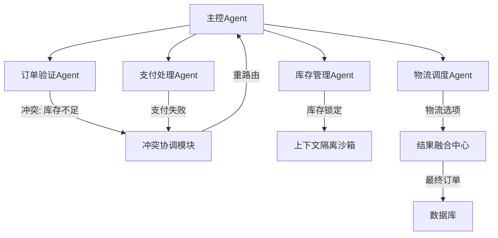

在构建多Agent系统时，并发执行带来的任务拆分、冲突协调、上下文隔离与结果融合是核心挑战。以下是针对这些问题的系统性解决方案和实践经验：

---

### **1. 任务拆分策略**
#### （1）动态任务分解技术
- **层次化目标分解**  
  采用HTN（分层任务网络）将高层目标拆解为原子操作：  
  ```python
  # 示例：电商订单处理任务分解
  def decompose(task):
      if task == "处理订单":
          return ["验证库存", "计算运费", "支付处理", "物流调度"]
      elif task == "验证库存":
          return ["查询DB", "预留库存"]
  ```
  *优势*：保持任务间的逻辑依赖关系（如必须先支付再发货）

- **LLM-based动态拆分**  
  利用大语言模型实时分解非结构化任务（如"策划营销活动"）：  
  ```markdown
  输入: "提升Q3季度销售额"
  输出分解: 
  1. 竞品促销分析
  2. 用户画像更新
  3. 折扣策略设计
  4. 广告渠道选择
  ```
  *注意点*：需设置最大拆分深度防止过度分解

#### （2）资源感知分配
- **负载均衡算法**  
  根据Agent能力画像动态分配任务：  
  ```python
  def assign_task(tasks, agents):
      agent_loads = {a.id: a.current_workload for a in agents}
      for task in tasks:
          # 选择专业匹配度最高且负载最低的Agent
          best_agent = min(agents, 
                          key=lambda x: (x.skill_match(task), agent_loads[x.id]))
          best_agent.assign(task)
          agent_loads[best_agent.id] += task.complexity
  ```

---

### **2. 冲突协调机制**
#### （1）分布式协调协议
- **基于规则的优先级系统**  
  定义冲突解决层次结构（如安全规则 > 业务目标 > 效率）：  
  ```python
  class ConflictResolver:
      RULE_HIERARCHY = ["safety", "legal", "business", "optimization"]
      
      def resolve(self, agent_actions):
          for rule_level in self.RULE_HIERARCHY:
              filtered = filter_actions(agent_actions, rule_level)
              if len(filtered) == 1:
                  return filtered[0]
          return random_select(filtered)  # 最终无法解决时随机选择
  ```

- **拍卖式资源竞争**  
  对稀缺资源（如API调用限额）采用Vickrey拍卖机制：  
  ```python
  def auction_resources(agents, resource):
      bids = {agent: agent.bid(resource) for agent in agents}
      winner = max(bids, key=bids.get)
      winner.charge(min(bid for agent, bid in bids.items() if agent != winner))
      return winner
  ```

#### （2）实时协商策略
- **承诺机制（Commitment Protocol）**  
  Agent通过承诺约束未来行为：  
  ```mermaid
  sequenceDiagram
      AgentA->>AgentB: 提议占用物流API 10:00-10:05
      AgentB->>AgentA: 承诺避开该时段
      AgentA->>Scheduler: 确认时段预约
  ```

---

### **3. 上下文隔离方案**
#### （1）沙箱化执行环境
- **会话级上下文隔离**  
  为每个Agent实例分配独立的内存空间：  
  ```python
  class AgentSandbox:
      def __init__(self, agent_class):
          self.context = {}  # 隔离的会话状态
          self.agent = agent_class()
      
      def run(self, input):
          return self.agent.process(input, self.context)
  ```

- **工具调用防火墙**  
  限制各Agent的工具访问权限：  
  ```yaml
  # 权限配置文件
  finance_agent:
    allowed_tools: [db_query, payment_api]
    memory_quota: 2GB
  logistics_agent:
    allowed_tools: [tracking_api, email_sender]
  ```

#### （2）知识访问控制
- **基于向量相似度的记忆过滤**  
  只允许访问相关度高于阈值的历史上下文：  
  ```python
  def filter_context(query, memory_db, threshold=0.8):
      query_embedding = embed(query)
      relevant = []
      for mem in memory_db:
          sim = cosine_similarity(query_embedding, mem.embedding)
          if sim > threshold:
              relevant.append(mem)
      return relevant
  ```

---

### **4. 结果融合策略**
#### （1）多模态结果集成
- **基于可信度加权投票**  
  对冲突结果进行置信度加权：  
  ```python
  def weighted_vote(results):
      total_weight = sum(r.confidence for r in results)
      aggregated = defaultdict(float)
      for r in results:
          aggregated[r.value] += r.confidence / total_weight
      return max(aggregated.items(), key=lambda x: x[1])[0]
  ```

- **知识图谱融合**  
  将不同Agent的输出构建为子图再合并：  
  ```python
  def merge_knowledge(agent_graphs):
      merged = KnowledgeGraph()
      for graph in agent_graphs:
          for node in graph.nodes:
              merged.add_node(node)
          for edge in graph.edges:
              merged.add_edge(edge)
      return merged.consolidate()  # 解决实体对齐冲突
  ```

#### （2）动态一致性检查
- **异常检测驱动复审**  
  当结果差异超过阈值时触发协调：  
  ```python
  def check_consistency(results, threshold=0.2):
      values = [r.normalized_value for r in results]
      std_dev = np.std(values)
      if std_dev > threshold:
          return ReflectiveAgent.review(results)
      else:
          return mean(values)
  ```

---

### **5. 实际系统设计案例**
#### 电商订单处理多Agent系统


**关键设计决策**：
1. 采用混合任务拆分（规则引擎处理标准订单，LLM分解异常订单）
2. 使用两阶段提交协议（2PC）确保支付与库存操作的原子性
3. 通过差分隐私技术隔离各Agent的用户数据访问

---

### **常见陷阱与优化建议**
1. **过度拆分问题**  
   *现象*：任务粒度过细导致协调开销超过执行收益  
   *解决方案*：设置最小执行时间阈值（如<100ms的任务不再拆分）

2. **死锁风险**  
   *案例*：支付Agent等待物流Agent释放锁，同时物流等待支付确认  
   *解决*：引入超时回滚和依赖图检测算法

3. **上下文污染**  
   *案例*：客服Agent意外学到财务Agent的专业术语  
   *预防*：严格实施embedding空间隔离（如领域适配微调）

4. **结果融合偏差**  
   *案例*：多个推荐Agent的投票结果趋同导致多样性丧失  
   *改进*：强制引入多样性约束（如相似结果的最大占比限制）

---

通过上述策略的组合运用，可构建出既保持各Agent自主性又能有效协作的并发系统。实际实施时需要根据具体场景权衡灵活性（如动态拆分）与确定性（如预定义协议）。
