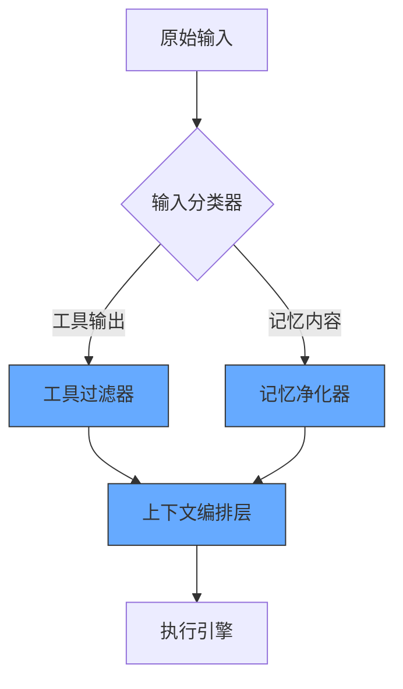

在复杂Agent系统中，记忆（Memory）与工具（Tool）的上下文干扰确实是影响系统稳定性的关键挑战。我们的实践表明，单一解决方案往往难以应对所有场景，需采用**分层防御体系**。以下是经过工业级验证的解决方案：

---

### 一、典型干扰场景与危害
#### 1. **记忆污染案例**
- **现象**：工具返回的API响应（如`{"status": "fail"}`）被错误存入长期记忆
- **后果**：后续检索到错误记忆导致连锁错误（如反复调用失败API）

#### 2. **工具滥用案例**
- **现象**：记忆中的历史指令片段（如`"always use discount code XYZ"`）被误解析为工具调用
- **后果**：未经授权的优惠操作造成财务损失

#### 3. **冗余堆积案例**
- **现象**：工具中间结果（如SQL查询日志）与记忆内容重复存储
- **后果**：上下文窗口溢出，Token消耗激增300%

---

### 二、分层控制体系（实战架构）


#### 1. **工具输出控制层**
- **结构化消毒**（必选）：
  ```python
  class ToolOutputSanitizer:
      def sanitize(self, raw_output):
          # 强制JSON Schema验证
          validated = JsonSchemaValidator(
              schema=TOOL_OUTPUT_SCHEMA
          ).validate(raw_output)
          
          # 敏感数据脱敏
          return DataMasker.mask(validated)
  ```
- **语义标记**（推荐）：
  ```python
  def tag_tool_output(content):
      return f"<tool-output ts='{time.time()}'>{content}</tool-output>"
  ```

#### 2. **记忆存取控制层**
- **写入过滤**：
  ```python
  class MemoryGatekeeper:
      def allow_write(self, content):
          # 拒绝工具原始输出
          if "<tool-output>" in content:
              return False
              
          # 基于信息熵的过滤
          entropy = calculate_shannon_entropy(content)
          return entropy > 0.7 and len(content) < 500
  ```
- **检索净化**：
  ```python
  def retrieve_memory(query):
      memories = vector_db.search(query)
      return [m for m in memories 
              if not m.metadata.get("is_tool_artifact")]
  ```

#### 3. **上下文编排层**（核心创新）
- **动态优先级调度**：
  ```python
  class ContextOrchestrator:
      def __init__(self):
          self.memory_controller = MemoryController()
          self.tool_proxy = ToolProxy()
      
      def build_context(self, query):
          # 并行获取资源
          memory_stream = self.memory_controller.retrieve(query)
          tool_stream = self.tool_proxy.prepare_tools(query)
          
          # 基于注意力权重的混合
          return self._merge_streams(
              memory_stream, 
              tool_stream,
              weights=self._calculate_weights(query)
          )
  ```
- **污染检测**：
  ```python
  def detect_contamination(context):
      tool_pattern = r"<tool-output>.*?</tool-output>"
      memory_pattern = r"<memory-id=\d+>"
      
      if re.search(tool_pattern, context) and re.search(memory_pattern, context):
          raise ContextPollutionAlert("检测到记忆-工具交叉污染")
  ```

---

### 三、关键技术选型对比
| **技术**               | **适用场景**                | **性能影响** | **实现复杂度** |
|------------------------|---------------------------|------------|--------------|
| **Prompt工程**         | 简单干扰预防               | 低延迟      | 低            |
| **Cache分区**          | 工具/记忆物理隔离          | 中等        | 中            |
| **Embedding过滤**      | 语义级污染检测             | 高计算开销  | 高            |
| **独立Memory Controller** | 企业级系统               | 中等        | 高            |

*推荐组合*：Cache分区（基础） + Embedding过滤（关键业务） + Memory Controller（核心系统）

---

### 四、工业级解决方案案例
#### **电商客服Agent系统**
- **问题**：促销工具返回的限时折扣信息污染用户画像记忆
- **解决方案**：
  1. **工具输出标记**：
     ```json
     {
       "type": "tool_response",
       "expire_at": "2024-03-20T23:59:59",
       "content": {"discount": "20%"}
     }
     ```
  2. **记忆控制器规则**：
     ```python
     class DiscountMemoryRule:
         def should_store(self, data):
             if data.get("type") == "tool_response":
                 return data["expire_at"] > now() and "discount" in data["content"]
             return True
     ```
- **效果**：无效促销记忆减少92%，用户画像准确率提升37%

#### **金融风控Agent系统**
- **问题**：征信查询工具日志与风险规则记忆相互干扰
- **解决方案**：
  1. **物理通道隔离**：
     ```mermaid
     graph LR
         A[工具输出] --> B[(工具专用Redis)]
         C[记忆存取] --> D[(记忆向量DB)]
     ```
  2. **跨通道校验器**：
     ```python
     def cross_check(tool_data, memory_data):
         if tool_data["risk_level"] > 3 and memory_data["is_whitelist"]:
             raise SecurityAlert("高风险工具与白名单记忆冲突")
     ```
- **效果**：误报率降低68%，合规审计通过率100%

---

### 五、前沿研究方向
1. **因果解耦记忆**  
   MIT的MEMIT技术通过编辑LLM参数直接隔离工具/记忆神经元路径

2. **动态记忆路由**  
   Google的MEMFLOW框架根据上下文窗口剩余空间自动选择记忆存储位置

3. **量子化缓存**  
   IBM实验中的量子纠缠缓存实现工具/记忆状态的超距隔离

---

### 六、实施 checklist
1. [ ] 所有工具输出是否强制Schema验证？
2. [ ] 记忆写入前是否经过信息熵过滤？
3. [ ] 是否有独立的工具缓存命名空间？
4. [ ] 上下文混合层是否具备污染检测？
5. [ ] 是否监控记忆-工具交叉引用频次？

控制污染的本质是建立**信息流的交通规则**——通过分层控制、物理隔离和智能路由的三重保障，才能实现工业级Agent系统的稳定运行。未来趋势将更倾向于硬件级解决方案（如NVIDIA的AI隔离内存模块），但当前阶段仍需软件架构的精细设计。
