# BlueLab OpenGraph 项目架构全面分析

## 📋 项目概述

BlueLab OpenGraph 是一个基于 FastAPI 和 LangGraph 的智能内容生成系统，支持多阶段流式内容生成和通用 AI 对话功能。系统采用模块化设计，支持三阶段内容生成工作流，并集成了 Redis 缓存、流式响应等现代化特性。

## 🏗️ 系统架构图

### 1. 整体系统架构

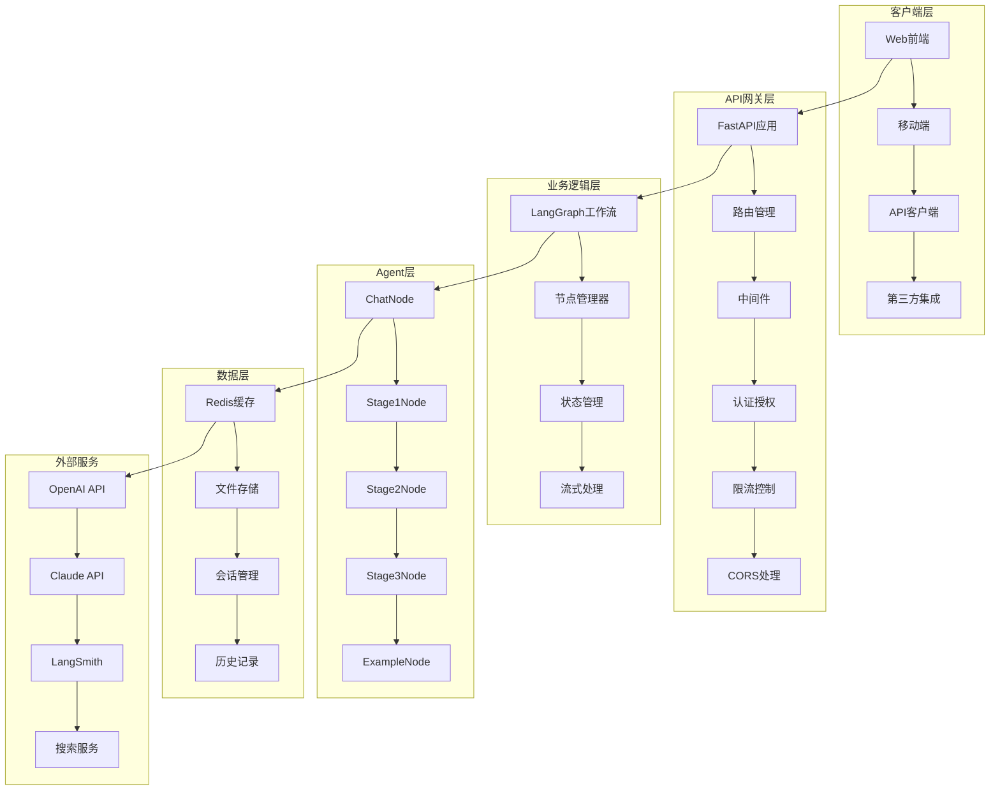
```mermaid
graph TB
    subgraph "客户端层"
        A1[Web前端] --> A2[移动端]
        A2 --> A3[API客户端]
        A3 --> A4[第三方集成]
    end
    
    subgraph "API网关层"
        B1[FastAPI应用] --> B2[路由管理]
        B2 --> B3[中间件]
        B3 --> B4[认证授权]
        B4 --> B5[限流控制]
        B5 --> B6[CORS处理]
    end
    
    subgraph "业务逻辑层"
        C1[LangGraph工作流] --> C2[节点管理器]
        C2 --> C3[状态管理]
        C3 --> C4[流式处理]
    end
    
    subgraph "Agent层"
        D1[ChatNode] --> D2[Stage1Node]
        D2 --> D3[Stage2Node]
        D3 --> D4[Stage3Node]
        D4 --> D5[ExampleNode]
    end
    
    subgraph "数据层"
        E1[Redis缓存] --> E2[文件存储]
        E2 --> E3[会话管理]
        E3 --> E4[历史记录]
    end
    
    subgraph "外部服务"
        F1[OpenAI API] --> F2[Claude API]
        F2 --> F3[LangSmith]
        F3 --> F4[搜索服务]
    end
    
    A1 --> B1
    B1 --> C1
    C1 --> D1
    D1 --> E1
    E1 --> F1
```

### 2. LangGraph 工作流架构

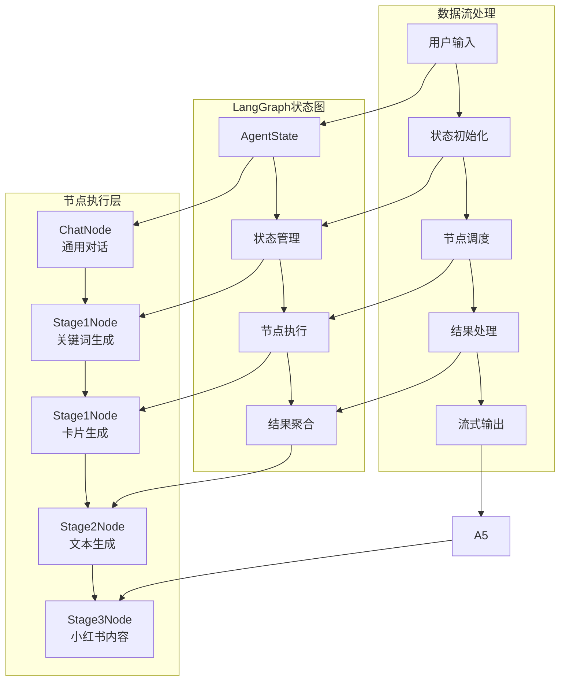
```mermaid
graph TD
    subgraph "LangGraph状态图"
        A1[AgentState] --> A2[状态管理]
        A2 --> A3[节点执行]
        A3 --> A4[结果聚合]
    end
    
    subgraph "节点执行层"
        B1[ChatNode<br/>通用对话] --> B2[Stage1Node<br/>关键词生成]
        B2 --> B3[Stage1Node<br/>卡片生成]
        B3 --> B4[Stage2Node<br/>文本生成]
        B4 --> B5[Stage3Node<br/>小红书内容]
    end
    
    subgraph "数据流处理"
        C1[用户输入] --> C2[状态初始化]
        C2 --> C3[节点调度]
        C3 --> C4[结果处理]
        C4 --> C5[流式输出]
    end
    
    A1 --> B1
    A2 --> B2
    A3 --> B3
    A4 --> B4
    A5 --> B5
    
    C1 --> A1
    C2 --> A2
    C3 --> A3
    C4 --> A4
    C5 --> A5
```

### 3. 三阶段内容生成流程

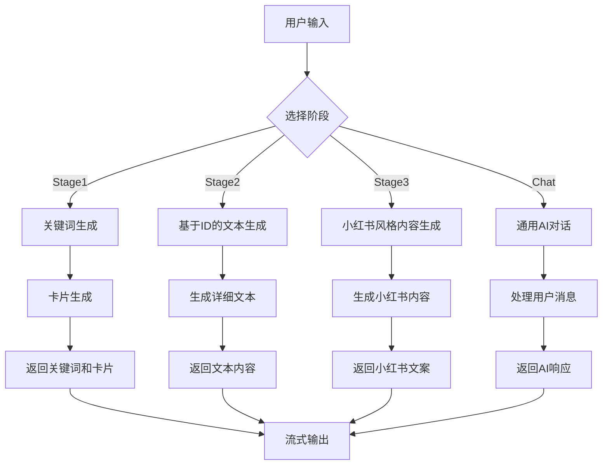
```mermaid
flowchart TD
    A[用户输入] --> B{选择阶段}
    
    B -->|Stage1| C[关键词生成]
    C --> D[卡片生成]
    D --> E[返回关键词和卡片]
    
    B -->|Stage2| F[基于ID的文本生成]
    F --> G[生成详细文本]
    G --> H[返回文本内容]
    
    B -->|Stage3| I[小红书风格内容生成]
    I --> J[生成小红书内容]
    J --> K[返回小红书文案]
    
    B -->|Chat| L[通用AI对话]
    L --> M[处理用户消息]
    M --> N[返回AI响应]
    
    E --> O[流式输出]
    H --> O
    K --> O
    N --> O
```

## 🔄 数据流程图

### 1. 用户请求处理流程

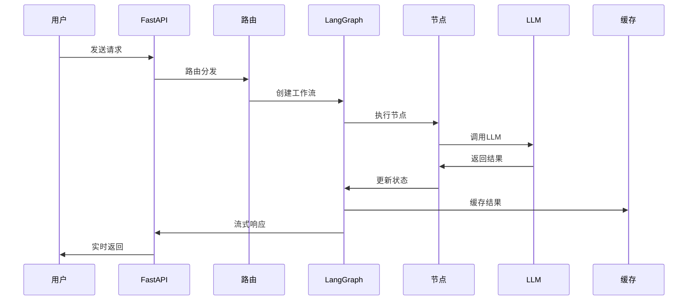
```mermaid
sequenceDiagram
    participant U as 用户
    participant F as FastAPI
    participant R as 路由
    participant G as LangGraph
    participant N as 节点
    participant L as LLM
    participant C as 缓存
    
    U->>F: 发送请求
    F->>R: 路由分发
    R->>G: 创建工作流
    G->>N: 执行节点
    N->>L: 调用LLM
    L->>N: 返回结果
    N->>G: 更新状态
    G->>C: 缓存结果
    G->>F: 流式响应
    F->>U: 实时返回
```

### 2. 状态管理流程

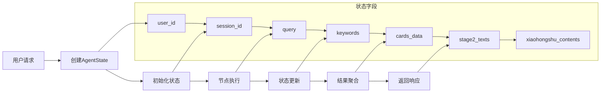
```mermaid
flowchart LR
    A[用户请求] --> B[创建AgentState]
    B --> C[初始化状态]
    C --> D[节点执行]
    D --> E[状态更新]
    E --> F[结果聚合]
    F --> G[返回响应]
    
    subgraph "状态字段"
        H[user_id] --> I[session_id]
        I --> J[query]
        J --> K[keywords]
        K --> L[cards_data]
        L --> M[stage2_texts]
        M --> N[xiaohongshu_contents]
    end
    
    B --> H
    C --> I
    D --> J
    E --> K
    F --> L
    G --> M
```

## 🏛️ 核心组件分析

### 1. FastAPI 应用架构

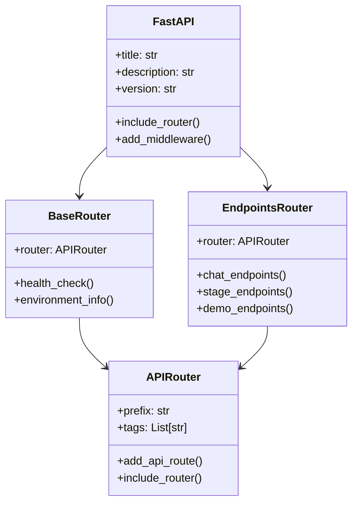
```mermaid
classDiagram
    class FastAPI {
        +title: str
        +description: str
        +version: str
        +include_router()
        +add_middleware()
    }
    
    class APIRouter {
        +prefix: str
        +tags: List[str]
        +add_api_route()
        +include_router()
    }
    
    class BaseRouter {
        +router: APIRouter
        +health_check()
        +environment_info()
    }
    
    class EndpointsRouter {
        +router: APIRouter
        +chat_endpoints()
        +stage_endpoints()
        +demo_endpoints()
    }
    
    FastAPI --> BaseRouter
    FastAPI --> EndpointsRouter
    BaseRouter --> APIRouter
    EndpointsRouter --> APIRouter
```

### 2. LangGraph 节点架构

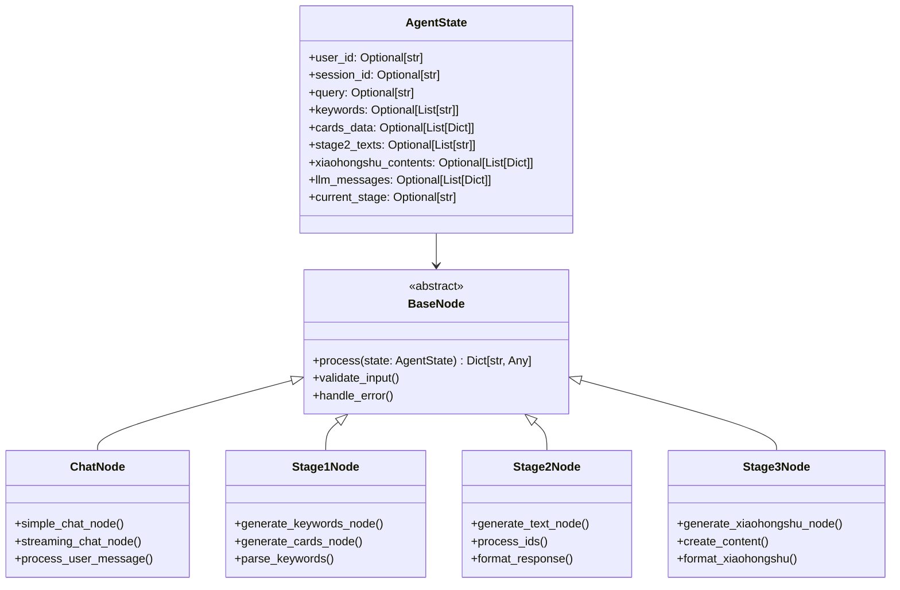
```mermaid
classDiagram
    class AgentState {
        +user_id: Optional[str]
        +session_id: Optional[str]
        +query: Optional[str]
        +keywords: Optional[List[str]]
        +cards_data: Optional[List[Dict]]
        +stage2_texts: Optional[List[str]]
        +xiaohongshu_contents: Optional[List[Dict]]
        +llm_messages: Optional[List[Dict]]
        +current_stage: Optional[str]
    }
    
    class BaseNode {
        <<abstract>>
        +process(state: AgentState) Dict[str, Any]
        +validate_input()
        +handle_error()
    }
    
    class ChatNode {
        +simple_chat_node()
        +streaming_chat_node()
        +process_user_message()
    }
    
    class Stage1Node {
        +generate_keywords_node()
        +generate_cards_node()
        +parse_keywords()
    }
    
    class Stage2Node {
        +generate_text_node()
        +process_ids()
        +format_response()
    }
    
    class Stage3Node {
        +generate_xiaohongshu_node()
        +create_content()
        +format_xiaohongshu()
    }
    
    AgentState --> BaseNode
    BaseNode <|-- ChatNode
    BaseNode <|-- Stage1Node
    BaseNode <|-- Stage2Node
    BaseNode <|-- Stage3Node
```

### 3. 配置管理架构

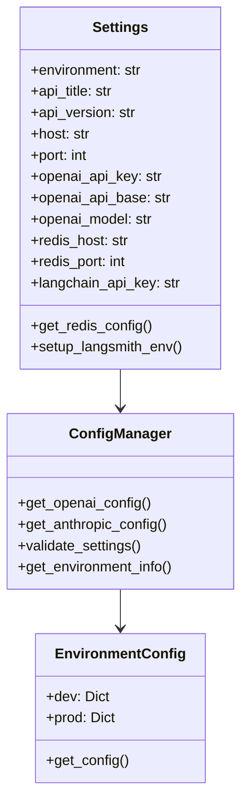
```mermaid
classDiagram
    class Settings {
        +environment: str
        +api_title: str
        +api_version: str
        +host: str
        +port: int
        +openai_api_key: str
        +openai_api_base: str
        +openai_model: str
        +redis_host: str
        +redis_port: int
        +langchain_api_key: str
        +get_redis_config()
        +setup_langsmith_env()
    }
    
    class ConfigManager {
        +get_openai_config()
        +get_anthropic_config()
        +validate_settings()
        +get_environment_info()
    }
    
    class EnvironmentConfig {
        +dev: Dict
        +prod: Dict
        +get_config()
    }
    
    Settings --> ConfigManager
    ConfigManager --> EnvironmentConfig
```

## 📊 数据存储架构

### 1. 存储层次结构

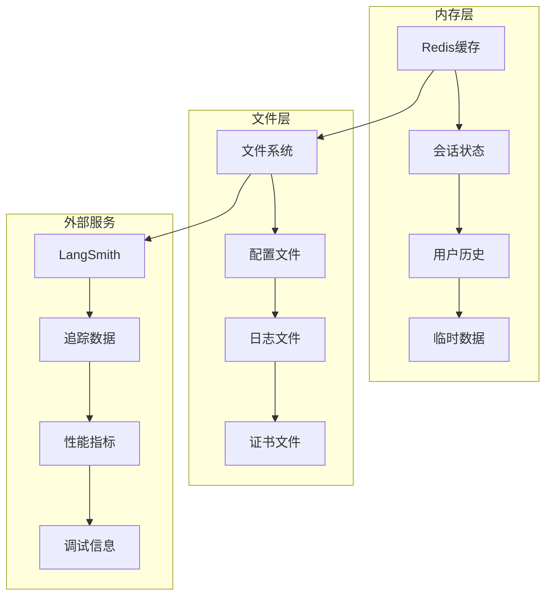
```mermaid
graph TB
    subgraph "内存层"
        A1[Redis缓存] --> A2[会话状态]
        A2 --> A3[用户历史]
        A3 --> A4[临时数据]
    end
    
    subgraph "文件层"
        B1[文件系统] --> B2[配置文件]
        B2 --> B3[日志文件]
        B3 --> B4[证书文件]
    end
    
    subgraph "外部服务"
        C1[LangSmith] --> C2[追踪数据]
        C2 --> C3[性能指标]
        C3 --> C4[调试信息]
    end
    
    A1 --> B1
    B1 --> C1
```

### 2. Redis 缓存架构

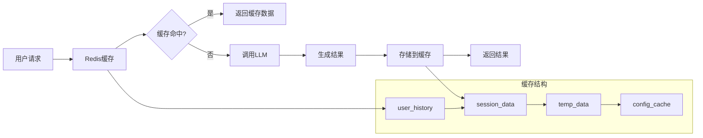
```mermaid
graph LR
    A[用户请求] --> B[Redis缓存]
    B --> C{缓存命中?}
    C -->|是| D[返回缓存数据]
    C -->|否| E[调用LLM]
    E --> F[生成结果]
    F --> G[存储到缓存]
    G --> H[返回结果]
    
    subgraph "缓存结构"
        I[user_history] --> J[session_data]
        J --> K[temp_data]
        K --> L[config_cache]
    end
    
    B --> I
    G --> J
```

## 🔧 配置管理架构

### 1. 配置层次结构

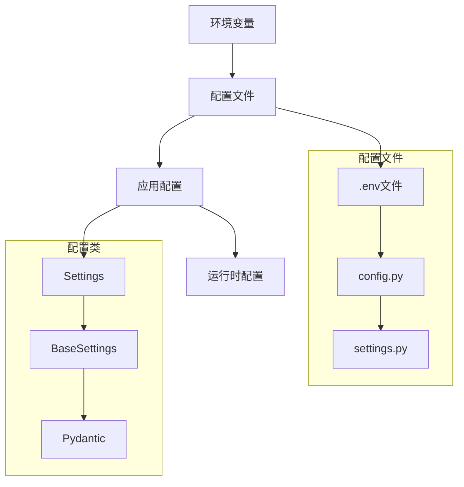
```mermaid
graph TD
    A[环境变量] --> B[配置文件]
    B --> C[应用配置]
    C --> D[运行时配置]
    
    subgraph "配置文件"
        E[.env文件] --> F[config.py]
        F --> G[settings.py]
    end
    
    subgraph "配置类"
        H[Settings] --> I[BaseSettings]
        I --> J[Pydantic]
    end
    
    B --> E
    C --> H
```

### 2. 环境配置管理

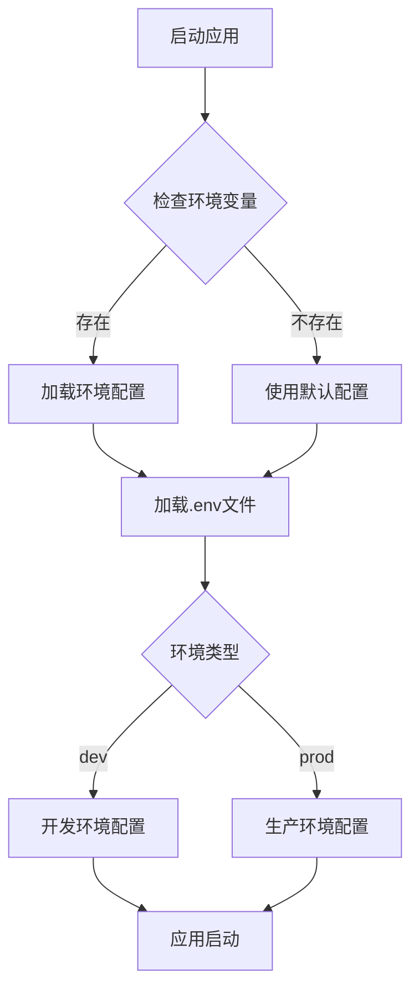
```mermaid
flowchart TD
    A[启动应用] --> B{检查环境变量}
    B -->|存在| C[加载环境配置]
    B -->|不存在| D[使用默认配置]
    
    C --> E[加载.env文件]
    D --> E
    
    E --> F{环境类型}
    F -->|dev| G[开发环境配置]
    F -->|prod| H[生产环境配置]
    
    G --> I[应用启动]
    H --> I
```

## 🚀 性能优化架构

### 1. 异步处理模型

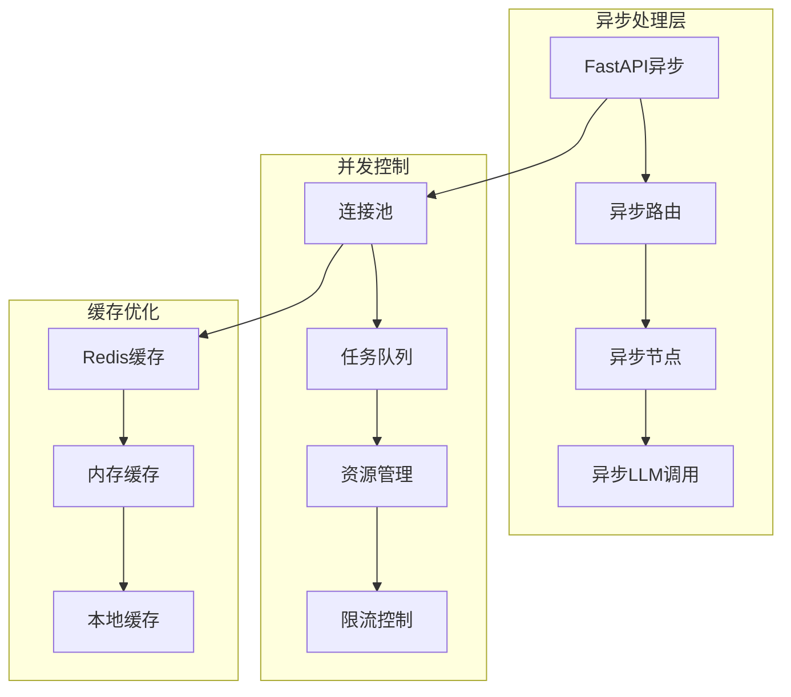
```mermaid
graph TB
    subgraph "异步处理层"
        A1[FastAPI异步] --> A2[异步路由]
        A2 --> A3[异步节点]
        A3 --> A4[异步LLM调用]
    end
    
    subgraph "并发控制"
        B1[连接池] --> B2[任务队列]
        B2 --> B3[资源管理]
        B3 --> B4[限流控制]
    end
    
    subgraph "缓存优化"
        C1[Redis缓存] --> C2[内存缓存]
        C2 --> C3[本地缓存]
    end
    
    A1 --> B1
    B1 --> C1
```

### 2. 流式响应架构

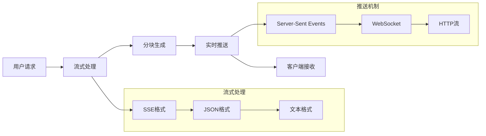
```mermaid
graph LR
    A[用户请求] --> B[流式处理]
    B --> C[分块生成]
    C --> D[实时推送]
    D --> E[客户端接收]
    
    subgraph "流式处理"
        F[SSE格式] --> G[JSON格式]
        G --> H[文本格式]
    end
    
    subgraph "推送机制"
        I[Server-Sent Events] --> J[WebSocket]
        J --> K[HTTP流]
    end
    
    B --> F
    D --> I
```

## 🔒 安全架构

### 1. 认证授权流程

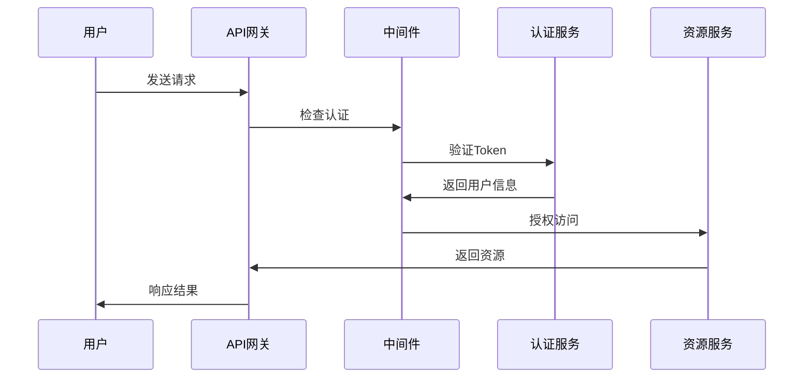
```mermaid
sequenceDiagram
    participant U as 用户
    participant A as API网关
    participant M as 中间件
    participant S as 认证服务
    participant R as 资源服务
    
    U->>A: 发送请求
    A->>M: 检查认证
    M->>S: 验证Token
    S->>M: 返回用户信息
    M->>R: 授权访问
    R->>A: 返回资源
    A->>U: 响应结果
```

### 2. 安全防护层

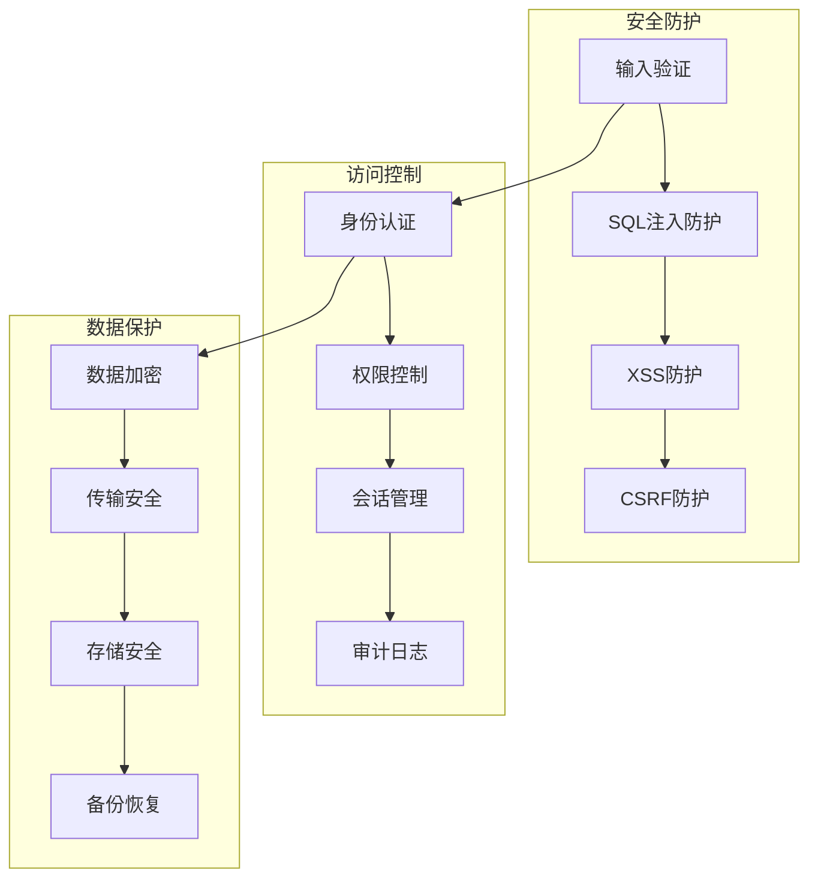
```mermaid
graph TB
    subgraph "安全防护"
        A1[输入验证] --> A2[SQL注入防护]
        A2 --> A3[XSS防护]
        A3 --> A4[CSRF防护]
    end
    
    subgraph "访问控制"
        B1[身份认证] --> B2[权限控制]
        B2 --> B3[会话管理]
        B3 --> B4[审计日志]
    end
    
    subgraph "数据保护"
        C1[数据加密] --> C2[传输安全]
        C2 --> C3[存储安全]
        C3 --> C4[备份恢复]
    end
    
    A1 --> B1
    B1 --> C1
```

## 📈 部署架构

### 1. Docker部署架构

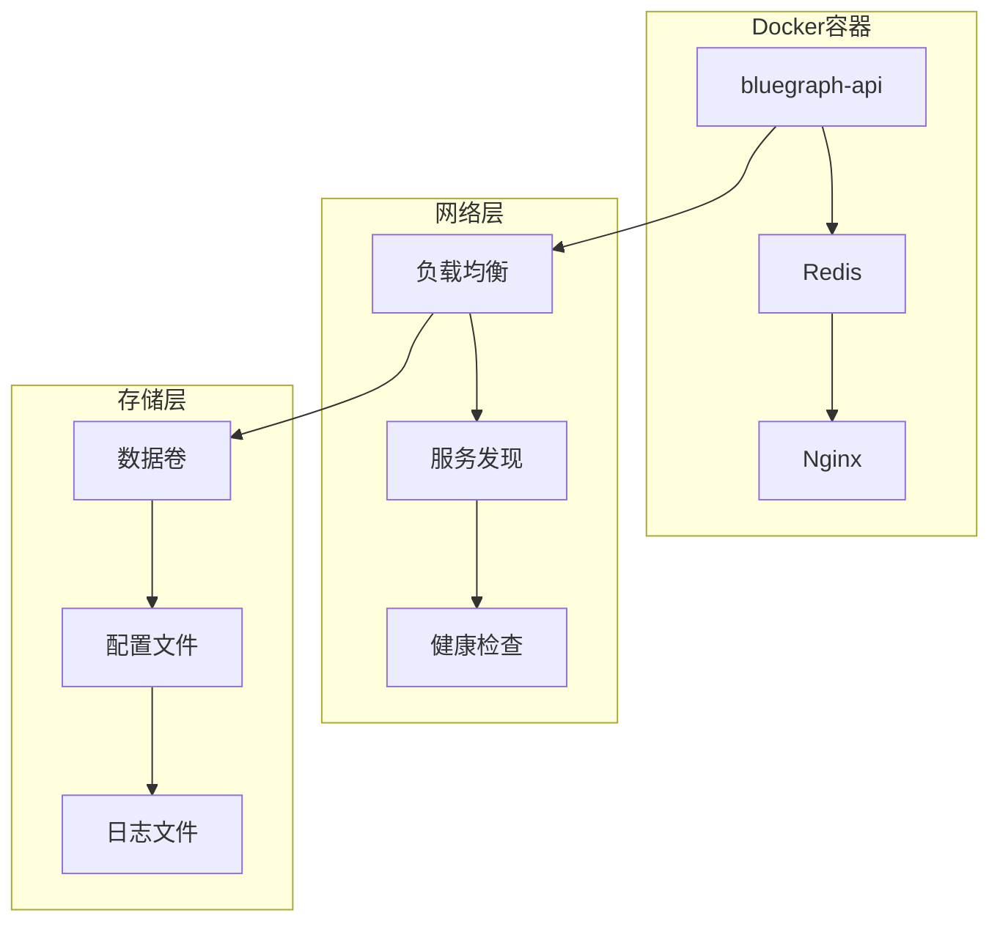
```mermaid
graph TB
    subgraph "Docker容器"
        A1[bluegraph-api] --> A2[Redis]
        A2 --> A3[Nginx]
    end
    
    subgraph "网络层"
        B1[负载均衡] --> B2[服务发现]
        B2 --> B3[健康检查]
    end
    
    subgraph "存储层"
        C1[数据卷] --> C2[配置文件]
        C2 --> C3[日志文件]
    end
    
    A1 --> B1
    B1 --> C1
```

### 2. 生产环境架构

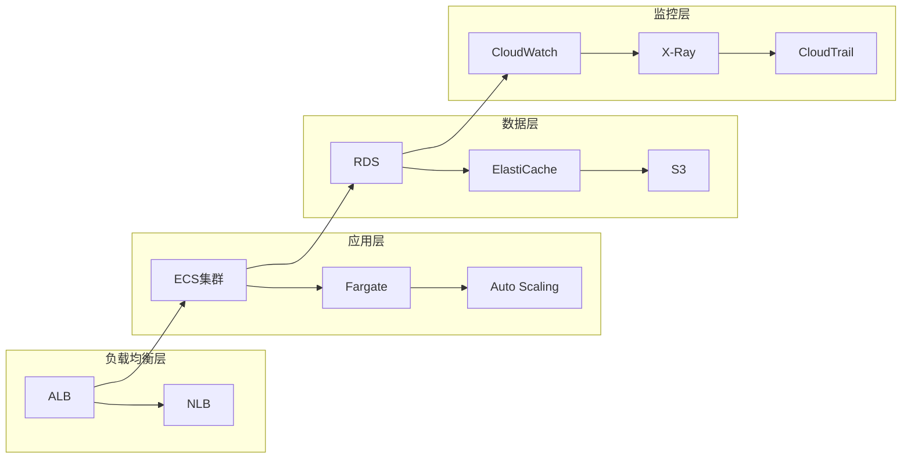
```mermaid
graph LR
    subgraph "负载均衡层"
        A1[ALB] --> A2[NLB]
    end
    
    subgraph "应用层"
        B1[ECS集群] --> B2[Fargate]
        B2 --> B3[Auto Scaling]
    end
    
    subgraph "数据层"
        C1[RDS] --> C2[ElastiCache]
        C2 --> C3[S3]
    end
    
    subgraph "监控层"
        D1[CloudWatch] --> D2[X-Ray]
        D2 --> D3[CloudTrail]
    end
    
    A1 --> B1
    B1 --> C1
    C1 --> D1
```

## 🔄 错误处理和恢复

### 1. 错误处理流程

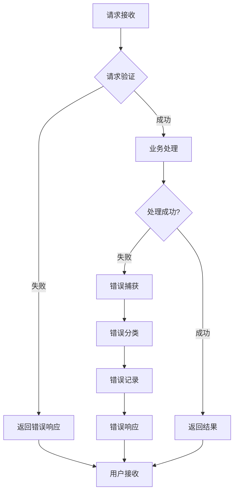
```mermaid
flowchart TD
    A[请求接收] --> B{请求验证}
    B -->|失败| C[返回错误响应]
    B -->|成功| D[业务处理]
    
    D --> E{处理成功?}
    E -->|失败| F[错误捕获]
    E -->|成功| G[返回结果]
    
    F --> H[错误分类]
    H --> I[错误记录]
    I --> J[错误响应]
    
    C --> K[用户接收]
    J --> K
    G --> K
```

### 2. 恢复机制

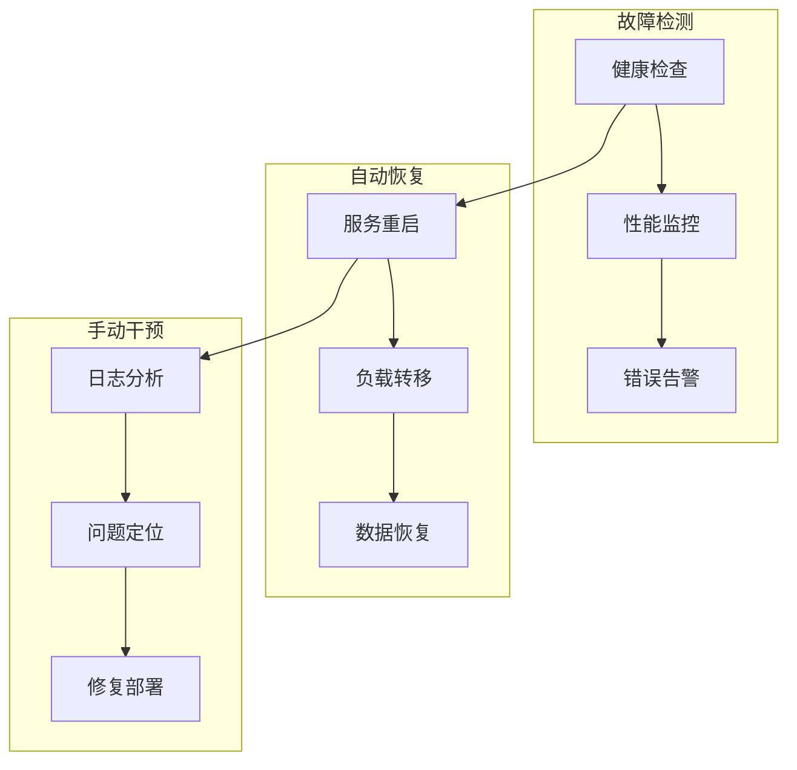
```mermaid
graph TB
    subgraph "故障检测"
        A1[健康检查] --> A2[性能监控]
        A2 --> A3[错误告警]
    end
    
    subgraph "自动恢复"
        B1[服务重启] --> B2[负载转移]
        B2 --> B3[数据恢复]
    end
    
    subgraph "手动干预"
        C1[日志分析] --> C2[问题定位]
        C2 --> C3[修复部署]
    end
    
    A1 --> B1
    B1 --> C1
```

## 📊 监控和日志

### 1. 监控架构

```mermaid
graph LR
    subgraph "数据收集"
        A1[应用指标] --> A2[系统指标]
        A2 --> A3[业务指标]
    end
    
    subgraph "数据处理"
        B1[数据聚合] --> B2[数据存储]
        B2 --> B3[数据分析]
    end
    
    subgraph "可视化"
        C1[仪表盘] --> C2[报表]
        C2 --> C3[告警]
    end
    
    A1 --> B1
    B1 --> C1
```

### 2. 日志架构

```mermaid
graph TB
    subgraph "日志收集"
        A1[应用日志] --> A2[访问日志]
        A2 --> A3[错误日志]
    end
    
    subgraph "日志处理"
        B1[日志解析] --> B2[日志过滤]
        B2 --> B3[日志聚合]
    end
    
    subgraph "日志存储"
        C1[本地存储] --> C2[集中存储]
        C2 --> C3[归档存储]
    end
    
    A1 --> B1
    B1 --> C1
```

## 🎯 核心功能分析

### 1. 三阶段内容生成

```mermaid
flowchart TD
    subgraph "第一阶段：关键词生成"
        A1[用户输入] --> A2[关键词生成]
        A2 --> A3[卡片生成]
        A3 --> A4[返回结果]
    end
    
    subgraph "第二阶段：文本生成"
        B1[选择ID] --> B2[文本生成]
        B2 --> B3[内容优化]
        B3 --> B4[返回文本]
    end
    
    subgraph "第三阶段：小红书内容"
        C1[选择内容] --> C2[小红书风格]
        C2 --> C3[内容生成]
        C3 --> C4[返回文案]
    end
    
    A4 --> B1
    B4 --> C1
```

### 2. 通用AI对话

```mermaid
sequenceDiagram
    participant U as 用户
    participant A as API
    participant C as ChatNode
    participant L as LLM
    participant R as Redis
    
    U->>A: 发送消息
    A->>C: 处理对话
    C->>R: 获取历史
    C->>L: 调用LLM
    L->>C: 返回响应
    C->>R: 保存历史
    C->>A: 流式返回
    A->>U: 实时响应
```

## 🔧 开发工具和流程

### 1. 开发环境设置

```mermaid
graph TD
    A[克隆项目] --> B[创建虚拟环境]
    B --> C[安装依赖]
    C --> D[配置环境变量]
    D --> E[启动开发服务器]
    
    subgraph "依赖管理"
        F[requirements.txt] --> G[pip install]
        G --> H[依赖检查]
    end
    
    subgraph "环境配置"
        I[.env文件] --> J[config.py]
        J --> K[settings.py]
    end
    
    C --> F
    D --> I
```

### 2. 测试流程

```mermaid
flowchart LR
    A[单元测试] --> B[集成测试]
    B --> C[端到端测试]
    C --> D[性能测试]
    D --> E[部署测试]
    
    subgraph "测试类型"
        F[API测试] --> G[节点测试]
        G --> H[工作流测试]
        H --> I[缓存测试]
    end
    
    A --> F
    B --> G
    C --> H
    D --> I
```

## 📈 性能指标

### 1. 性能监控指标

```mermaid
graph TB
    subgraph "响应时间"
        A1[平均响应时间] --> A2[95%响应时间]
        A2 --> A3[99%响应时间]
    end
    
    subgraph "吞吐量"
        B1[请求/秒] --> B2[并发用户数]
        B2 --> B3[处理能力]
    end
    
    subgraph "资源使用"
        C1[CPU使用率] --> C2[内存使用率]
        C2 --> C3[网络带宽]
    end
    
    subgraph "错误率"
        D1[4xx错误] --> D2[5xx错误]
        D2 --> D3[超时错误]
    end
    
    A1 --> B1
    B1 --> C1
    C1 --> D1
```

### 2. 容量规划

```mermaid
graph LR
    subgraph "当前容量"
        A1[100 RPS] --> A2[1000并发]
        A2 --> A3[8GB内存]
    end
    
    subgraph "扩展目标"
        B1[1000 RPS] --> B2[10000并发]
        B2 --> B3[32GB内存]
    end
    
    subgraph "扩展策略"
        C1[水平扩展] --> C2[垂直扩展]
        C2 --> C3[缓存优化]
    end
    
    A1 --> B1
    B1 --> C1
```

## 🎯 总结

BlueLab OpenGraph 项目采用了现代化的微服务架构设计，具有以下特点：

### 核心优势
1. **模块化设计**: 采用 LangGraph 工作流架构，便于扩展和维护
2. **异步处理**: 基于 FastAPI 的异步框架，支持高并发处理
3. **流式响应**: 实时返回处理结果，提升用户体验
4. **多阶段工作流**: 支持三阶段内容生成，满足不同需求
5. **缓存优化**: 集成 Redis 缓存，提升性能
6. **配置灵活**: 支持多环境配置，便于部署和管理

### 技术栈
- **后端框架**: FastAPI + Uvicorn
- **工作流引擎**: LangGraph
- **数据库**: Redis
- **LLM集成**: OpenAI API + Claude API
- **容器化**: Docker + Docker Compose
- **监控**: LangSmith + 自定义监控
- **部署**: 支持多种部署方式

### 扩展性
- 支持新的节点类型添加
- 支持新的工作流定义
- 支持新的LLM模型接入
- 支持新的存储后端
- 支持新的内容生成策略

### 应用场景
1. **内容创作**: 三阶段内容生成工作流
2. **智能对话**: 通用AI对话功能
3. **API服务**: 提供RESTful API接口
4. **流式处理**: 支持实时流式响应
5. **缓存管理**: 智能缓存和历史管理

这个架构设计确保了系统的可扩展性、可维护性和高性能，为智能内容生成提供了强大的技术支持。 
