# BluePlan Research 项目架构全面分析

## 📋 项目概述

BluePlan Research 是一款面向社交媒体内容创作的 Gen-AI Agent 系统，采用多 Agent 协作架构，支持小红书、抖音、公众号等内容创作平台。系统基于 FastAPI 构建，支持流式响应和实时内容生成。

## 🏗️ 系统架构图

### 1. 整体系统架构

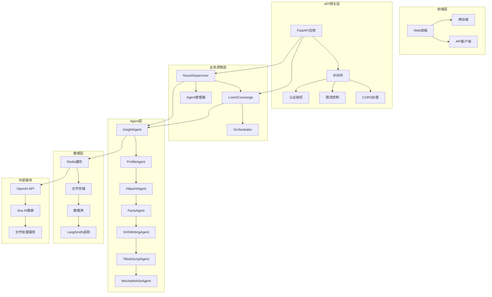
```mermaid
graph TB
    subgraph "前端层"
        A[Web前端] --> B[移动端]
        A --> C[API客户端]
    end
    
    subgraph "API网关层"
        D[FastAPI应用] --> E[中间件]
        E --> F[认证授权]
        E --> G[限流控制]
        E --> H[CORS处理]
    end
    
    subgraph "业务逻辑层"
        I[Nova3Supervisor] --> J[LoomiConcierge]
        I --> K[Agent管理器]
        J --> L[Orchestrator]
    end
    
    subgraph "Agent层"
        M[InsightAgent] --> N[ProfileAgent]
        N --> O[HitpointAgent]
        O --> P[FactsAgent]
        P --> Q[XHSWritingAgent]
        Q --> R[TiktokScriptAgent]
        R --> S[WechatArticleAgent]
    end
    
    subgraph "数据层"
        T[Redis缓存] --> U[文件存储]
        U --> V[数据库]
        V --> W[LangSmith追踪]
    end
    
    subgraph "外部服务"
        X[OpenAI API] --> Y[Jina AI搜索]
        Y --> Z[文件处理服务]
    end
    
    D --> I
    D --> J
    I --> M
    J --> M
    M --> T
    T --> X
```

### 2. Nova3 多Agent协作架构

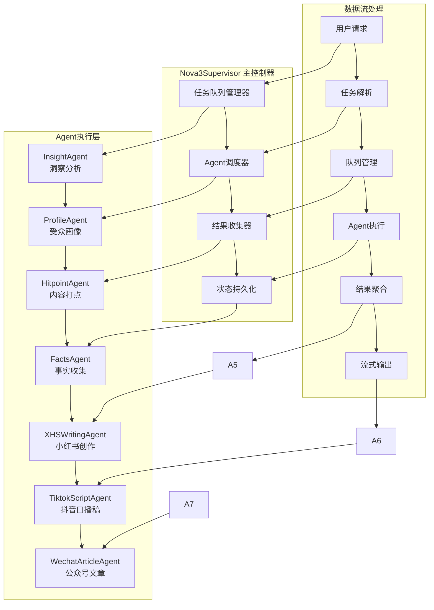
```mermaid
graph TD
    subgraph "Nova3Supervisor 主控制器"
        A1[任务队列管理器] --> A2[Agent调度器]
        A2 --> A3[结果收集器]
        A3 --> A4[状态持久化]
    end
    
    subgraph "Agent执行层"
        B1[InsightAgent<br/>洞察分析] --> B2[ProfileAgent<br/>受众画像]
        B2 --> B3[HitpointAgent<br/>内容打点]
        B3 --> B4[FactsAgent<br/>事实收集]
        B4 --> B5[XHSWritingAgent<br/>小红书创作]
        B5 --> B6[TiktokScriptAgent<br/>抖音口播稿]
        B6 --> B7[WechatArticleAgent<br/>公众号文章]
    end
    
    subgraph "数据流处理"
        C1[用户请求] --> C2[任务解析]
        C2 --> C3[队列管理]
        C3 --> C4[Agent执行]
        C4 --> C5[结果聚合]
        C5 --> C6[流式输出]
    end
    
    A1 --> B1
    A2 --> B2
    A3 --> B3
    A4 --> B4
    A5 --> B5
    A6 --> B6
    A7 --> B7
    
    C1 --> A1
    C2 --> A2
    C3 --> A3
    C4 --> A4
    C5 --> A5
    C6 --> A6
```

### 3. Loomi 内容创作架构

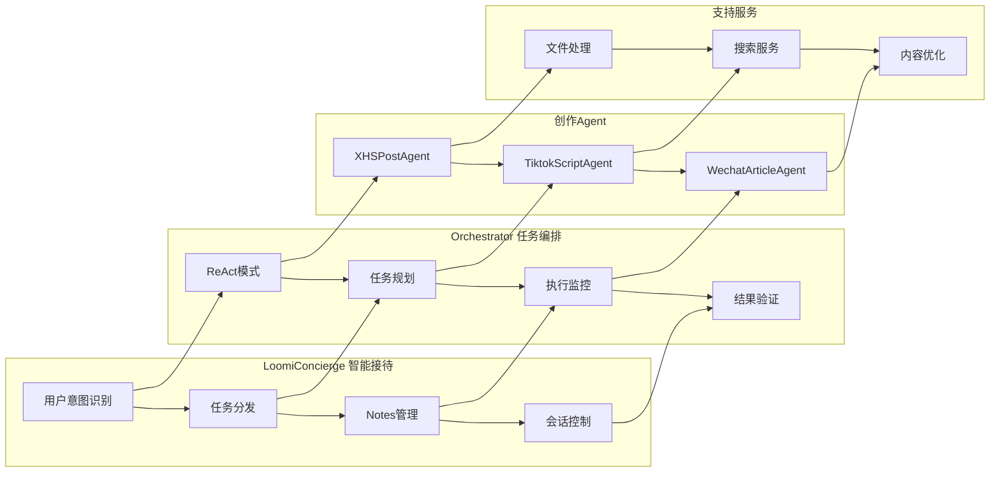
```mermaid
graph LR
    subgraph "LoomiConcierge 智能接待"
        A1[用户意图识别] --> A2[任务分发]
        A2 --> A3[Notes管理]
        A3 --> A4[会话控制]
    end
    
    subgraph "Orchestrator 任务编排"
        B1[ReAct模式] --> B2[任务规划]
        B2 --> B3[执行监控]
        B3 --> B4[结果验证]
    end
    
    subgraph "创作Agent"
        C1[XHSPostAgent] --> C2[TiktokScriptAgent]
        C2 --> C3[WechatArticleAgent]
    end
    
    subgraph "支持服务"
        D1[文件处理] --> D2[搜索服务]
        D2 --> D3[内容优化]
    end
    
    A1 --> B1
    A2 --> B2
    A3 --> B3
    A4 --> B4
    
    B1 --> C1
    B2 --> C2
    B3 --> C3
    
    C1 --> D1
    C2 --> D2
    C3 --> D3
```

## 🔄 数据流程图

### 1. 用户请求处理流程

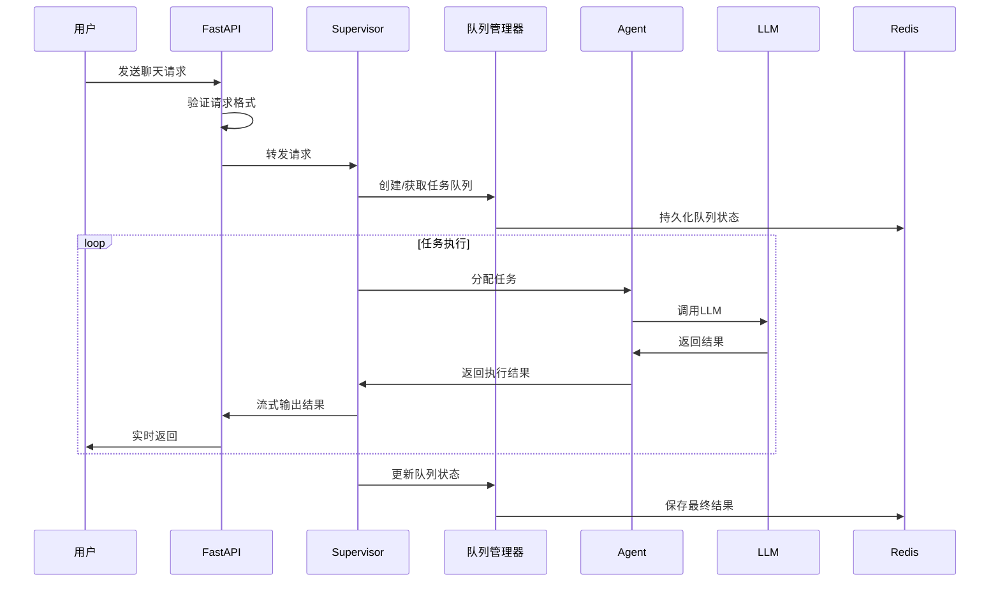
```mermaid
sequenceDiagram
    participant U as 用户
    participant F as FastAPI
    participant S as Supervisor
    participant Q as 队列管理器
    participant A as Agent
    participant L as LLM
    participant R as Redis
    
    U->>F: 发送聊天请求
    F->>F: 验证请求格式
    F->>S: 转发请求
    S->>Q: 创建/获取任务队列
    Q->>R: 持久化队列状态
    
    loop 任务执行
        S->>A: 分配任务
        A->>L: 调用LLM
        L->>A: 返回结果
        A->>S: 返回执行结果
        S->>F: 流式输出结果
        F->>U: 实时返回
    end
    
    S->>Q: 更新队列状态
    Q->>R: 保存最终结果
```

### 2. Agent协作流程

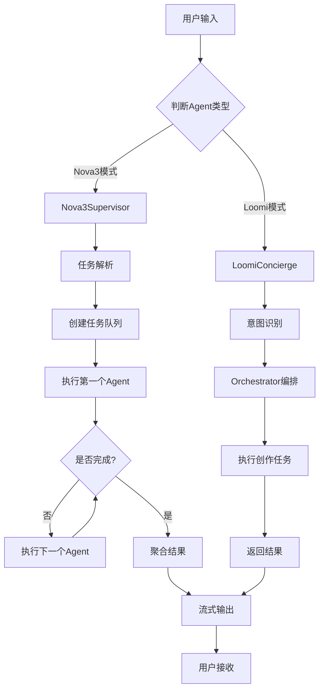
```mermaid
flowchart TD
    A[用户输入] --> B{判断Agent类型}
    B -->|Nova3模式| C[Nova3Supervisor]
    B -->|Loomi模式| D[LoomiConcierge]
    
    C --> E[任务解析]
    E --> F[创建任务队列]
    F --> G[执行第一个Agent]
    G --> H{是否完成?}
    H -->|否| I[执行下一个Agent]
    I --> H
    H -->|是| J[聚合结果]
    
    D --> K[意图识别]
    K --> L[Orchestrator编排]
    L --> M[执行创作任务]
    M --> N[返回结果]
    
    J --> O[流式输出]
    N --> O
    O --> P[用户接收]
```

## 🏛️ 核心组件分析

### 1. Nova3Supervisor 主控制器

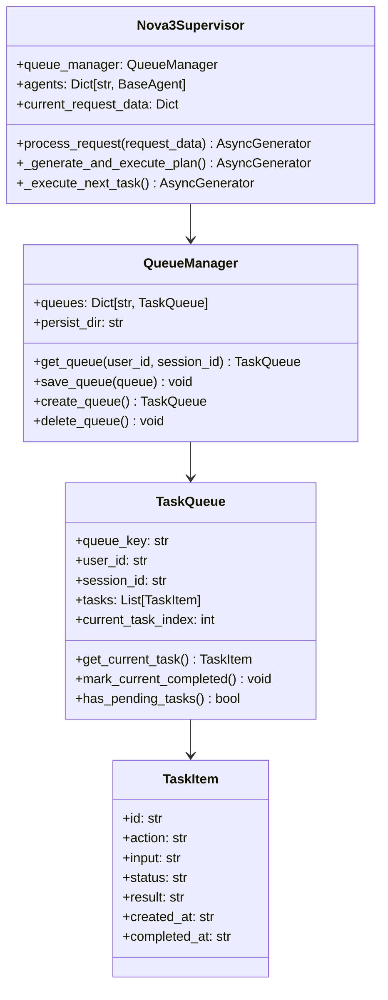
```mermaid
classDiagram
    class Nova3Supervisor {
        +queue_manager: QueueManager
        +agents: Dict[str, BaseAgent]
        +current_request_data: Dict
        +process_request(request_data) AsyncGenerator
        +_generate_and_execute_plan() AsyncGenerator
        +_execute_next_task() AsyncGenerator
    }
    
    class QueueManager {
        +queues: Dict[str, TaskQueue]
        +persist_dir: str
        +get_queue(user_id, session_id) TaskQueue
        +save_queue(queue) void
        +create_queue() TaskQueue
        +delete_queue() void
    }
    
    class TaskQueue {
        +queue_key: str
        +user_id: str
        +session_id: str
        +tasks: List[TaskItem]
        +current_task_index: int
        +get_current_task() TaskItem
        +mark_current_completed() void
        +has_pending_tasks() bool
    }
    
    class TaskItem {
        +id: str
        +action: str
        +input: str
        +status: str
        +result: str
        +created_at: str
        +completed_at: str
    }
    
    Nova3Supervisor --> QueueManager
    QueueManager --> TaskQueue
    TaskQueue --> TaskItem
```

### 2. Agent基类架构

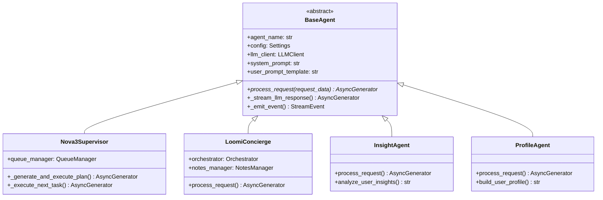
```mermaid
classDiagram
    class BaseAgent {
        <<abstract>>
        +agent_name: str
        +config: Settings
        +llm_client: LLMClient
        +system_prompt: str
        +user_prompt_template: str
        +process_request(request_data) AsyncGenerator*
        +_stream_llm_response() AsyncGenerator
        +_emit_event() StreamEvent
    }
    
    class Nova3Supervisor {
        +queue_manager: QueueManager
        +_generate_and_execute_plan() AsyncGenerator
        +_execute_next_task() AsyncGenerator
    }
    
    class LoomiConcierge {
        +orchestrator: Orchestrator
        +notes_manager: NotesManager
        +process_request() AsyncGenerator
    }
    
    class InsightAgent {
        +process_request() AsyncGenerator
        +analyze_user_insights() str
    }
    
    class ProfileAgent {
        +process_request() AsyncGenerator
        +build_user_profile() str
    }
    
    BaseAgent <|-- Nova3Supervisor
    BaseAgent <|-- LoomiConcierge
    BaseAgent <|-- InsightAgent
    BaseAgent <|-- ProfileAgent
```

## 📊 数据存储架构

### 1. 存储层次结构

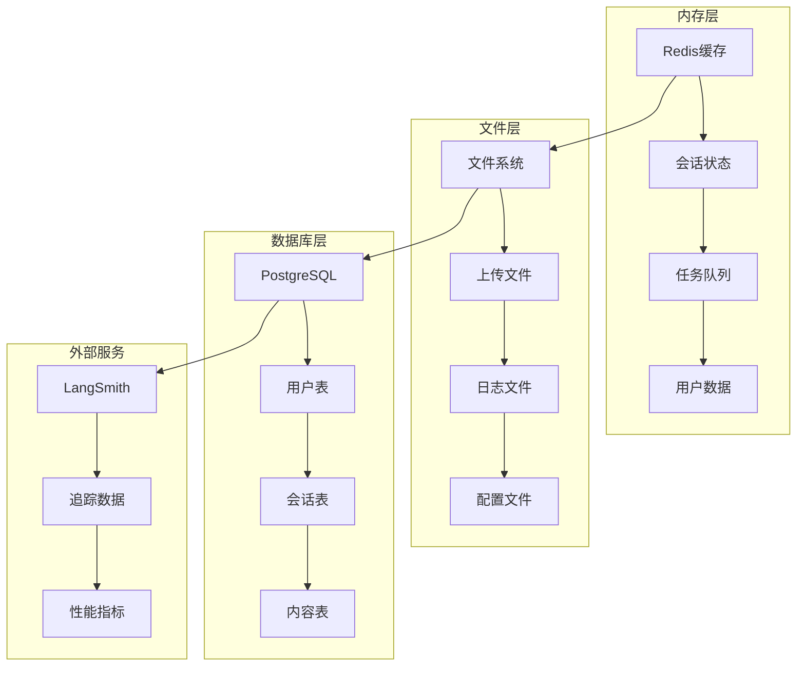
```mermaid
graph TB
    subgraph "内存层"
        A1[Redis缓存] --> A2[会话状态]
        A2 --> A3[任务队列]
        A3 --> A4[用户数据]
    end
    
    subgraph "文件层"
        B1[文件系统] --> B2[上传文件]
        B2 --> B3[日志文件]
        B3 --> B4[配置文件]
    end
    
    subgraph "数据库层"
        C1[PostgreSQL] --> C2[用户表]
        C2 --> C3[会话表]
        C3 --> C4[内容表]
    end
    
    subgraph "外部服务"
        D1[LangSmith] --> D2[追踪数据]
        D2 --> D3[性能指标]
    end
    
    A1 --> B1
    B1 --> C1
    C1 --> D1
```

### 2. 数据流设计

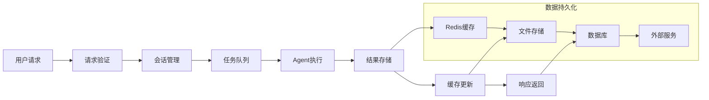
```mermaid
flowchart LR
    A[用户请求] --> B[请求验证]
    B --> C[会话管理]
    C --> D[任务队列]
    D --> E[Agent执行]
    E --> F[结果存储]
    F --> G[缓存更新]
    G --> H[响应返回]
    
    subgraph "数据持久化"
        I[Redis缓存] --> J[文件存储]
        J --> K[数据库]
        K --> L[外部服务]
    end
    
    F --> I
    G --> J
    H --> K
```

## 🔧 配置管理架构

### 1. 配置层次结构

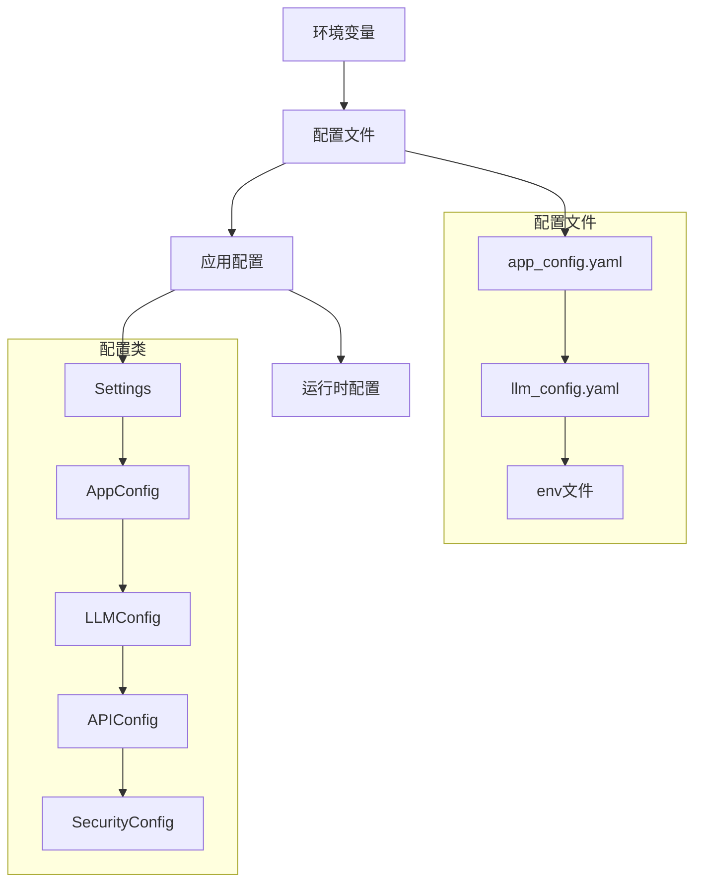
```mermaid
graph TD
    A[环境变量] --> B[配置文件]
    B --> C[应用配置]
    C --> D[运行时配置]
    
    subgraph "配置文件"
        E[app_config.yaml] --> F[llm_config.yaml]
        F --> G[env文件]
    end
    
    subgraph "配置类"
        H[Settings] --> I[AppConfig]
        I --> J[LLMConfig]
        J --> K[APIConfig]
        K --> L[SecurityConfig]
    end
    
    B --> E
    C --> H
```

### 2. 环境配置管理

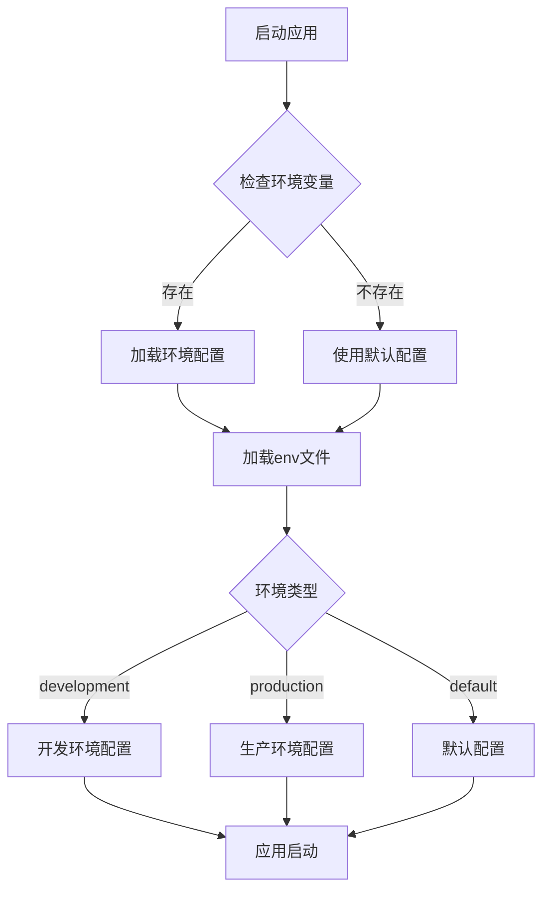
```mermaid
flowchart TD
    A[启动应用] --> B{检查环境变量}
    B -->|存在| C[加载环境配置]
    B -->|不存在| D[使用默认配置]
    
    C --> E[加载env文件]
    D --> E
    
    E --> F{环境类型}
    F -->|development| G[开发环境配置]
    F -->|production| H[生产环境配置]
    F -->|default| I[默认配置]
    
    G --> J[应用启动]
    H --> J
    I --> J
```

## 🚀 性能优化架构

### 1. 并发处理模型

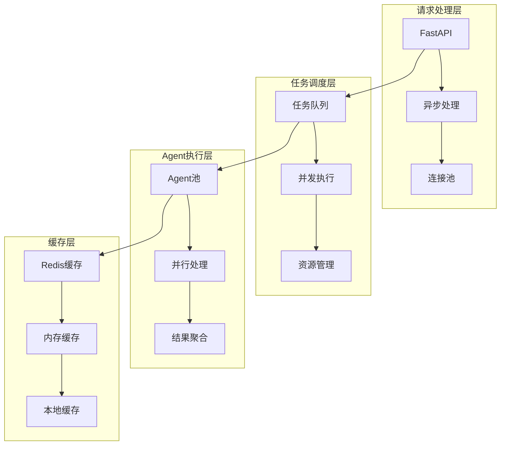
```mermaid
graph TB
    subgraph "请求处理层"
        A1[FastAPI] --> A2[异步处理]
        A2 --> A3[连接池]
    end
    
    subgraph "任务调度层"
        B1[任务队列] --> B2[并发执行]
        B2 --> B3[资源管理]
    end
    
    subgraph "Agent执行层"
        C1[Agent池] --> C2[并行处理]
        C2 --> C3[结果聚合]
    end
    
    subgraph "缓存层"
        D1[Redis缓存] --> D2[内存缓存]
        D2 --> D3[本地缓存]
    end
    
    A1 --> B1
    B1 --> C1
    C1 --> D1
```

### 2. 性能监控架构

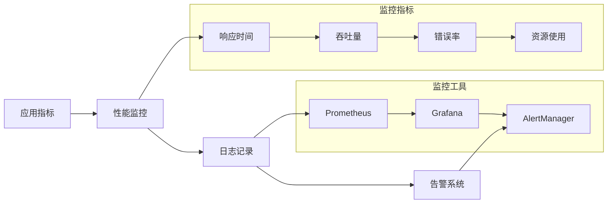
```mermaid
graph LR
    A[应用指标] --> B[性能监控]
    B --> C[日志记录]
    C --> D[告警系统]
    
    subgraph "监控指标"
        E[响应时间] --> F[吞吐量]
        F --> G[错误率]
        G --> H[资源使用]
    end
    
    subgraph "监控工具"
        I[Prometheus] --> J[Grafana]
        J --> K[AlertManager]
    end
    
    B --> E
    C --> I
    D --> K
```

## 🔒 安全架构

### 1. 认证授权流程

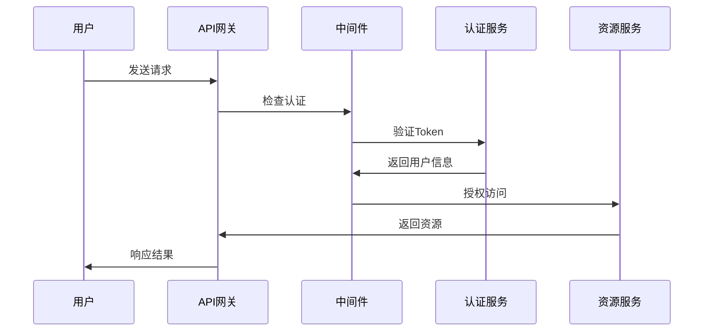
```mermaid
sequenceDiagram
    participant U as 用户
    participant A as API网关
    participant M as 中间件
    participant S as 认证服务
    participant R as 资源服务
    
    U->>A: 发送请求
    A->>M: 检查认证
    M->>S: 验证Token
    S->>M: 返回用户信息
    M->>R: 授权访问
    R->>A: 返回资源
    A->>U: 响应结果
```

### 2. 安全防护层

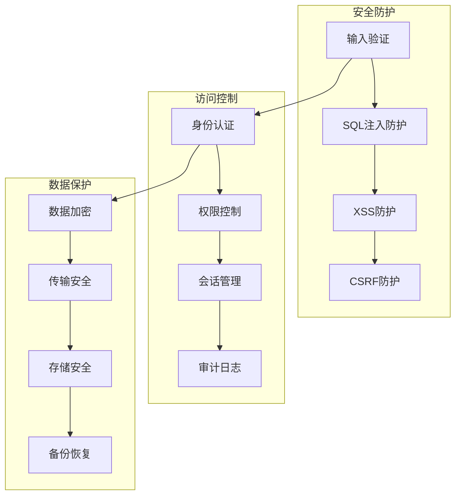
```mermaid
graph TB
    subgraph "安全防护"
        A1[输入验证] --> A2[SQL注入防护]
        A2 --> A3[XSS防护]
        A3 --> A4[CSRF防护]
    end
    
    subgraph "访问控制"
        B1[身份认证] --> B2[权限控制]
        B2 --> B3[会话管理]
        B3 --> B4[审计日志]
    end
    
    subgraph "数据保护"
        C1[数据加密] --> C2[传输安全]
        C2 --> C3[存储安全]
        C3 --> C4[备份恢复]
    end
    
    A1 --> B1
    B1 --> C1
```

## 📈 部署架构

### 1. Docker部署架构

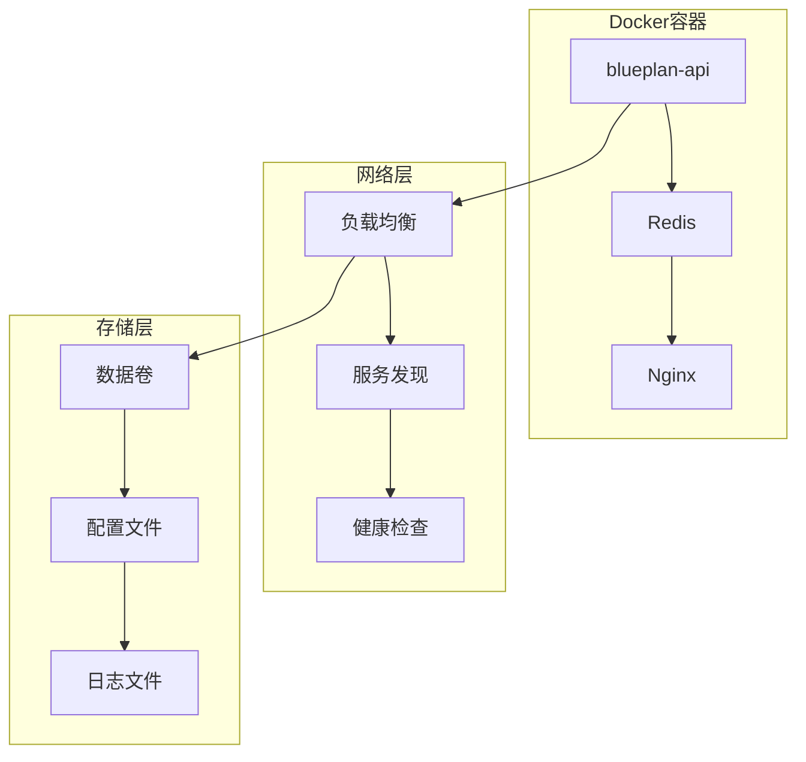
```mermaid
graph TB
    subgraph "Docker容器"
        A1[blueplan-api] --> A2[Redis]
        A2 --> A3[Nginx]
    end
    
    subgraph "网络层"
        B1[负载均衡] --> B2[服务发现]
        B2 --> B3[健康检查]
    end
    
    subgraph "存储层"
        C1[数据卷] --> C2[配置文件]
        C2 --> C3[日志文件]
    end
    
    A1 --> B1
    B1 --> C1
```

### 2. 生产环境架构

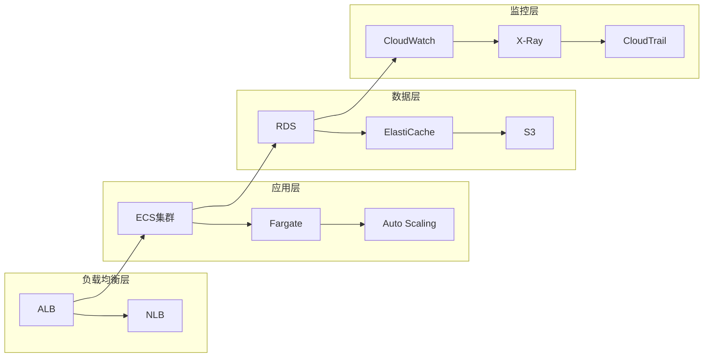
```mermaid
graph LR
    subgraph "负载均衡层"
        A1[ALB] --> A2[NLB]
    end
    
    subgraph "应用层"
        B1[ECS集群] --> B2[Fargate]
        B2 --> B3[Auto Scaling]
    end
    
    subgraph "数据层"
        C1[RDS] --> C2[ElastiCache]
        C2 --> C3[S3]
    end
    
    subgraph "监控层"
        D1[CloudWatch] --> D2[X-Ray]
        D2 --> D3[CloudTrail]
    end
    
    A1 --> B1
    B1 --> C1
    C1 --> D1
```

## 🔄 错误处理和恢复

### 1. 错误处理流程

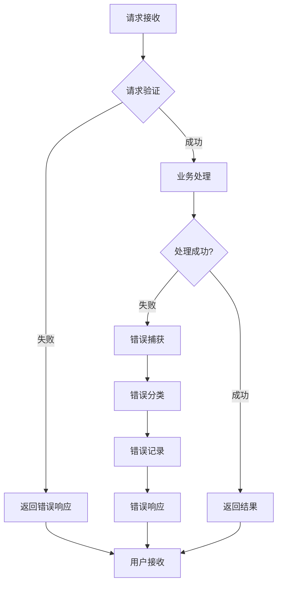
```mermaid
flowchart TD
    A[请求接收] --> B{请求验证}
    B -->|失败| C[返回错误响应]
    B -->|成功| D[业务处理]
    
    D --> E{处理成功?}
    E -->|失败| F[错误捕获]
    E -->|成功| G[返回结果]
    
    F --> H[错误分类]
    H --> I[错误记录]
    I --> J[错误响应]
    
    C --> K[用户接收]
    J --> K
    G --> K
```

### 2. 恢复机制

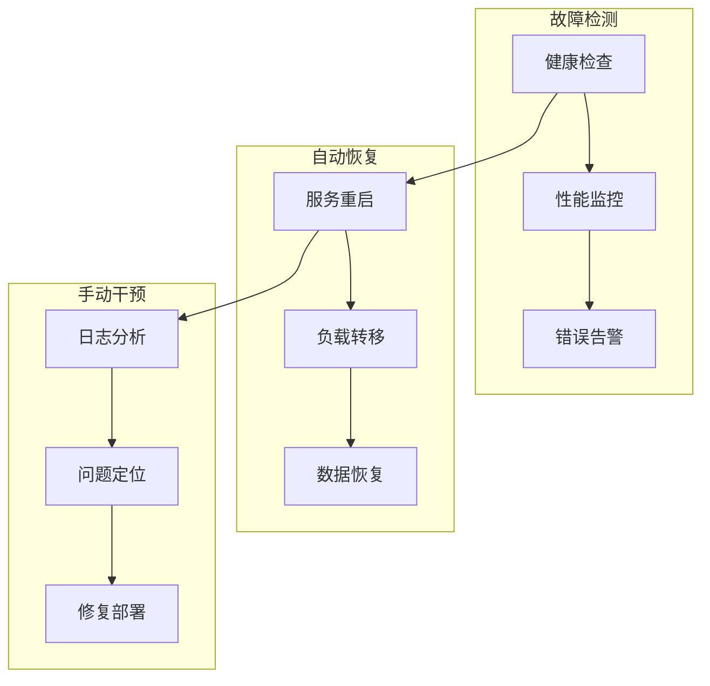
```mermaid
graph TB
    subgraph "故障检测"
        A1[健康检查] --> A2[性能监控]
        A2 --> A3[错误告警]
    end
    
    subgraph "自动恢复"
        B1[服务重启] --> B2[负载转移]
        B2 --> B3[数据恢复]
    end
    
    subgraph "手动干预"
        C1[日志分析] --> C2[问题定位]
        C2 --> C3[修复部署]
    end
    
    A1 --> B1
    B1 --> C1
```

## 📊 监控和日志

### 1. 监控架构

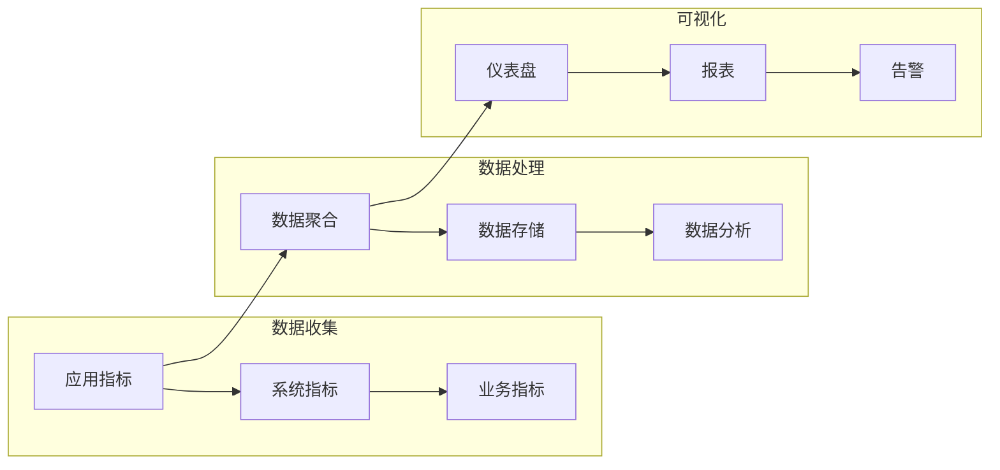
```mermaid
graph LR
    subgraph "数据收集"
        A1[应用指标] --> A2[系统指标]
        A2 --> A3[业务指标]
    end
    
    subgraph "数据处理"
        B1[数据聚合] --> B2[数据存储]
        B2 --> B3[数据分析]
    end
    
    subgraph "可视化"
        C1[仪表盘] --> C2[报表]
        C2 --> C3[告警]
    end
    
    A1 --> B1
    B1 --> C1
```

### 2. 日志架构

```mermaid
graph TB
    subgraph "日志收集"
        A1[应用日志] --> A2[访问日志]
        A2 --> A3[错误日志]
    end
    
    subgraph "日志处理"
        B1[日志解析] --> B2[日志过滤]
        B2 --> B3[日志聚合]
    end
    
    subgraph "日志存储"
        C1[本地存储] --> C2[集中存储]
        C2 --> C3[归档存储]
    end
    
    A1 --> B1
    B1 --> C1
```

## 🎯 总结

BluePlan Research 项目采用了现代化的微服务架构设计，具有以下特点：

### 核心优势
1. **模块化设计**: 采用多Agent协作架构，便于扩展和维护
2. **异步处理**: 基于FastAPI的异步框架，支持高并发处理
3. **流式响应**: 实时返回处理结果，提升用户体验
4. **配置灵活**: 支持多环境配置，便于部署和管理
5. **监控完善**: 集成多种监控和日志系统

### 技术栈
- **后端框架**: FastAPI + Uvicorn
- **数据库**: Redis + PostgreSQL
- **容器化**: Docker + Docker Compose
- **监控**: Prometheus + Grafana
- **日志**: ELK Stack
- **部署**: AWS ECS + Fargate

### 扩展性
- 支持新的Agent类型添加
- 支持新的内容平台集成
- 支持新的LLM模型接入
- 支持新的存储后端

这个架构设计确保了系统的可扩展性、可维护性和高性能，为社交媒体内容创作提供了强大的AI支持。 
