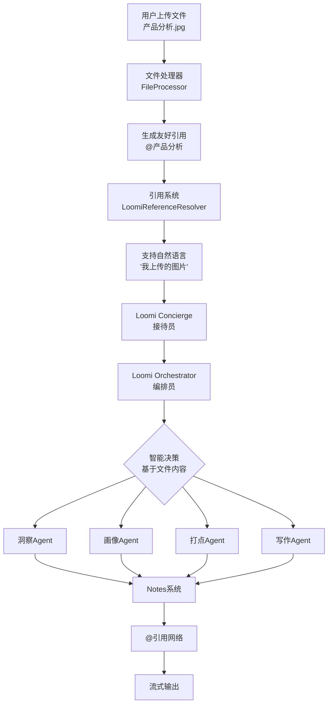

# Loomi系统文件集成使用指南 (更新版)

## 🎉 前端兼容性

**Loomi系统现已完全兼容现有前端！**

### 🔄 ContentType统一

Loomi系统使用与Nova3相同的ContentType值，前端无需额外开发：

```javascript
// 前端处理代码保持不变
switch(event.payload.content_type) {
    case 'nova3_insight':      // Loomi洞察分析 ✅
        handleInsight(event.payload.data);
        break;
    case 'nova3_profile':      // Loomi受众画像 ✅  
        handleProfile(event.payload.data);
        break;
    case 'nova3_hitpoint':     // Loomi内容打点 ✅
        handleHitpoint(event.payload.data);
        break;
    case 'nova3_xhs_post':     // Loomi小红书内容 ✅
        handleXHSPost(event.payload.data);
        break;
    case 'plan_insight':       // Loomi计划事件 ✅
        handlePlanInsight(event.payload.data);
        break;
    // ... 其他类型
}
```

### 🎯 兼容性对照表

| Loomi系统 | ContentType值 | 前端处理函数 | 兼容性 |
|-----------|---------------|-------------|---------|
| 洞察分析 | `nova3_insight` | `handleInsight()` | ✅ 完全兼容 |
| 受众画像 | `nova3_profile` | `handleProfile()` | ✅ 完全兼容 |  
| 内容打点 | `nova3_hitpoint` | `handleHitpoint()` | ✅ 完全兼容 |
| 小红书内容 | `nova3_xhs_post` | `handleXHSPost()` | ✅ 完全兼容 |
| 抖音口播稿 | `nova3_tiktok_script` | `handleTikTokScript()` | ✅ 完全兼容 |
| 公众号文章 | `nova3_wechat_article` | `handleWeChatArticle()` | ✅ 完全兼容 |
| 计划事件 | `plan_insight`, `plan_profile`, 等 | `handlePlan*()` | ✅ 完全兼容 |

这意味着：
- **前端零改动**：现有的Nova3处理逻辑直接适用于Loomi
- **数据格式一致**：事件结构和数据格式完全相同
- **用户体验统一**：界面展示和交互保持一致

## 🎯 概述

Loomi系统现在支持基于文件名的智能引用系统，用户上传文件后，系统会根据文件名自动生成友好的引用名称，用户可以用@符号或自然语言来引用自己上传的文件。

## 🔄 重新设计的引用系统

### ❌ 旧方式 (不友好)
- 系统生成：`@file1`, `@image1`, `@pdf1`
- 用户不知道用什么引用

### ✅ 新方式 (友好)
- 基于文件名：上传 `产品分析.jpg` → `@产品分析`
- 自然语言：`"我上传的图片"`, `"刚才的PDF"`
- 用户一目了然

## 📋 系统架构



## 🚀 使用示例

### 示例1：图片分析生成洞察

```python
# 1. 上传图片
POST /upload/file
文件名: "用户行为分析.jpg"

# 2. 系统响应
{
    "status": "success",
    "data": {
        "file_id": "uuid-string",
        "filename": "用户行为分析.jpg",
        "reference_name": "@用户行为分析",  # 🎯 友好的引用名称
        "category": "图片"
    }
}

# 3. 用户查询 (两种方式都可以)
方式1: "分析@用户行为分析，生成用户洞察"
方式2: "分析我上传的图片，生成用户洞察"
```

### 示例2：文档分析生成策略

```python
# 1. 上传文档
POST /upload/file
文件名: "2024行业报告.pdf"

# 2. 获取引用信息
GET /upload/files/{user_id}/{session_id}/references
{
    "file_references": [
        {
            "original_filename": "2024行业报告.pdf",
            "reference_name": "@2024行业报告",
            "category": "PDF文档",
            "natural_reference_examples": [
                "我上传的PDF", "这个文档", "刚才的PDF"
            ]
        }
    ]
}

# 3. 用户查询 (多种方式)
方式1: "根据@2024行业报告制定内容策略"
方式2: "根据我上传的PDF制定内容策略"  
方式3: "根据刚才的文档制定内容策略"
```

### 示例3：多文件综合分析

```python
# 1. 上传多个文件
- 用户调研.xlsx
- 竞品分析.pdf
- 产品截图.png

# 2. 系统自动生成引用
- @用户调研 (Excel表格)
- @竞品分析 (PDF文档)  
- @产品截图 (图片)

# 3. 综合分析查询
"综合@用户调研的数据、@竞品分析的信息和@产品截图的特点，生成完整的用户画像"

# 或者用自然语言
"综合我上传的Excel数据、PDF竞品分析和产品图片，生成完整的用户画像"
```

## 🎛️ API接口

### 1. 文件上传接口

```http
POST /upload/file
Content-Type: multipart/form-data

Parameters:
- file: 上传的文件
- user_id: 用户ID
- session_id: 会话ID
- description: 文件描述（可选）

Response:
{
    "status": "success",
    "data": {
        "file_id": "uuid-string",
        "filename": "产品分析.jpg",
        "reference_name": "@产品分析",  # 🎯 自动生成的引用名称
        "category": "图片",
        "natural_reference_examples": [
            "我上传的图片", "这张图片", "刚才的照片"
        ]
    }
}
```

### 2. 获取文件引用信息

```http
GET /upload/files/{user_id}/{session_id}/references

Response:
{
    "status": "success",
    "data": {
        "file_references": [
            {
                "original_filename": "产品分析.jpg",
                "reference_name": "@产品分析",
                "category": "图片",
                "file_size": 1024000
            }
        ],
        "natural_language_examples": [
            "我上传的图片", "我上传的PDF", "刚才的文档"
        ],
        "usage_examples": [
            {
                "type": "@引用方式",
                "examples": ["@产品分析", "@用户调研"]
            },
            {
                "type": "自然语言方式",
                "examples": ["我上传的图片", "刚才的PDF"]
            }
        ]
    }
}
```

### 3. Loomi聊天接口

```http
POST /loomichat
{
    "user_id": "string",
    "session_id": "string",
    "request_data": {
        "query": "分析@产品分析，生成用户洞察",  # 🎯 使用友好的引用名称
        "auto": true
    }
}
```

## 💡 引用规则

### 📁 @引用名称生成规则

1. **基于文件名**：`产品分析.jpg` → `@产品分析`
2. **清理特殊字符**：`用户-调研_数据.xlsx` → `@用户调研数据`
3. **长度限制**：超过10个字符会截断
4. **后备方案**：如果文件名无法识别，使用文件类型 `@图片`, `@PDF`

### 🗣️ 自然语言引用

支持的自然语言模式：
- `我上传的图片/PDF/Excel/文档`
- `刚才上传的图片/文档`
- `这张图片/这个文档/这个表格`

## 🔧 最佳实践

### 1. 文件命名建议

```
✅ 好的文件名
- 产品分析.jpg
- 用户调研数据.xlsx  
- 2024行业报告.pdf
- 竞品功能对比.png

❌ 避免的文件名
- IMG_0001.jpg (无意义)
- 文档1.pdf (不具体)
- 新建文件夹.zip (混乱)
```

### 2. 引用使用技巧

```python
✅ 推荐的查询方式
"分析@产品分析的用户行为特征"
"基于@用户调研数据生成用户画像"
"结合我上传的图片和PDF制定策略"

❌ 不推荐的方式
"分析图片"  # 太模糊
"看看文档"  # 不具体
```

### 3. 多文件组合

```python
# 精确引用
"综合@用户调研、@竞品分析和@产品截图生成策略"

# 自然语言
"结合我上传的Excel、PDF和图片进行分析"

# 混合使用
"基于@用户调研的数据和我上传的竞品图片制定策略"
```

## 🎯 完整工作流程

### 用户操作流程

1. **上传文件** → 系统自动生成友好引用名称
2. **查看引用** → 获取可用的引用方式
3. **输入查询** → 使用@引用或自然语言
4. **获得分析** → 系统智能分析并生成内容

### 系统处理流程

1. **文件上传** → 生成引用映射
2. **引用解析** → 识别@引用和自然语言
3. **内容获取** → 获取文件内容和Gemini URI
4. **智能分析** → 多模态处理和内容生成
5. **结果输出** → 流式返回分析结果

## 🎉 总结

新的引用系统让用户能够：

1. **直观引用**：基于文件名的@引用，一目了然
2. **灵活表达**：支持自然语言，更符合人类习惯
3. **智能识别**：系统自动识别和解析各种引用方式
4. **无缝集成**：与现有的Notes系统完美结合

这种设计真正做到了用户友好，让文件引用变得简单直观！ 
