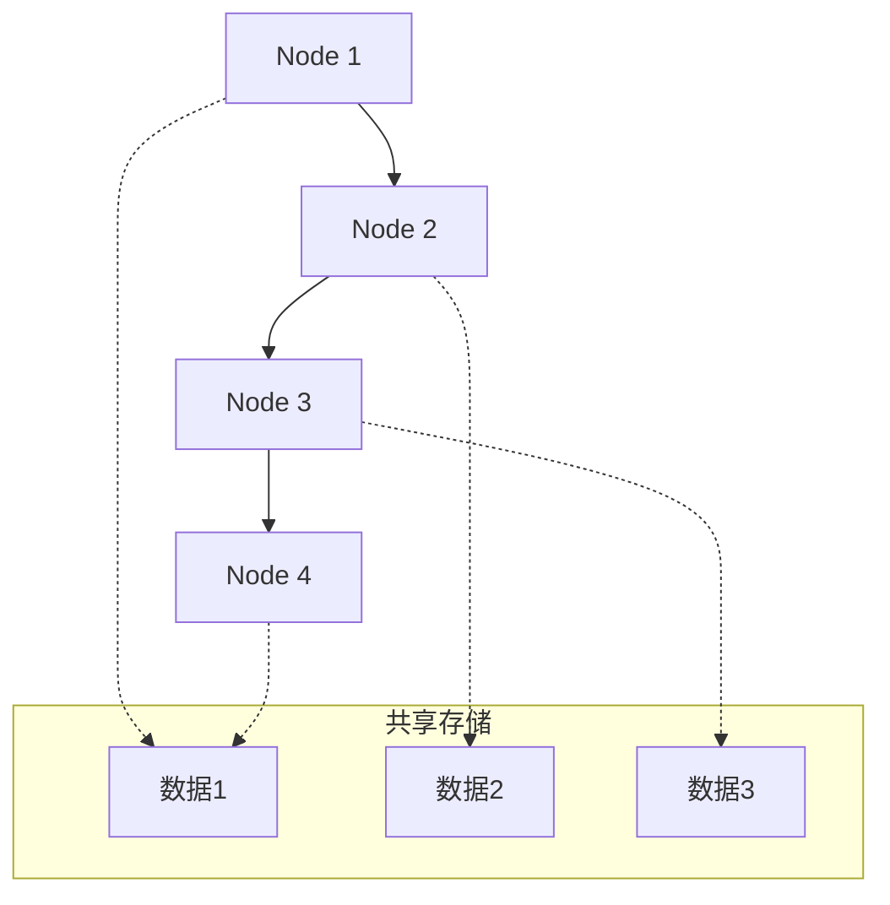
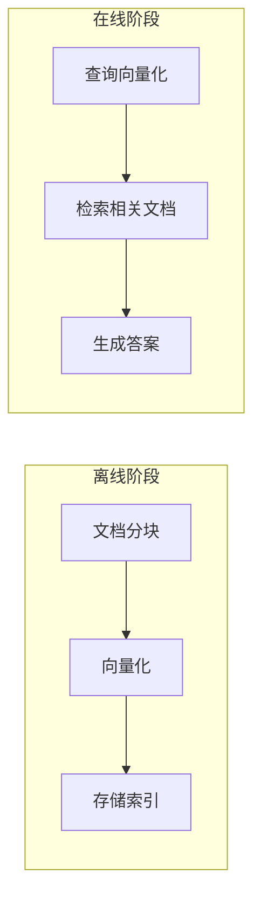

# PocketFlow 框架深度解析

## 目录

1. [框架概述](#框架概述)
2. [核心设计理念](#核心设计理念)
3. [核心抽象概念](#核心抽象概念)
4. [设计模式应用](#设计模式应用)
5. [工具函数体系](#工具函数体系)
6. [Agentic Coding 方法论](#agentic-coding-方法论)
7. [与 Bluetown Core 的对比](#与-bluetown-core-的对比)
8. [实际应用案例](#实际应用案例)
9. [最佳实践与注意事项](#最佳实践与注意事项)

---

## 框架概述

### 什么是 PocketFlow？

PocketFlow 是一个**100行代码**的极简LLM框架，专门为AI Agent、任务分解、RAG等场景设计。它的核心理念是：

- **轻量级**：仅100行核心代码，零依赖，无厂商锁定
- **表达性强**：支持多Agent、工作流、RAG等复杂模式
- **Agentic Coding友好**：AI Agent可以轻松帮助人类构建复杂LLM应用

### 核心优势

```
┌─────────────────────────────────────┐
│           轻量级设计                │
│   • 100行核心代码                  │
│   • 零依赖                        │
│   • 无厂商锁定                    │
├─────────────────────────────────────┤
│           表达性强                  │
│   • 支持多Agent协作               │
│   • 复杂工作流编排                │
│   • RAG检索增强生成               │
├─────────────────────────────────────┤
│           AI友好                   │
│   • 直观的抽象概念                │
│   • 清晰的代码结构                │
│   • 易于理解和扩展                │
└─────────────────────────────────────┘
```

---

## 核心设计理念

### 1. 图 + 共享存储模型

PocketFlow 将LLM工作流建模为**图 + 共享存储**：



**设计优势**：
- **解耦**：计算逻辑与数据存储分离
- **可组合**：节点可以自由组合成复杂工作流
- **可扩展**：新节点可以轻松集成到现有工作流

### 2. 最小化抽象

PocketFlow 只提供最核心的抽象：

- **Node**：处理简单任务的最小单元
- **Flow**：通过Action连接节点的图
- **Shared Store**：节点间通信的共享存储
- **Batch**：处理数据密集型任务
- **Async**：处理异步任务

---

## 核心抽象概念

### 1. Node（节点）

Node 是最小的构建块，每个Node有三个步骤：`prep -> exec -> post`

```python
class SummarizeNode(Node):
    def prep(self, shared):
        # 从共享存储读取数据
        return shared["text"]
    
    def exec(self, text):
        # 执行核心逻辑（通常是LLM调用）
        return call_llm(f"Summarize: {text}")
    
    def post(self, shared, prep_res, exec_res):
        # 将结果写回共享存储
        shared["summary"] = exec_res
        return "default"  # 决定下一步动作
```

**通俗解释**：
- `prep`：就像准备材料，从仓库（shared）取出需要的数据
- `exec`：就像加工过程，对数据进行处理（通常是调用LLM）
- `post`：就像包装成品，把结果放回仓库，并决定下一步做什么

### 2. Flow（工作流）

Flow 通过Action（标记的边）连接节点：

```python
# 简单序列
node_a >> node_b >> node_c

# 分支和循环
review - "approved" >> payment
review - "needs_revision" >> revise
revise >> review  # 循环回审核
```

**Action机制**：
- 每个节点的`post()`方法返回一个Action字符串
- Flow根据Action决定下一步执行哪个节点
- 支持复杂的条件分支和循环

### 3. Shared Store（共享存储）

节点间通信的全局数据结构：

```python
shared = {
    "user": {
        "id": "user123",
        "context": {
            "weather": {"temp": 72, "condition": "sunny"},
            "location": "San Francisco"
        }
    },
    "results": {}  # 存储输出结果
}
```

**设计原则**：
- **关注点分离**：数据模式与计算逻辑分离
- **灵活性**：可以是内存字典、数据库或文件
- **可维护性**：清晰的数据结构便于管理

---

## 设计模式应用

### 1. Agent 模式

Agent 是一个强大的设计模式，节点可以根据上下文动态采取行动：

```python
class DecideAction(Node):
    def exec(self, inputs):
        prompt = f"""
### 上下文
任务：{task_description}
当前状态：{current_state}

### 可用动作
[1] search - 使用网络搜索获取信息
[2] answer - 基于当前知识得出结论

### 下一步动作
根据当前上下文和可用动作空间决定下一步动作。
返回格式：
```yaml
thinking: <推理过程>
action: <动作名称>
parameters:
    <参数名>: <参数值>
```
"""
        return call_llm(prompt)
```

**关键要素**：
- **上下文管理**：提供相关、最小化的上下文
- **动作空间**：提供结构良好、无歧义的动作集
- **参数化**：支持参数化的动作，而不是固定动作

### 2. RAG 模式

RAG（检索增强生成）是两阶段管道：



**实现要点**：
- **离线索引**：预处理和索引文档
- **在线查询**：给定问题，检索最相关的上下文生成答案
- **向量搜索**：使用嵌入向量进行相似性搜索

### 3. Map Reduce 模式

适用于大数据处理：

```python
class SummarizeAllFiles(BatchNode):
    def prep(self, shared):
        # 返回要处理的文件列表
        return list(shared["files"].items())
    
    def exec(self, file_item):
        filename, content = file_item
        return (filename, call_llm(f"Summarize: {content}"))
    
    def post(self, shared, prep_res, exec_res_list):
        # 合并所有结果
        shared["summaries"] = dict(exec_res_list)
```

**适用场景**：
- 大输入数据（多个文件处理）
- 大输出数据（多个表单填写）
- 可以逻辑分解的任务

### 4. Workflow 模式

将复杂任务分解为多个节点链：

```python
# 文章写作工作流
outline = GenerateOutline()    # 生成大纲
write = WriteSection()         # 写作内容
review = ReviewAndRefine()     # 审查优化

outline >> write >> review
```

**设计原则**：
- **不要过于粗糙**：每个任务不应该太复杂，超出单个LLM调用的能力
- **不要过于细粒度**：每个LLM调用应该有足够的上下文，保持节点间结果的一致性

---

## 工具函数体系

PocketFlow **不提供**内置工具函数，而是提供示例，鼓励用户实现自己的工具：

### 1. LLM 包装器

```python
def call_llm(prompt):
    from openai import OpenAI
    client = OpenAI(api_key="YOUR_API_KEY")
    r = client.chat.completions.create(
        model="gpt-4o",
        messages=[{"role": "user", "content": prompt}]
    )
    return r.choices[0].message.content
```

### 2. 向量数据库

```python
def get_embedding(text):
    # 实现向量化
    pass

def search_index(index, query_embedding, top_k=5):
    # 实现向量搜索
    pass
```

### 3. 网络搜索

```python
def search_web(query):
    # 实现网络搜索
    pass
```

**设计理念**：
- **避免厂商锁定**：不硬编码特定API
- **灵活性**：可以切换厂商、使用微调模型或本地运行
- **优化空间**：更容易实现提示缓存、批处理和流式处理

---

## Agentic Coding 方法论

### 1. 人机协作流程

| 步骤 | 人类参与度 | AI参与度 | 说明 |
|:-----|:----------:|:--------:|:-----|
| 1. 需求分析 | ★★★ 高 | ★☆☆ 低 | 人类理解需求和上下文 |
| 2. 流程设计 | ★★☆ 中 | ★★☆ 中 | 人类指定高层设计，AI填充细节 |
| 3. 工具函数 | ★★☆ 中 | ★★☆ 中 | 人类提供外部API，AI帮助实现 |
| 4. 节点设计 | ★☆☆ 低 | ★★★ 高 | AI基于流程设计节点类型和数据处理 |
| 5. 实现 | ★☆☆ 低 | ★★★ 高 | AI基于设计实现流程 |
| 6. 优化 | ★★☆ 中 | ★★☆ 中 | 人类评估结果，AI帮助优化 |
| 7. 可靠性 | ★☆☆ 低 | ★★★ 高 | AI编写测试用例和处理边界情况 |

### 2. 开发步骤

#### 步骤1：需求分析
- 明确项目需求，评估AI系统是否适合
- 理解AI系统的优势和局限性
- 保持用户中心，从用户角度解释"问题"

#### 步骤2：流程设计
- 识别适用的设计模式（Map Reduce、Agent、RAG等）
- 为流程中的每个节点提供高层描述
- 绘制流程图

#### 步骤3：工具函数
- 识别并实现必要的工具函数
- 将AI系统视为大脑，工具函数是身体
- 为每个工具函数编写简单测试

#### 步骤4：节点设计
- 设计共享存储结构
- 描述每个节点的类型、数据读写方式、使用的工具函数

#### 步骤5：实现
- 基于设计实现初始节点和流程
- 保持简单，避免复杂功能
- 快速失败，避免try逻辑

#### 步骤6：优化
- 使用直觉进行快速评估
- 重新设计流程（回到步骤3）
- 微优化：提示工程、上下文学习

#### 步骤7：可靠性
- 节点重试：在节点exec中添加检查
- 日志和可视化：维护所有尝试的日志
- 自我评估：添加单独的节点来审查输出

---

## 与 Bluetown Core 的对比

### 架构对比

| 方面 | PocketFlow | Bluetown Core |
|:-----|:-----------|:--------------|
| **设计理念** | 极简抽象，图+共享存储 | 模块化，配置驱动 |
| **核心组件** | Node, Flow, Shared Store | Crew, Agent, Task, Tool |
| **配置方式** | 代码配置 | YAML配置文件 |
| **扩展性** | 通过代码扩展 | 通过配置扩展 |
| **复杂度** | 轻量级，100行核心 | 功能丰富，完整框架 |

### 适用场景对比

**PocketFlow 适合**：
- 快速原型开发
- 简单到中等复杂度的LLM应用
- 需要高度定制化的场景
- 学习和理解LLM工作流

**Bluetown Core 适合**：
- 复杂的多Agent协作系统
- 需要配置驱动的场景
- 大型企业级应用
- 需要严格数据隔离的场景

### 代码示例对比

**PocketFlow 风格**：
```python
class SummarizeNode(Node):
    def prep(self, shared): return shared["text"]
    def exec(self, text): return call_llm(f"Summarize: {text}")
    def post(self, shared, prep_res, exec_res): 
        shared["summary"] = exec_res

node = SummarizeNode()
flow = Flow(start=node)
flow.run({"text": "Some text to summarize"})
```

**Bluetown Core 风格**：
```python
# 通过配置文件定义Agent和Task
# agents.yaml
summarizer:
  role: "文本总结专家"
  goal: "将长文本总结为简洁的要点"
  tools: ["summarize_tool"]

# tasks.yaml
summarize_task:
  description: "总结用户提供的文本"
  agent: summarizer
  expected_output: "结构化的总结要点"
```

---

## 实际应用案例

### 案例1：智能客服系统

```python
class UnderstandQuery(Node):
    def prep(self, shared): return shared["user_input"]
    def exec(self, query): 
        return call_llm(f"Classify this query: {query}")
    def post(self, shared, prep_res, exec_res):
        shared["query_type"] = exec_res
        return exec_res

class SearchKnowledge(Node):
    def prep(self, shared): return shared["user_input"]
    def exec(self, query): return search_knowledge_base(query)
    def post(self, shared, prep_res, exec_res):
        shared["relevant_info"] = exec_res

class GenerateResponse(Node):
    def prep(self, shared): 
        return shared["user_input"], shared["relevant_info"]
    def exec(self, inputs):
        query, info = inputs
        return call_llm(f"Answer: {query}\nContext: {info}")
    def post(self, shared, prep_res, exec_res):
        shared["response"] = exec_res

# 构建工作流
understand = UnderstandQuery()
search = SearchKnowledge()
generate = GenerateResponse()

understand - "general" >> search
understand - "specific" >> generate
search >> generate

flow = Flow(start=understand)
```

### 案例2：文档分析系统

```python
class ExtractInfo(BatchNode):
    def prep(self, shared): return shared["documents"]
    def exec(self, doc): 
        return call_llm(f"Extract key info from: {doc}")
    def post(self, shared, prep_res, exec_res_list):
        shared["extracted_info"] = exec_res_list

class AnalyzePatterns(Node):
    def prep(self, shared): return shared["extracted_info"]
    def exec(self, info_list): 
        return call_llm(f"Analyze patterns in: {info_list}")
    def post(self, shared, prep_res, exec_res):
        shared["analysis"] = exec_res

# 使用Batch处理多个文档
extract = ExtractInfo()
analyze = AnalyzePatterns()
extract >> analyze
```

---

## 最佳实践与注意事项

### 1. 设计原则

**保持简单**：
- 避免复杂功能和全面的类型检查
- 快速失败，避免try逻辑
- 在整个代码中添加日志以便调试

**迭代优化**：
- 期望重复步骤3-6数百次
- 使用直觉进行快速评估
- 考虑进一步分解任务、引入Agent决策或更好地管理输入上下文

### 2. 性能优化

**提示工程**：
- 使用清晰、具体的指令和示例减少歧义
- 为难以仅用指令指定的任务提供强大的示例

**上下文学习**：
- 为复杂任务提供示例
- 使用少量示例提高性能

### 3. 错误处理

**节点重试**：
```python
class RobustNode(Node):
    def __init__(self):
        super().__init__(max_retries=3, wait=10)
    
    def exec(self, prep_res):
        # 实现逻辑
        pass
    
    def exec_fallback(self, prep_res, exc):
        # 提供优雅的降级方案
        return "处理失败，请稍后重试"
```

**自我评估**：
```python
class SelfEvaluatingNode(Node):
    def post(self, shared, prep_res, exec_res):
        # 添加自我评估
        evaluation = call_llm(f"Evaluate this result: {exec_res}")
        shared["evaluation"] = evaluation
        return "default"
```

### 4. 常见陷阱

**避免过度分解**：
- 每个任务不应该太细粒度
- LLM调用应该有足够的上下文
- 保持节点间结果的一致性

**避免厂商锁定**：
- 不要硬编码特定API
- 保持切换厂商的灵活性
- 考虑本地部署选项

**避免复杂依赖**：
- 保持工具函数的独立性
- 避免循环依赖
- 使用清晰的接口定义

---

## 总结

PocketFlow 是一个设计精良的轻量级LLM框架，其核心价值在于：

1. **极简抽象**：通过Node、Flow、Shared Store三个核心概念，构建了完整的LLM应用开发框架

2. **表达性强**：支持Agent、RAG、Map Reduce、Workflow等复杂设计模式

3. **AI友好**：清晰的抽象概念和代码结构，使得AI Agent能够轻松理解和扩展

4. **灵活性高**：不提供内置工具函数，避免厂商锁定，保持最大灵活性

5. **方法论完整**：提供Agentic Coding方法论，指导人机协作开发

这个框架为LLM应用开发提供了一个优雅而强大的基础，特别适合快速原型开发和学习LLM工作流概念。它的设计理念和实现方式值得在更复杂的系统中借鉴和应用。 