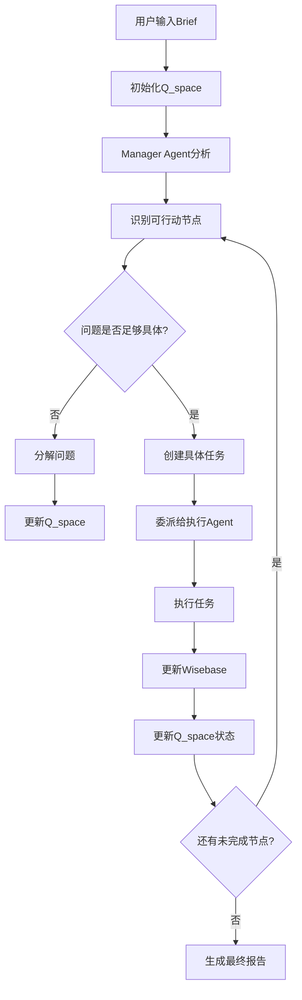

# 动态Agent创建与问题建模详解

## 目录

1. [动态Agent创建机制](#动态agent创建机制)
2. [动态问题建模原理](#动态问题建模原理)
3. [Q_space问题建模详解](#q_space问题建模详解)
4. [Wisebase知识状态管理](#wisebase知识状态管理)
5. [动态任务生成机制](#动态任务生成机制)
6. [实际应用案例](#实际应用案例)
7. [技术实现细节](#技术实现细节)

---

## 动态Agent创建机制

### 1. 什么是动态Agent创建？

想象一下，你要开一家公司，但是：
- **传统方式**：需要提前招聘所有员工，写死每个人的职责
- **动态方式**：根据项目需要，临时"招聘"合适的员工，分配具体任务

动态Agent创建就是后者，系统能够：
- 根据配置文件动态创建AI员工
- 根据任务需要分配不同的角色和工具
- 在运行时调整Agent的行为和能力

### 2. 核心实现机制

#### 配置驱动的Agent创建

```python
class CompetitionAnalysisAgents:
    def __init__(self):
        # 1. 加载配置文件
        self.agents_config = load_yaml_config(_CONFIG_PATH)
        self.crew_id = AGENT_CREW_ID
        
        # 2. 预实例化工具包装器
        self.q_space_get_tool = QSpaceGetWrapper(crew_id=self.crew_id)
        self.q_space_update_tool = QSpaceUpdateWrapper(crew_id=self.crew_id)
        self.wisebase_write_tool = WisebaseWriteWrapper(crew_id=self.crew_id)

    def _create_agent(self, name: str) -> Agent:
        """动态创建Agent的核心方法"""
        # 1. 从配置文件获取Agent定义
        agent_config = self.agents_config[name]
        
        # 2. 创建LLM实例
        llm_config = agent_config.get('llm', {})
        llm = create_crewai_llm(model_kwargs=llm_config)
        
        # 3. 动态分配工具
        agent_tools = []
        for tool_name in agent_config['tools']:
            if tool_name == 'Q_space Get Tool':
                agent_tools.append(self.q_space_get_tool)
            elif tool_name == 'Wisebase Write Tool':
                agent_tools.append(self.wisebase_write_tool)
            # ... 更多工具分配
        
        # 4. 创建Agent实例
        return Agent(
            role=agent_config.get('role', 'Default Role'),
            goal=agent_config.get('goal', 'Default Goal'),
            backstory=agent_config.get('backstory', ''),
            instructions=agent_config.get('instructions'),
            llm=llm,
            tools=agent_tools,
            allow_delegation=agent_config.get('allow_delegation', False),
            verbose=agent_config.get('verbose', True),
            memory=agent_config.get('memory', False)
        )
```

**通俗解释**：
- 就像根据"员工手册"（配置文件）来招聘员工
- 每个员工都有明确的职位、职责、技能和工具
- 系统根据配置文件动态"组装"出完整的员工

#### 工具自动注入机制

```python
class QSpaceGetWrapper(BaseTool):
    name: str = "Q_space Get Tool"
    description: str = q_space_get.__doc__
    crew_id: str  # 自动注入crew_id

    def _run(self) -> str:
        # 调用原始函数，自动传入crew_id
        return q_space_get(crew_id=self.crew_id)

class WisebaseWriteWrapper(BaseTool):
    name: str = "Wisebase Write Tool"
    args_schema: Type[BaseModel] = WisebaseWriteArgs
    crew_id: str  # 自动注入crew_id

    def _run(self, content, classification, **kwargs) -> str:
        # 调用内部函数，自动注入crew_id
        return _wisebase_write_internal(
            crew_id=self.crew_id,
            content=content,
            classification=classification,
            **kwargs
        )
```

**通俗解释**：
- 就像给每个员工发"工作证"（crew_id）
- 员工使用工具时自动带上工作证
- 这样不同部门的数据就不会混在一起

### 3. 动态Agent的优势

```
┌─────────────────────────────────────┐
│           传统方式                   │
│   • 代码写死，难以修改              │
│   • 需要重新部署才能改变行为        │
│   • 不同项目需要不同代码            │
├─────────────────────────────────────┤
│           动态方式                   │
│   • 配置文件驱动，易于修改          │
│   • 运行时调整，无需重新部署        │
│   • 一套代码支持多种项目            │
└─────────────────────────────────────┘
```

---

## 动态问题建模原理

### 1. 什么是动态问题建模？

传统的问题解决方式：
- **静态分析**：一次性分析所有问题
- **固定流程**：按照预设步骤执行
- **结果导向**：只关注最终结果

动态问题建模：
- **渐进式分析**：逐步深入分析问题
- **自适应流程**：根据发现调整分析方向
- **过程导向**：关注分析过程和中间发现

### 2. Q_space问题建模机制

#### Q_space结构设计

```json
{
  "id": "q_root",
  "text": "分析亚一黄金的竞争格局",
  "type": "main_question",
  "status": "open",
  "children": [
    {
      "id": "q_clarify_scope",
      "text": "根据简报明确分析范围和目标",
      "type": "sub_question",
      "status": "open",
      "children": [
        {
          "id": "task_define_persona",
          "text": "初步定义目标用户画像的关键维度",
          "type": "task_definition",
          "status": "open",
          "children": []
        }
      ]
    },
    {
      "id": "q_find_competitors",
      "text": "识别主要竞争对手",
      "type": "sub_question",
      "status": "pending",
      "children": []
    }
  ]
}
```

**通俗解释**：
- 就像解数学题一样，把大问题分解成小问题
- 每个节点代表一个问题或任务
- 状态表示当前进度（open、pending、in_progress、answered）
- 层级结构表示问题的依赖关系

#### 动态问题分解过程

```python
# Manager Agent的动态问题分解逻辑
def decompose_problem(self, current_qspace, new_insights):
    """根据新发现的信息动态分解问题"""
    
    # 1. 分析当前问题状态
    open_nodes = find_open_nodes(current_qspace)
    
    # 2. 评估问题粒度
    for node in open_nodes:
        if is_too_broad(node):
            # 问题太宽泛，需要分解
            sub_questions = generate_sub_questions(node, new_insights)
            add_children_to_node(node, sub_questions)
    
    # 3. 更新Q_space结构
    update_qspace_structure(current_qspace)
```

**通俗解释**：
- 就像侦探破案一样，根据新线索调整调查方向
- 发现大问题太复杂时，分解成具体的小问题
- 根据新信息调整分析重点

---

## Q_space问题建模详解

### 1. Q_space的核心概念

#### 节点类型

```yaml
节点类型:
  main_question: 主要问题（根节点）
  sub_question: 子问题（需要进一步分解）
  task_definition: 具体任务（可以直接执行）
  hypothesis: 假设（需要验证）
  insight: 洞察（分析结果）
```

#### 状态管理

```yaml
节点状态:
  initial: 初始状态
  open: 待处理
  pending: 等待依赖
  in_progress: 正在处理
  answered: 已回答
  failed: 处理失败
  conflicted: 存在冲突
```

### 2. 动态问题建模流程



### 3. 实际应用示例

#### 竞品分析问题建模

```json
{
  "id": "q_root",
  "text": "分析亚一黄金的竞争格局",
  "type": "main_question",
  "status": "open",
  "children": [
    {
      "id": "q_competitor_scope",
      "text": "明确竞争对手范围",
      "type": "sub_question",
      "status": "open",
      "children": [
        {
          "id": "task_define_scope",
          "text": "分析亚一黄金的产品定位，确定竞争边界",
          "type": "task_definition",
          "status": "open",
          "children": []
        }
      ]
    },
    {
      "id": "q_competitor_list",
      "text": "识别主要竞争对手",
      "type": "sub_question",
      "status": "pending",
      "children": [
        {
          "id": "task_search_competitors",
          "text": "搜索黄金首饰行业的主要品牌",
          "type": "task_definition",
          "status": "pending",
          "children": []
        }
      ]
    },
    {
      "id": "q_competitive_analysis",
      "text": "深入分析竞争对手",
      "type": "sub_question",
      "status": "pending",
      "children": []
    }
  ]
}
```

**动态演化过程**：

1. **初始状态**：只有根问题
2. **第一次分解**：识别出竞争对手范围、竞争对手列表、竞争分析三个子问题
3. **进一步分解**：将竞争对手范围分解为具体的分析任务
4. **任务执行**：执行具体任务，获取信息
5. **状态更新**：根据执行结果更新节点状态
6. **继续分解**：根据新信息继续分解其他问题

---

## Wisebase知识状态管理

### 1. Wisebase的作用

Wisebase就像公司的"知识库"，存储：
- **事实信息**（facts）：确凿的数据和事实
- **假设**（hypothesis）：需要验证的假设
- **观点**（points）：分析得出的洞察和观点

### 2. 知识分类机制

```python
def classify_knowledge(content, source, confidence):
    """对知识进行分类"""
    
    if is_verified_fact(content, source):
        return "fact"
    elif is_testable_hypothesis(content):
        return "hypothesis"
    elif is_insight_or_opinion(content):
        return "point"
    else:
        return "context"
```

### 3. 动态知识更新

```python
def update_wisebase(crew_id, content, classification, source_info):
    """动态更新知识库"""
    
    # 1. 验证知识质量
    if not validate_knowledge_quality(content):
        return "知识质量不足，拒绝添加"
    
    # 2. 检查重复
    if is_duplicate_knowledge(content, crew_id):
        return "知识已存在，跳过添加"
    
    # 3. 添加新知识
    knowledge_entry = {
        "id": generate_unique_id(),
        "content": content,
        "classification": classification,
        "source": source_info,
        "timestamp": get_current_time(),
        "confidence": calculate_confidence(content, source_info)
    }
    
    # 4. 保存到文件
    save_to_wisebase(crew_id, knowledge_entry)
    
    return "知识添加成功"
```

---

## 动态任务生成机制

### 1. 任务生成触发条件

```python
def should_generate_new_tasks(qspace, wisebase):
    """判断是否需要生成新任务"""
    
    # 1. 检查是否有待处理的节点
    open_nodes = find_open_nodes(qspace)
    if not open_nodes:
        return False
    
    # 2. 检查是否有新的知识输入
    new_knowledge = check_new_knowledge(wisebase)
    if new_knowledge:
        return True
    
    # 3. 检查是否有超时的任务
    timeout_tasks = find_timeout_tasks(qspace)
    if timeout_tasks:
        return True
    
    return False
```

### 2. 任务生成逻辑

```python
def generate_tasks(qspace, wisebase, available_agents):
    """根据当前状态生成新任务"""
    
    tasks = []
    
    # 1. 分析当前Q_space状态
    for node in qspace.get_open_nodes():
        
        # 2. 判断节点类型
        if node.type == "task_definition":
            # 直接创建任务
            task = create_execution_task(node, wisebase)
            tasks.append(task)
            
        elif node.type == "sub_question":
            # 需要进一步分解
            if can_decompose_further(node, wisebase):
                sub_tasks = decompose_question_to_tasks(node, wisebase)
                tasks.extend(sub_tasks)
            else:
                # 转换为具体任务
                task = convert_question_to_task(node, wisebase)
                tasks.append(task)
    
    return tasks
```

### 3. 任务分配策略

```python
def assign_tasks_to_agents(tasks, available_agents):
    """将任务分配给合适的Agent"""
    
    assignments = []
    
    for task in tasks:
        # 1. 分析任务需求
        task_requirements = analyze_task_requirements(task)
        
        # 2. 评估Agent能力
        agent_scores = []
        for agent in available_agents:
            score = evaluate_agent_for_task(agent, task_requirements)
            agent_scores.append((agent, score))
        
        # 3. 选择最佳Agent
        best_agent = max(agent_scores, key=lambda x: x[1])[0]
        
        # 4. 创建任务分配
        assignment = {
            "task": task,
            "agent": best_agent,
            "priority": calculate_priority(task),
            "estimated_duration": estimate_duration(task)
        }
        
        assignments.append(assignment)
    
    return assignments
```

---

## 实际应用案例

### 案例：亚一黄金竞争分析

#### 1. 初始问题建模

**用户输入**：分析亚一黄金的市场机会

**初始Q_space**：
```json
{
  "id": "q_root",
  "text": "分析亚一黄金的市场机会",
  "type": "main_question",
  "status": "open",
  "children": []
}
```

#### 2. 第一次问题分解

Manager Agent分析后，分解为：
```json
{
  "id": "q_root",
  "text": "分析亚一黄金的市场机会",
  "type": "main_question",
  "status": "open",
  "children": [
    {
      "id": "q_competitor_analysis",
      "text": "分析竞争对手情况",
      "type": "sub_question",
      "status": "open",
      "children": []
    },
    {
      "id": "q_market_opportunity",
      "text": "识别市场机会",
      "type": "sub_question",
      "status": "pending",
      "children": []
    }
  ]
}
```

#### 3. 进一步分解

竞争对手分析进一步分解：
```json
{
  "id": "q_competitor_analysis",
  "text": "分析竞争对手情况",
  "type": "sub_question",
  "status": "open",
  "children": [
    {
      "id": "task_identify_competitors",
      "text": "识别主要竞争对手",
      "type": "task_definition",
      "status": "open",
      "children": []
    },
    {
      "id": "task_analyze_competitor_strategies",
      "text": "分析竞争对手策略",
      "type": "task_definition",
      "status": "pending",
      "children": []
    }
  ]
}
```

#### 4. 任务执行

信息搜集员执行"识别主要竞争对手"任务：
- 使用Jina AI搜索黄金首饰行业品牌
- 将搜索结果写入Wisebase
- 更新任务状态为"answered"

#### 5. 知识积累

Wisebase中积累的知识：
```json
{
  "facts": [
    {
      "content": "周大福是中国最大的黄金首饰零售商",
      "source": "jina_search",
      "confidence": 0.9
    },
    {
      "content": "老凤祥是传统黄金品牌，主要面向中老年客户",
      "source": "jina_search", 
      "confidence": 0.8
    }
  ],
  "hypothesis": [
    {
      "content": "亚一黄金可能面临来自周大福等大品牌的竞争压力",
      "source": "strategic_analyst",
      "confidence": 0.7
    }
  ]
}
```

#### 6. 动态调整

根据新发现的知识，Manager Agent：
- 更新Q_space结构
- 生成新的分析任务
- 调整分析重点

---

## 技术实现细节

### 1. 状态同步机制

```python
class StateManager:
    def __init__(self):
        self.qspace_observers = []
        self.wisebase_observers = []
    
    def update_qspace(self, crew_id, new_structure):
        """更新Q_space状态"""
        # 1. 保存新状态
        save_qspace(crew_id, new_structure)
        
        # 2. 通知观察者
        for observer in self.qspace_observers:
            observer.on_qspace_updated(crew_id, new_structure)
    
    def update_wisebase(self, crew_id, new_knowledge):
        """更新Wisebase状态"""
        # 1. 保存新知识
        save_wisebase(crew_id, new_knowledge)
        
        # 2. 通知观察者
        for observer in self.wisebase_observers:
            observer.on_wisebase_updated(crew_id, new_knowledge)
```

### 2. 错误处理与恢复

```python
def robust_task_execution(task, agent):
    """健壮的任务执行"""
    max_retries = 3
    
    for attempt in range(max_retries):
        try:
            # 执行任务
            result = agent.execute_task(task)
            
            # 验证结果
            if validate_result(result):
                return result
            else:
                raise ValueError("结果验证失败")
                
        except Exception as e:
            if attempt == max_retries - 1:
                # 最后一次尝试失败
                return create_fallback_result(task, e)
            else:
                # 等待后重试
                time.sleep(2 ** attempt)
                continue
```

### 3. 性能优化

```python
class PerformanceOptimizer:
    def __init__(self):
        self.task_cache = {}
        self.knowledge_cache = {}
    
    def optimize_task_execution(self, tasks):
        """优化任务执行"""
        # 1. 任务去重
        unique_tasks = self.deduplicate_tasks(tasks)
        
        # 2. 任务排序
        sorted_tasks = self.prioritize_tasks(unique_tasks)
        
        # 3. 并行执行
        if can_parallel_execute(sorted_tasks):
            return self.parallel_execute(sorted_tasks)
        else:
            return self.sequential_execute(sorted_tasks)
```

---

## 总结

### 动态Agent创建的核心价值

1. **配置驱动**：通过YAML配置文件定义Agent行为
2. **工具自动注入**：自动为Agent分配合适的工具
3. **运行时调整**：无需重新部署即可调整Agent行为
4. **可扩展性**：易于添加新的Agent类型和工具

### 动态问题建模的核心价值

1. **渐进式分析**：根据发现逐步深入分析问题
2. **自适应流程**：根据新信息调整分析方向
3. **结构化思维**：将复杂问题分解为可管理的子问题
4. **知识积累**：持续积累和利用分析过程中的知识

### 技术优势

- **灵活性**：支持复杂多变的分析需求
- **可维护性**：配置与代码分离，易于维护
- **可扩展性**：易于添加新的分析能力和工具
- **健壮性**：完善的错误处理和恢复机制

这种设计使得系统能够像人类专家一样，根据具体情况动态调整分析策略，逐步深入理解复杂问题，最终得出有价值的洞察。 
