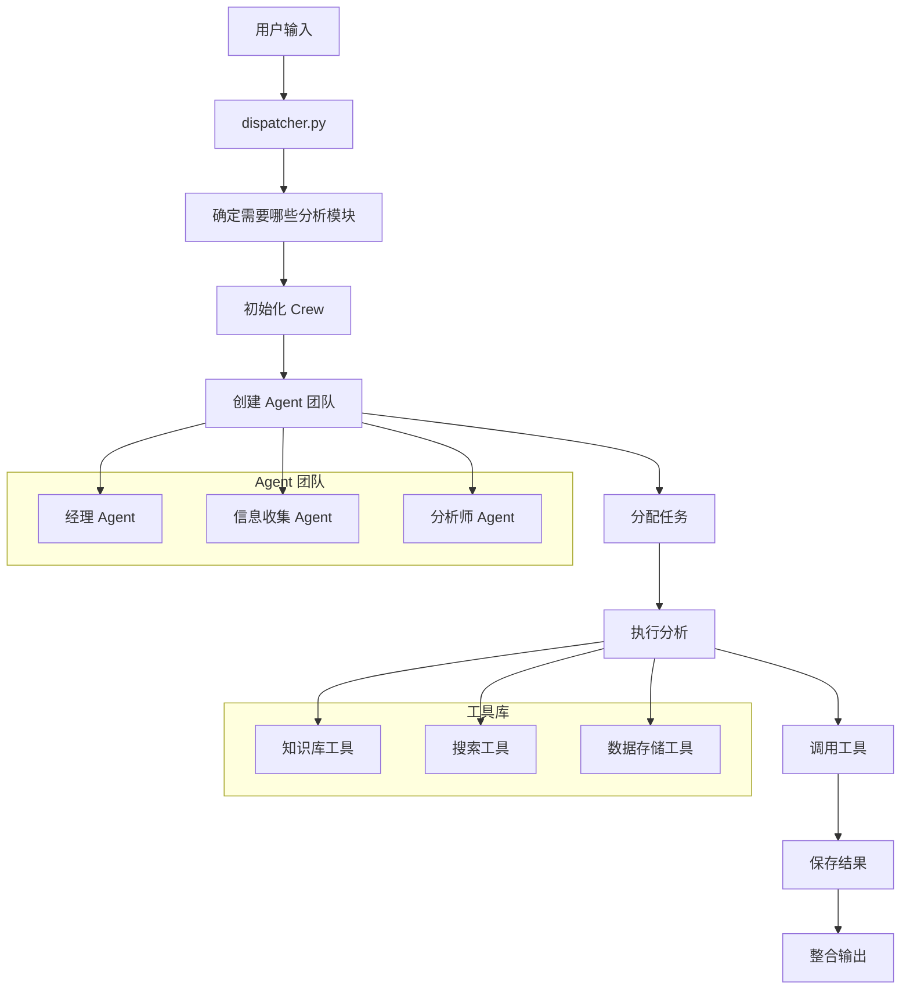

# Bluetown Core 技术应用逻辑详解

## 目录

1. [项目核心思想](#项目核心思想)
2. [技术架构详解](#技术架构详解)
3. [实际应用场景](#实际应用场景)
4. [关键技术实现](#关键技术实现)
5. [数据流转逻辑](#数据流转逻辑)
6. [扩展性与维护性](#扩展性与维护性)
7. [常见问题与解决方案](#常见问题与解决方案)

---

## 项目核心思想

### 什么是 Bluetown Core？

想象一下，你有一个智能助手团队，每个助手都有不同的专长：
- **经理助手**：负责整体规划和协调
- **信息收集助手**：专门收集各种信息
- **分析师助手**：专门分析数据和趋势

Bluetown Core 就是这样一个"智能助手团队管理系统"，它能让这些助手协作完成复杂的分析任务。

### 核心设计理念

1. **模块化设计**：每个功能都是独立的模块，就像乐高积木一样可以自由组合
2. **配置驱动**：通过配置文件就能改变系统行为，无需修改代码
3. **智能编排**：系统能自动安排哪个助手做什么任务
4. **数据持久化**：所有分析结果都会保存，方便后续查看和使用

---

## 技术架构详解

### 1. 分层架构设计

```
┌─────────────────────────────────────┐
│           用户交互层                 │
│    (命令行参数、配置文件)            │
├─────────────────────────────────────┤
│           调度控制层                 │
│      (dispatcher.py 主调度器)       │
├─────────────────────────────────────┤
│           业务逻辑层                 │
│    (crews/ - 各种分析模块)          │
├─────────────────────────────────────┤
│           工具服务层                 │
│    (tools/ - 各种工具能力)          │
├─────────────────────────────────────┤
│           数据存储层                 │
│    (data/, state/ - 数据文件)       │
└─────────────────────────────────────┘
```

### 2. 核心组件关系图



---

## 实际应用场景

### 场景1：竞品分析

**用户需求**：分析竞争对手A公司的市场策略

**系统处理流程**：
1. **接收任务**：用户输入"分析A公司的市场策略"
2. **智能分发**：系统识别这是竞品分析任务
3. **组建团队**：
   - 经理Agent：制定分析计划
   - 信息收集Agent：收集A公司信息
   - 分析师Agent：分析数据得出结论
4. **执行分析**：各Agent协作完成分析
5. **输出结果**：生成详细的分析报告

### 场景2：市场调研

**用户需求**：了解某个产品的市场需求

**系统处理流程**：
1. **任务识别**：系统识别这是市场调研任务
2. **数据收集**：收集相关市场数据
3. **趋势分析**：分析市场趋势和机会
4. **报告生成**：生成调研报告

---

## 关键技术实现

### 1. 动态Agent创建

```python
# 系统如何动态创建Agent
def _create_agent(self, name: str) -> Agent:
    # 1. 从配置文件读取Agent定义
    agent_config = self.agents_config[name]
    
    # 2. 创建LLM（大语言模型）
    llm = create_crewai_llm(model_kwargs=llm_config)
    
    # 3. 分配工具
    agent_tools = []
    for tool_name in agent_config['tools']:
        if tool_name == '知识库工具':
            agent_tools.append(self.knowledge_tool)
        elif tool_name == '搜索工具':
            agent_tools.append(self.search_tool)
    
    # 4. 创建Agent实例
    return Agent(
        role=agent_config['role'],
        goal=agent_config['goal'],
        llm=llm,
        tools=agent_tools
    )
```

**通俗解释**：
- 就像给员工分配工作一样，系统会根据配置文件给每个Agent分配角色、目标和工具
- 配置文件就像"员工手册"，定义了每个Agent应该做什么、怎么做

### 2. 任务流编排

```python
# 系统如何编排任务
def _create_task(self, name: str, context: List[Task] = None) -> Task:
    # 1. 读取任务配置
    task_config = self.tasks_config[name]
    
    # 2. 找到负责的Agent
    agent_name = task_config['agent']
    agent_instance = getattr(self.agents, agent_name)()
    
    # 3. 创建任务
    return Task(
        description=task_config['description'],
        agent=agent_instance,
        context=context  # 任务依赖关系
    )
```

**通俗解释**：
- 就像项目管理一样，系统会把大任务分解成小任务
- 每个任务都有明确的负责人（Agent）和完成标准
- 任务之间可以有依赖关系，比如"收集数据"必须在"分析数据"之前完成

### 3. 工具自动注入

```python
# 工具如何自动注入上下文
class QSpaceWrapper(BaseTool):
    def __init__(self, crew_id: str):
        self.crew_id = crew_id  # 自动注入团队ID
    
    def _run(self, data: str) -> str:
        # 调用原始工具，自动传入团队ID
        return q_space_update(crew_id=self.crew_id, data=data)
```

**通俗解释**：
- 就像给每个员工发工作证一样，系统会给每个工具自动分配"工作证"（crew_id）
- 这样不同团队的数据就不会混在一起，保证数据安全

---

## 数据流转逻辑

### 1. 数据流向图


### 2. 数据隔离机制

```python
# 不同团队的数据隔离
def q_space_update(crew_id: str, data: str):
    # 根据团队ID创建独立的数据文件
    filepath = f"data/q_space_{crew_id}.json"
    # 确保数据不会串扰
    save_data(filepath, data)
```

**通俗解释**：
- 就像每个部门有自己的文件夹一样，每个团队都有独立的数据存储空间
- 这样不同团队的数据就不会互相干扰

---

## 扩展性与维护性

### 1. 如何添加新的分析模块

**步骤1**：创建新的Crew目录
```
src/crews/new_analysis/
├── __init__.py
├── crew.py
├── agents.py
├── tasks.py
└── config/
    ├── agents.yaml
    └── tasks.yaml
```

**步骤2**：在dispatcher.py中注册
```python
def initialize_crews(crew_ids: List[str], brief: str):
    for crew_id in crew_ids:
        if crew_id == "new_analysis":
            crew_wrapper = NewAnalysisCrew(brief)
            crews[crew_id] = crew_wrapper.setup()
```

**通俗解释**：
- 就像开新部门一样，只需要按照标准格式创建新模块
- 系统会自动识别和加载新模块

### 2. 如何添加新的工具

**步骤1**：在tools目录下创建新工具
```python
# src/tools/new_tool.py
@tool
def new_tool_function(data: str) -> str:
    """新工具的功能描述"""
    # 实现工具逻辑
    return result
```

**步骤2**：在Agent配置中引用
```yaml
# config/agents.yaml
competition_manager:
  tools:
    - "新工具名称"
```

**通俗解释**：
- 就像给员工配新工具一样，只需要创建工具并在配置中引用
- 系统会自动把工具分配给需要的Agent

---

## 常见问题与解决方案

### 问题1：如何调试Agent执行问题？

**解决方案**：
1. 查看日志文件：`logs/bluetown.log`
2. 检查配置文件：确保agents.yaml和tasks.yaml格式正确
3. 测试单个Agent：可以单独测试某个Agent的功能

### 问题2：如何优化性能？

**解决方案**：
1. 调整LLM参数：在配置文件中优化模型参数
2. 并行执行：设置async_execution=True
3. 缓存结果：利用Q_space和Wisebase缓存中间结果

### 问题3：如何处理数据安全问题？

**解决方案**：
1. 数据隔离：每个crew_id独立存储
2. 权限控制：通过配置文件控制访问权限
3. 日志审计：记录所有数据操作

---

## 总结

Bluetown Core 通过模块化设计、配置驱动、智能编排等技术手段，实现了一个灵活、可扩展的智能分析平台。它的核心价值在于：

1. **降低使用门槛**：用户只需要描述需求，系统自动完成复杂的分析任务
2. **提高工作效率**：多个智能Agent协作，比人工分析更快速准确
3. **保证数据安全**：严格的数据隔离和权限控制
4. **支持灵活扩展**：新功能可以通过配置快速集成

这个项目展示了现代AI应用的最佳实践：将复杂的技术封装成简单易用的工具，让用户专注于业务需求而不是技术细节。 