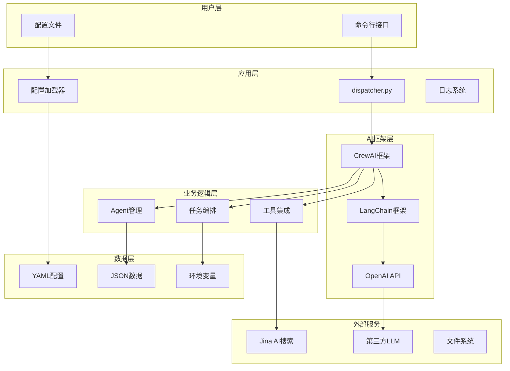

# Bluetown Core 技术栈与选型分析

## 目录

1. [技术栈概览](#技术栈概览)
2. [核心框架分析](#核心框架分析)
3. [LLM集成技术](#llm集成技术)
4. [数据处理技术](#数据处理技术)
5. [配置管理技术](#配置管理技术)
6. [工具链技术](#工具链技术)
7. [技术选型理由](#技术选型理由)
8. [技术架构图](#技术架构图)
9. [性能与扩展性](#性能与扩展性)
10. [技术债务与优化](#技术债务与优化)

---

## 技术栈概览

### 核心技术栈

```
┌─────────────────────────────────────┐
│           应用层                    │
│   • Python 3.8+                   │
│   • argparse (命令行参数解析)       │
│   • logging (日志管理)             │
├─────────────────────────────────────┤
│           AI/LLM 框架              │
│   • CrewAI (多Agent协作框架)       │
│   • LangChain (LLM应用框架)        │
│   • OpenAI API (LLM服务)           │
├─────────────────────────────────────┤
│           数据处理                  │
│   • PyYAML (YAML配置文件)          │
│   • Pydantic (数据验证)            │
│   • JSON (数据序列化)              │
├─────────────────────────────────────┤
│           配置管理                  │
│   • python-dotenv (环境变量)       │
│   • YAML (配置文件)                │
│   • 自定义配置加载器               │
├─────────────────────────────────────┤
│           异步处理                  │
│   • nest-asyncio (异步嵌套)        │
│   • asyncio (异步编程)             │
└─────────────────────────────────────┘
```

### 依赖包详细分析

| 包名 | 版本 | 作用 | 在项目中的应用 |
|:-----|:-----|:-----|:--------------|
| `crewai` | >=0.28.0 | 多Agent协作框架 | 核心业务逻辑，Agent编排 |
| `openai` | >=1.25.0 | OpenAI API客户端 | LLM调用接口 |
| `pyyaml` | >=6.0 | YAML解析 | 配置文件读取 |
| `python-dotenv` | >=1.0.0 | 环境变量管理 | 敏感配置管理 |
| `langchain` | >=0.0.335 | LLM应用框架 | 工具链集成 |
| `langchain-community` | >=0.0.16 | LangChain社区工具 | 扩展工具支持 |
| `langchain-openai` | >=0.0.2 | OpenAI集成 | LLM实例创建 |
| `pydantic` | >=2.0.0 | 数据验证 | 工具参数验证 |
| `nest-asyncio` | >=1.5.8 | 异步嵌套支持 | 异步任务处理 |
| `crewai-tools` | >=0.1.0 | CrewAI工具集 | 预定义工具 |

---

## 核心框架分析

### 1. CrewAI 框架

**作用**：多Agent协作的核心框架

**在项目中的应用**：
```python
# 核心Crew创建
from crewai import Crew, Process, Agent

class CompetitionAnalysisCrew:
    def setup(self) -> Crew:
        crew = Crew(
            agents=[manager_agent, gatherer_agent, strategist_agent],
            tasks=[initial_task],
            process=Process.hierarchical,  # 分层处理
            manager_llm=manager_agent.llm,
            verbose=True,
        )
        return crew
```

**技术优势**：
- **分层处理**：支持Manager Agent协调其他Agent
- **任务编排**：自动管理任务依赖和执行顺序
- **工具集成**：无缝集成各种工具和API
- **可扩展性**：易于添加新的Agent和工具

**选型理由**：
- 专门为多Agent协作设计
- 支持复杂的任务分解和编排
- 与LangChain生态系统兼容
- 活跃的社区和持续更新

### 2. LangChain 框架

**作用**：LLM应用开发的基础框架

**在项目中的应用**：
```python
# LLM实例创建
from langchain_openai import ChatOpenAI

def get_llm_instance(model_kwargs: Optional[Dict[str, Any]] = None) -> ChatOpenAI:
    return ChatOpenAI(
        model=f"openai/{model_name}",
        temperature=0.5,
        max_tokens=2000,
        api_key=api_key,
        openai_api_base=api_base,
    )
```

**技术优势**：
- **标准化接口**：统一的LLM调用接口
- **工具链集成**：丰富的工具和集成选项
- **流式处理**：支持流式输出
- **错误处理**：完善的错误处理和重试机制

---

## LLM集成技术

### 1. OpenAI API 集成

**配置方式**：
```yaml
# config/settings.yaml
llm:
  provider: openai
  model: gemini-2.0-flash-lite-preview-02-05
  api_base: https://api.claude-plus.top/v1
  temperature: 0.5
  max_tokens: 2000
  timeout: 90
```

**技术特点**：
- **兼容性接口**：使用OpenAI兼容的API接口
- **模型适配**：通过`openai/`前缀适配第三方模型
- **参数配置**：支持温度、最大token等参数调整
- **超时控制**：90秒超时确保稳定性

### 2. 多模型支持

**实现方式**：
```python
def create_crewai_llm(model_kwargs: Optional[Dict[str, Any]] = None) -> CrewAILLM:
    # 获取原始模型名称并添加openai/前缀
    original_model = llm_config.get("model", "gemini-2.0-flash-thinking-exp")
    model_name_for_llm = f"openai/{original_model}"
    
    return CrewAILLM(
        model=model_name_for_llm,
        temperature=llm_config.get("temperature", 0.5),
        max_tokens=llm_config.get("max_tokens", 2000),
        api_key=llm_config.get("api_key"),
        base_url=llm_config.get("api_base"),
    )
```

**技术优势**：
- **模型切换**：支持不同LLM模型的快速切换
- **参数覆盖**：支持运行时参数调整
- **错误处理**：完善的异常处理和重试机制

---

## 数据处理技术

### 1. YAML 配置管理

**应用场景**：
```yaml
# agents.yaml - Agent配置
competition_manager:
  role: 竞争分析主管
  goal: 理解用户简报，初始化并动态维护部门的问题模型
  backstory: 你是一位经验丰富的竞争策略分析专家
  instructions: 收到用户简报后，你的首要任务是初始化分析流程
  llm:
    model: gemini-2.0-flash-thinking-exp
    temperature: 0.6
  tools:
    - Q_space Get Tool
    - Q_space Update Tool
    - Wisebase Write Tool
    - Wisebase Read Tool
```

**技术优势**：
- **可读性强**：人类友好的配置格式
- **层次结构**：支持复杂的嵌套配置
- **类型安全**：通过Pydantic进行数据验证
- **版本控制**：易于进行版本管理和变更追踪

### 2. Pydantic 数据验证

**应用场景**：
```python
from pydantic.v1 import BaseModel, Field

class WisebaseWriteArgs(BaseModel):
    content: Union[str, Dict, List] = Field(description="要写入的内容")
    classification: str = Field(description="内容分类")
    source_task_id: Optional[str] = Field(None, description="来源任务ID")
    source_agent_role: Optional[str] = Field(None, description="来源Agent角色")
    confidence: Optional[float] = Field(None, description="置信度")
    tags: Optional[List[str]] = Field(None, description="标签列表")
    related_qspace_node_ids: Optional[List[str]] = Field(None, description="相关Q_space节点ID")
```

**技术优势**：
- **类型安全**：编译时类型检查
- **自动验证**：自动验证数据格式和范围
- **文档生成**：自动生成API文档
- **IDE支持**：良好的IDE自动补全支持

### 3. JSON 数据序列化

**应用场景**：
```python
# Q_space数据结构
q_space_structure = {
    "id": "q_root",
    "text": "分析目标实体的竞争格局",
    "type": "main_question",
    "status": "open",
    "children": [
        {
            "id": "q_clarify_scope",
            "text": "根据简报明确分析范围和目标",
            "type": "sub_question",
            "status": "open",
            "children": []
        }
    ]
}
```

**技术优势**：
- **标准化**：广泛支持的数据格式
- **可读性**：人类和机器都可读
- **互操作性**：与其他系统良好集成
- **性能**：高效的序列化和反序列化

---

## 配置管理技术

### 1. python-dotenv 环境变量管理

**应用场景**：
```python
from dotenv import load_dotenv

# 加载.env文件
load_dotenv()

# 获取环境变量
api_key = os.environ.get("OPENAI_API_KEY")
api_base = os.environ.get("OPENAI_API_BASE")
model_name = os.environ.get("OPENAI_MODEL_NAME")
```

**技术优势**：
- **安全性**：敏感信息不进入代码库
- **环境隔离**：不同环境使用不同配置
- **部署友好**：容器化部署时易于管理
- **开发便利**：本地开发时易于配置

### 2. 自定义配置加载器

**实现方式**：
```python
def get_config() -> Dict[str, Any]:
    global _config_cache
    
    if _config_cache is not None:
        return _config_cache
    
    # 加载.env环境变量
    load_dotenv()
    
    # 加载YAML配置
    config_path = os.path.join(project_root, 'config', 'settings.yaml')
    config = load_yaml_config(config_path)
    
    # 从环境变量覆盖LLM配置
    llm_config = config.get('llm', {})
    if os.environ.get('OPENAI_API_KEY'):
        llm_config['api_key'] = os.environ.get('OPENAI_API_KEY')
    
    _config_cache = config
    return config
```

**技术优势**：
- **单例模式**：避免重复加载配置
- **优先级管理**：环境变量覆盖文件配置
- **类型安全**：通过类型注解确保类型安全
- **缓存机制**：提高配置访问性能

---

## 工具链技术

### 1. CrewAI Tools 集成

**应用场景**：
```python
from crewai.tools import BaseTool

class QSpaceGetWrapper(BaseTool):
    name: str = "Q_space Get Tool"
    description: str = q_space_get.__doc__
    crew_id: str

    def _run(self) -> str:
        return q_space_get(crew_id=self.crew_id)
```

**技术优势**：
- **标准化接口**：统一的工具接口
- **自动文档**：自动生成工具文档
- **类型安全**：通过Pydantic进行参数验证
- **可扩展性**：易于添加新工具

### 2. 外部API集成

**Jina AI 搜索集成**：
```python
@tool("Jina AI DeepSearch Tool")
def jina_deep_search(query: str) -> str:
    api_key = os.getenv("JINA_API_KEY")
    url = 'https://deepsearch.jina.ai/v1/chat/completions'
    headers = {
        "Content-Type": "application/json",
        "Authorization": f"Bearer {api_key}"
    }
    data = {
        "model": "jina-deepsearch-v1",
        "messages": [{"role": "user", "content": query}],
        "stream": False,
    }
    response = requests.post(url, headers=headers, json=data)
    return response.json()["choices"][0]["message"]["content"]
```

**技术优势**：
- **实时搜索**：获取最新的网络信息
- **高质量结果**：Jina AI的专业搜索能力
- **安全集成**：通过环境变量管理API密钥
- **错误处理**：完善的错误处理机制

---

## 技术选型理由

### 1. 为什么选择 CrewAI？

**技术优势**：
- **专门设计**：专门为多Agent协作设计
- **成熟稳定**：经过大量生产环境验证
- **社区活跃**：持续更新和维护
- **生态丰富**：与LangChain生态系统完美集成

**业务契合度**：
- **多部门协作**：完美匹配项目的多部门协作需求
- **任务分解**：支持复杂的任务分解和编排
- **知识共享**：内置的知识共享机制
- **可扩展性**：易于添加新的部门和功能

### 2. 为什么选择 LangChain？

**技术优势**：
- **标准化**：LLM应用开发的标准框架
- **工具丰富**：大量预构建的工具和集成
- **类型安全**：完善的类型系统
- **文档完善**：详细的文档和示例

**集成优势**：
- **与CrewAI兼容**：无缝集成CrewAI框架
- **工具生态**：丰富的工具生态系统
- **社区支持**：活跃的开发者社区

### 3. 为什么选择 YAML 配置？

**技术优势**：
- **可读性强**：人类友好的配置格式
- **层次结构**：支持复杂的嵌套配置
- **版本控制**：易于进行版本管理
- **工具支持**：丰富的工具支持

**业务优势**：
- **非技术人员友好**：业务人员可以理解和修改
- **快速迭代**：配置变更无需重新部署
- **环境隔离**：不同环境使用不同配置

---

## 技术架构图



---

## 性能与扩展性

### 1. 性能优化技术

**异步处理**：
```python
import nest_asyncio
nest_asyncio.apply()

# 支持异步任务处理
async def async_task():
    # 异步处理逻辑
    pass
```

**缓存机制**：
```python
# 配置缓存
_config_cache = None

def get_config() -> Dict[str, Any]:
    global _config_cache
    if _config_cache is not None:
        return _config_cache
    # 加载配置...
```

**连接池**：
```python
# LLM连接复用
def get_llm_instance():
    # 复用LLM连接
    return ChatOpenAI(...)
```

### 2. 扩展性设计

**模块化架构**：
- **Crew模块**：每个部门独立模块
- **工具模块**：可插拔的工具系统
- **配置模块**：灵活的配置管理

**插件化设计**：
- **新Agent**：通过配置文件添加
- **新工具**：实现标准接口即可集成
- **新部门**：遵循标准模式即可扩展

---

## 技术债务与优化

### 1. 当前技术债务

**配置管理**：
- 配置分散在多个文件中
- 缺乏配置验证机制
- 环境变量管理不够规范

**错误处理**：
- 异常处理不够完善
- 缺乏统一的错误码系统
- 日志记录不够详细

**测试覆盖**：
- 单元测试覆盖率不足
- 集成测试缺失
- 性能测试不完善

### 2. 优化建议

**短期优化**：
- 完善配置验证机制
- 统一异常处理
- 增加日志记录

**中期优化**：
- 提高测试覆盖率
- 优化性能瓶颈
- 完善监控系统

**长期优化**：
- 微服务化改造
- 容器化部署
- 云原生架构

---

## 总结

Bluetown Core 的技术栈选型体现了以下特点：

### 1. **技术选型合理性**
- **CrewAI + LangChain**：完美匹配多Agent协作需求
- **YAML + Pydantic**：提供灵活且类型安全的配置管理
- **python-dotenv**：确保敏感信息的安全性

### 2. **架构设计优势**
- **模块化设计**：清晰的模块边界和职责分离
- **可扩展性**：支持新功能的无缝集成
- **可维护性**：标准化的代码结构和配置管理

### 3. **技术成熟度**
- **成熟框架**：使用经过验证的成熟框架
- **社区支持**：活跃的开发者社区
- **文档完善**：详细的技术文档和示例

### 4. **业务契合度**
- **多部门协作**：完美支持项目的多部门协作需求
- **知识管理**：内置的知识共享和管理机制
- **任务编排**：支持复杂的任务分解和编排

这个技术栈为项目提供了坚实的基础，既保证了系统的稳定性和可扩展性，又为未来的功能扩展留下了充足的空间。 