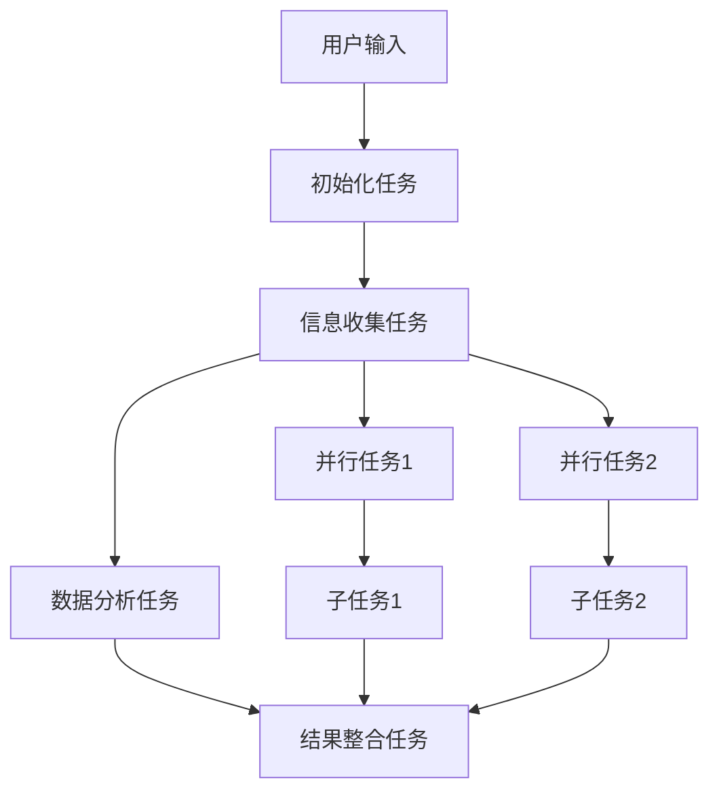

# Bluetown Core 架构设计与设计模式分析

## 目录

1. [整体架构模式](#整体架构模式)
2. [设计模式应用](#设计模式应用)
3. [DAG与工作流](#dag与工作流)
4. [状态管理模式](#状态管理模式)
5. [工具链设计](#工具链设计)
6. [扩展性设计](#扩展性设计)
7. [技术难点与解决方案](#技术难点与解决方案)

---

## 整体架构模式

### 1. 分层架构 (Layered Architecture)

```
┌─────────────────────────────────────┐
│           表现层 (Presentation)      │
│   命令行接口、配置文件、用户交互      │
├─────────────────────────────────────┤
│           业务逻辑层 (Business)      │
│   Crew编排、Agent管理、任务调度      │
├─────────────────────────────────────┤
│           服务层 (Service)          │
│   工具服务、数据服务、外部API        │
├─────────────────────────────────────┤
│           数据层 (Data)             │
│   文件存储、状态管理、配置管理        │
└─────────────────────────────────────┘
```

**设计优势**：
- **关注点分离**：每层只负责自己的职责
- **松耦合**：层与层之间通过接口交互
- **可测试性**：每层可以独立测试
- **可维护性**：修改一层不影响其他层

### 2. 微服务架构思想

虽然这是一个单体应用，但采用了微服务的设计思想：

- **Crew模块化**：每个Crew都是独立的业务单元
- **工具服务化**：每个工具都是独立的服务
- **配置驱动**：通过配置文件控制行为，无需修改代码

---

## 设计模式应用

### 1. 工厂模式 (Factory Pattern)

**应用场景**：动态创建Agent和Task

```python
# 工厂模式示例
class CompetitionAnalysisAgents:
    def _create_agent(self, name: str) -> Agent:
        # 根据配置动态创建Agent
        agent_config = self.agents_config[name]
        llm = create_crewai_llm(model_kwargs=llm_config)
        
        # 根据配置分配工具
        agent_tools = []
        for tool_name in agent_config['tools']:
            if tool_name == 'Q_space Get Tool':
                agent_tools.append(self.q_space_get_tool)
        
        return Agent(
            role=agent_config['role'],
            goal=agent_config['goal'],
            llm=llm,
            tools=agent_tools
        )
```

**优势**：
- **灵活性**：通过配置文件就能改变Agent的行为
- **可扩展性**：新增Agent类型只需修改配置
- **解耦**：Agent创建逻辑与使用逻辑分离

### 2. 策略模式 (Strategy Pattern)

**应用场景**：不同的Crew有不同的分析策略

```python
# 策略模式示例
def initialize_crews(crew_ids: List[str], brief: str):
    crews = {}
    for crew_id in crew_ids:
        if crew_id == "competition_analysis":
            # 竞品分析策略
            crew_wrapper = CompetitionAnalysisCrew(brief)
        elif crew_id == "user_research":
            # 用户研究策略
            crew_wrapper = UserResearchCrew(brief)
        
        crews[crew_id] = crew_wrapper.setup()
```

**优势**：
- **可替换性**：不同策略可以互相替换
- **扩展性**：新增策略不影响现有代码
- **维护性**：每个策略独立维护

### 3. 观察者模式 (Observer Pattern)

**应用场景**：状态变化通知

```python
# 观察者模式示例
class QSpaceManager:
    def __init__(self):
        self.observers = []
    
    def add_observer(self, observer):
        self.observers.append(observer)
    
    def notify_observers(self, change):
        for observer in self.observers:
            observer.update(change)
    
    def update_qspace(self, new_data):
        # 更新Q_space
        self.save_data(new_data)
        # 通知所有观察者
        self.notify_observers("qspace_updated")
```

### 4. 装饰器模式 (Decorator Pattern)

**应用场景**：工具包装器

```python
# 装饰器模式示例
class QSpaceWrapper(BaseTool):
    def __init__(self, crew_id: str):
        self.crew_id = crew_id  # 装饰器添加crew_id
    
    def _run(self, data: str) -> str:
        # 调用原始工具，自动注入crew_id
        return q_space_update(crew_id=self.crew_id, data=data)
```

**优势**：
- **功能扩展**：在不修改原工具的情况下添加新功能
- **职责分离**：装饰器负责上下文注入，原工具负责核心逻辑

### 5. 模板方法模式 (Template Method Pattern)

**应用场景**：任务执行流程

```python
# 模板方法模式示例
class BaseTask:
    def execute(self):
        # 模板方法定义执行流程
        self.prepare()
        self.run()
        self.cleanup()
    
    def prepare(self):
        # 子类可以重写
        pass
    
    def run(self):
        # 子类必须实现
        raise NotImplementedError
    
    def cleanup(self):
        # 子类可以重写
        pass
```

---

## DAG与工作流

### 1. 是否使用了DAG？

**答案**：部分使用了DAG的思想，但实现方式比较灵活

### 2. DAG的应用场景

#### 任务依赖关系
```yaml
# tasks.yaml 中的任务依赖
initial_setup_task:
  description: "初始化分析流程"
  agent: competition_manager

research_task:
  description: "研究竞争对手"
  agent: information_gatherer
  context: [initial_setup_task]  # 依赖初始任务

analysis_task:
  description: "分析数据"
  agent: strategic_analyst
  context: [research_task]  # 依赖研究任务
```

#### 动态任务生成
```python
# 动态生成任务依赖
def create_task_chain(self, qspace_node):
    tasks = []
    
    # 根据Q_space节点状态生成任务
    if qspace_node.status == "open":
        # 创建信息收集任务
        gather_task = self.create_gather_task(qspace_node)
        tasks.append(gather_task)
        
        # 创建分析任务，依赖收集任务
        analysis_task = self.create_analysis_task(qspace_node)
        analysis_task.context = [gather_task]
        tasks.append(analysis_task)
    
    return tasks
```

### 3. 工作流编排



---

## 状态管理模式

### 1. 状态机模式

**应用场景**：Q_space节点状态管理

```python
# 状态机模式示例
class QSpaceNode:
    def __init__(self, status="open"):
        self.status = status
        self.transitions = {
            "open": ["in_progress", "closed"],
            "in_progress": ["answered", "failed"],
            "answered": ["closed"],
            "failed": ["open", "closed"]
        }
    
    def can_transition_to(self, new_status):
        return new_status in self.transitions.get(self.status, [])
    
    def transition_to(self, new_status):
        if self.can_transition_to(new_status):
            self.status = new_status
            return True
        return False
```

### 2. 观察者模式 + 状态管理

```python
# 状态变化通知
class StateManager:
    def __init__(self):
        self.observers = []
        self.current_state = {}
    
    def update_state(self, key, value):
        old_value = self.current_state.get(key)
        self.current_state[key] = value
        
        # 通知观察者状态变化
        for observer in self.observers:
            observer.on_state_change(key, old_value, value)
```

---

## 工具链设计

### 1. 工具适配器模式

```python
# 适配器模式示例
class ToolAdapter:
    def __init__(self, original_tool, crew_id):
        self.original_tool = original_tool
        self.crew_id = crew_id
    
    def execute(self, *args, **kwargs):
        # 适配原始工具接口
        return self.original_tool(crew_id=self.crew_id, *args, **kwargs)
```

### 2. 工具链组合

```python
# 组合模式示例
class ToolChain:
    def __init__(self):
        self.tools = []
    
    def add_tool(self, tool):
        self.tools.append(tool)
    
    def execute(self, input_data):
        result = input_data
        for tool in self.tools:
            result = tool.execute(result)
        return result
```

---

## 扩展性设计

### 1. 插件化架构

```python
# 插件注册机制
class PluginManager:
    def __init__(self):
        self.plugins = {}
    
    def register_plugin(self, name, plugin):
        self.plugins[name] = plugin
    
    def get_plugin(self, name):
        return self.plugins.get(name)
    
    def execute_plugin(self, name, *args, **kwargs):
        plugin = self.get_plugin(name)
        if plugin:
            return plugin.execute(*args, **kwargs)
```

### 2. 配置驱动扩展

```yaml
# 通过配置扩展功能
new_crew:
  agents:
    - name: custom_agent
      role: "自定义角色"
      tools:
        - "自定义工具"
  tasks:
    - name: custom_task
      description: "自定义任务"
      agent: custom_agent
```

---

## 技术难点与解决方案

### 1. 动态任务生成

**难点**：如何根据Q_space动态生成任务依赖

**解决方案**：
- 使用状态机管理节点状态
- 通过观察者模式监听状态变化
- 动态构建任务依赖图

### 2. 数据隔离

**难点**：多Crew共享工具但数据需要隔离

**解决方案**：
- 使用装饰器模式包装工具
- 自动注入crew_id实现数据隔离
- 通过文件路径区分不同Crew的数据

### 3. 配置热更新

**难点**：如何在不重启的情况下更新配置

**解决方案**：
- 使用观察者模式监听配置变化
- 实现配置重载机制
- 支持动态Agent/Task创建

### 4. 错误处理与恢复

**难点**：复杂工作流中的错误处理

**解决方案**：
- 使用状态机跟踪任务状态
- 实现错误重试机制
- 提供断点续跑功能

---

## 总结

Bluetown Core 项目采用了多种设计模式和架构思想：

1. **分层架构**：清晰的职责分离
2. **微服务思想**：模块化、服务化设计
3. **设计模式**：工厂、策略、观察者、装饰器、模板方法
4. **DAG思想**：任务依赖和工作流编排
5. **状态管理**：状态机模式管理复杂状态
6. **插件化**：支持动态扩展

这些设计使得项目具有：
- **高可扩展性**：新功能可以轻松集成
- **高可维护性**：代码结构清晰，易于理解
- **高可测试性**：各组件可以独立测试
- **高灵活性**：通过配置就能改变系统行为

这种架构设计为复杂的AI应用提供了良好的基础，既保证了系统的稳定性，又提供了足够的灵活性来应对不断变化的需求。 