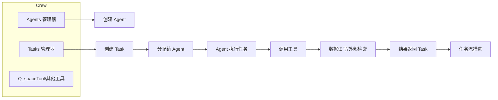
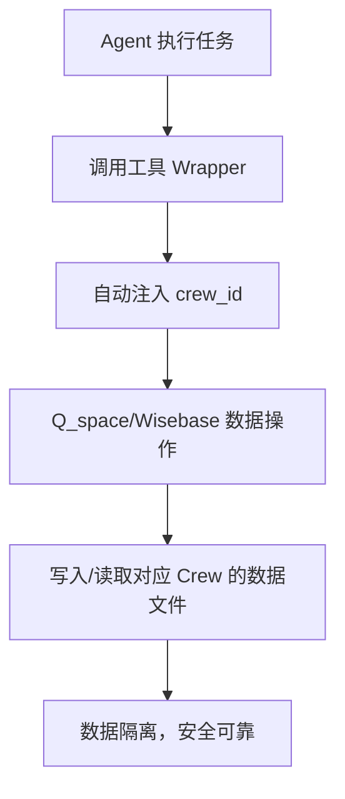

---

# Bluetown Core 源码深度解析

## 1. 主流程概览

### 1.1 dispatcher.py（主调度器）

- 入口文件，负责：
  1. 解析命令行参数（如 brief、config 路径等）
  2. 根据 brief 内容确定需要启动哪些 Crew（部门/分析模块）
  3. 初始化并配置各 Crew
  4. 启动分析流程，整合输出结果

#### 主要函数
- `parse_args()`：解析命令行参数
- `determine_crews(brief)`：根据 brief 内容决定需要哪些 Crew
- `initialize_crews(crew_ids, brief)`：实例化并配置 Crew
- `run_analysis(crews)`：执行分析流程
- `integrate_results(results)`：整合分析结果
- `main()`：主入口，串联上述流程

---

## 2. Crew 及其核心模块

### 2.1 CompetitionAnalysisCrew（竞品分析 Crew）

- 负责竞品分析任务的整体编排
- 初始化时会：
  - 实例化 Q_spaceTool（知识空间工具）
  - 实例化 Agents 管理器（加载 agents.yaml 配置，创建各类智能体）
  - 实例化 Tasks 管理器（加载 tasks.yaml 配置，创建任务流）

#### 关键方法
- `__init__(self, brief)`：接收用户简报，初始化工具和管理器
- `setup(self)`：组装 Crew，配置 Agents、Tasks、流程等

---

### 2.2 Agents 智能体体系

- 每个 Agent 代表一个分析角色（如经理、信息收集者、策略分析师）
- Agent 通过配置文件（agents.yaml）灵活定义
- 支持为 Agent 注入不同的工具（如 Q_space、Wisebase、Jina 检索等）

#### 关键类与方法
- `CompetitionAnalysisAgents`：加载配置，管理所有 Agent
- `_create_agent(name)`：根据配置创建 Agent 实例
- `competition_manager()`、`information_gatherer()`、`strategic_analyst()`：返回具体角色的 Agent

---

### 2.3 Tasks 任务流体系

- 每个 Task 代表分析流程中的一个步骤
- 任务通过配置文件（tasks.yaml）灵活定义
- 支持任务依赖、上下文注入、动态参数

#### 关键类与方法
- `CompetitionAnalysisTasks`：加载配置，管理所有 Task
- `_create_task(name, context, inputs)`：根据配置创建 Task 实例
- `initial_setup_task(brief)`：创建初始任务，注入用户简报

---

## 3. 数据流与工具调用

- Agent 在执行 Task 时，会调用各类工具（如知识库读写、外部检索等）
- 工具通过 Wrapper 封装，自动注入 crew_id 等上下文
- 任务执行结果可写入 Q_space、Wisebase 等，实现数据持久化与复用

---

## 4. 主流程源码流程图

```mermaid
flowchart TD
    A[用户输入 brief]
    B[dispatcher.py 解析参数]
    C[determine_crews 确定需要的 Crew]
    D[initialize_crews 实例化 Crew]
    E[CompetitionAnalysisCrew 初始化]
    F1[实例化 Q_spaceTool]
    F2[实例化 Agents 管理器]
    F3[实例化 Tasks 管理器]
    G1[加载 agents.yaml 配置]
    G2[创建各类 Agent]
    H1[加载 tasks.yaml 配置]
    H2[创建初始 Task]
    I[setup() 组装 Crew]
    J[返回 Crew 实例]
    K[run_analysis 执行分析流程]
    L[Agent 执行任务，调用工具]
    M[写入/读取 Q_space、Wisebase 等数据]
    N[分析结果整合]
    O[输出最终结果]

    A --> B
    B --> C
    C --> D
    D --> E
    E --> F1
    E --> F2
    E --> F3
    F2 --> G1
    F2 --> G2
    F3 --> H1
    F3 --> H2
    D --> I
    I --> J
    J --> K
    K --> L
    L --> M
    K --> N
    N --> O
```

---

## 5. 代码细节通俗解读

### dispatcher.py
- 通过 argparse 解析命令行参数，支持自定义 brief、配置文件路径、debug 模式等
- determine_crews 目前硬编码只启动竞品分析（后续可扩展为 LLM 动态决策）
- initialize_crews 会根据 crew_id 实例化对应 Crew，并调用其 setup 方法
- run_analysis 负责实际的分析流程（未展开，通常会遍历 Crew 执行 kickoff 等）

### crew.py
- CompetitionAnalysisCrew 负责组装竞品分析的所有资源
- setup 方法会将所有 Agent、Task、流程组装成 CrewAI 框架的 Crew 实例
- 支持灵活扩展 Agent、Task，便于后续业务拓展

### agents.py
- CompetitionAnalysisAgents 负责加载 agents.yaml 配置，动态创建各类 Agent
- 支持为 Agent 注入多种工具（如知识库、检索、写入等）
- Agent 的角色、目标、工具、LLM 参数均可配置，极大提升灵活性

### tasks.py
- CompetitionAnalysisTasks 负责加载 tasks.yaml 配置，动态创建任务流
- 支持任务依赖、上下文注入、动态参数格式化
- 任务与 Agent 解耦，便于复用和扩展

---

## 6. 总结

本项目采用高度模块化、配置驱动的设计，主流程清晰，易于扩展。每个核心环节（调度、Agent、Task、工具）都可独立演进，适合复杂的智能分析与自动化场景。流程图直观展示了数据与控制流，有助于新成员快速理解和上手。

如需进一步分析某个具体模块、工具或配置文件，请随时告知！

---

# 深入分析：技术难点与核心逻辑

## 一、技术难点剖析

### 1. 高度模块化与解耦
- **难点**：如何让各个 Crew、Agent、Task、工具之间既能灵活组合，又能独立演进。
- **实现**：通过配置驱动（YAML），所有角色、任务、工具都可热插拔，主流程只需关注 orchestrate（编排），极大提升了可维护性和扩展性。

### 2. 动态任务与智能体编排
- **难点**：任务和 Agent 不是写死的，而是根据配置和输入动态生成，支持复杂依赖和上下文传递。
- **实现**：
  - Agents/Tasks 管理器根据 YAML 配置动态实例化对象。
  - 支持任务依赖（context）、参数注入（inputs），实现灵活的任务流。

### 3. 工具链自动注入与上下文隔离
- **难点**：同一工具（如知识库）要服务于不同 Crew，且需自动注入 crew_id 等上下文，避免数据串扰。
- **实现**：所有工具通过 Wrapper 封装，自动注入 crew_id，保证数据隔离和安全。

### 4. 配置驱动的可扩展性
- **难点**：如何让新业务、新角色、新任务无需改动主流程即可集成。
- **实现**：只需新增/修改 YAML 配置和对应实现类，主流程自动识别和加载。

### 5. 任务执行与数据持久化
- **难点**：任务执行结果需持久化到 Q_space、Wisebase 等，支持断点续跑和结果追溯。
- **实现**：所有数据操作通过工具层封装，支持 JSON/YAML 多格式，便于与外部系统对接。

### 6. 日志与异常处理
- **难点**：多层调用下如何追踪问题、定位异常。
- **实现**：统一日志封装，详细记录每一步操作和异常，结合 state/ 结果文件，便于调试。


## 二、核心逻辑流程图

### 1. 主流程逻辑
```mermaid
flowchart TD
    A[用户输入 brief]
    B[dispatcher.py 解析参数]
    C[determine_crews 确定需要的 Crew]
    D[initialize_crews 实例化 Crew]
    E[CompetitionAnalysisCrew 初始化]
    F1[实例化 Q_spaceTool]
    F2[实例化 Agents 管理器]
    F3[实例化 Tasks 管理器]
    G1[加载 agents.yaml 配置]
    G2[创建各类 Agent]
    H1[加载 tasks.yaml 配置]
    H2[创建初始 Task]
    I[setup() 组装 Crew]
    J[返回 Crew 实例]
    K[run_analysis 执行分析流程]
    L[Agent 执行任务，调用工具]
    M[写入/读取 Q_space、Wisebase 等数据]
    N[分析结果整合]
    O[输出最终结果]

    A --> B
    B --> C
    C --> D
    D --> E
    E --> F1
    E --> F2
    E --> F3
    F2 --> G1
    F2 --> G2
    F3 --> H1
    F3 --> H2
    D --> I
    I --> J
    J --> K
    K --> L
    L --> M
    K --> N
    N --> O
```

### 2. Agent/Task/工具协作逻辑


### 3. 数据流与隔离



## 三、总结与建议

- 本项目通过高度模块化、配置驱动、工具自动注入等设计，有效解决了多业务、多角色、多任务的复杂编排难题。
- 技术难点主要集中在动态编排、上下文隔离、数据持久化和可扩展性。
- 推荐持续完善单元测试、自动化文档、异常处理和性能优化，进一步提升项目健壮性和团队协作效率。

如需针对某一模块、工具或配置文件做更细致的源码解读，请随时提出！
