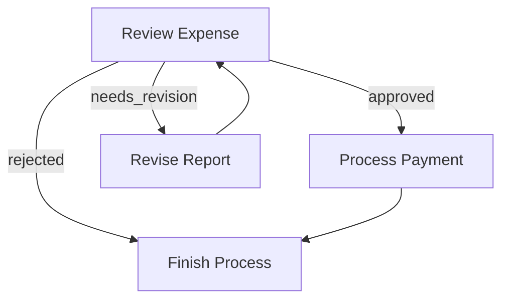
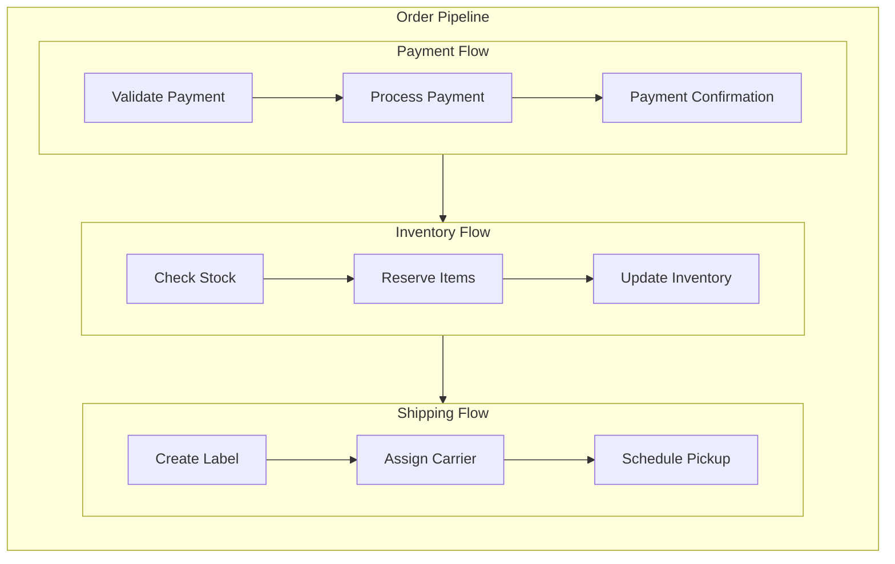
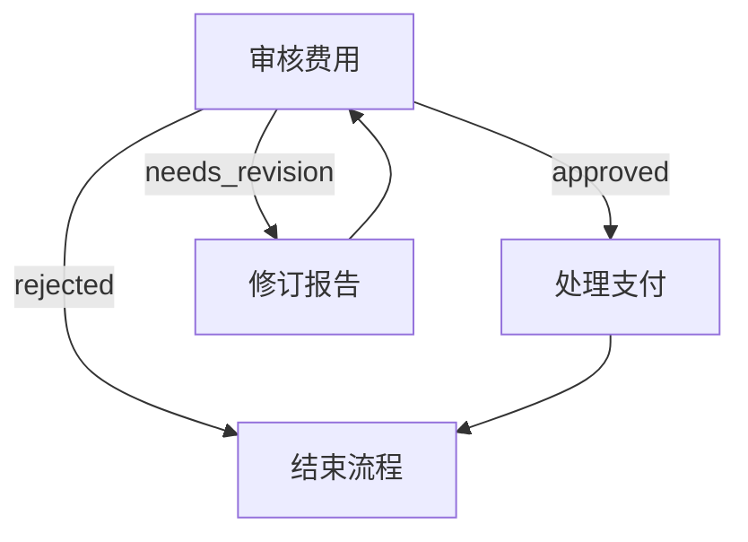
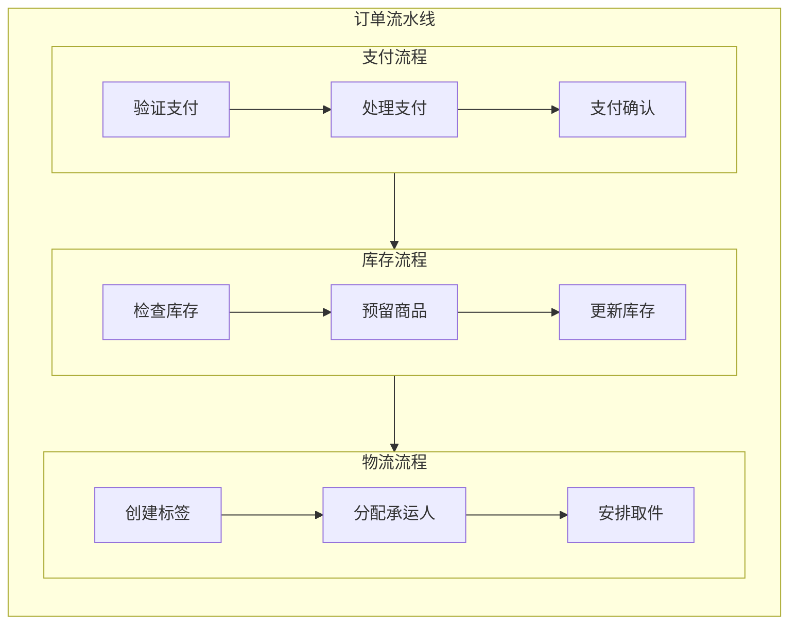

# TOT

Q_space使用json/yaml格式构建一个动态的树状问题模型，每个节点代表一个思考点或者自问题，图谱式推理。不是简单的线性任务，可以在树的不同的分支间条约的

动态演化：树结构会根据新的发现的信息动态扩展和调整

主问题，子问题。假设。概念定义，潜在因素，数据点分类，

多agent协作的tot探索

多个agent协作来探索TPT的不同分支，ManagerAgent作为TPT的导航员。解析当前的Qspace的解雇，识别当前需要探索的节点，讲抽象问题转换成为具体的任务，动态扩展问题树

执行agent，负责具体的探索tpt的叶子节点

information gather:搜索信息

strategic。analyst:分析推理

知识状态和思考树的双向反馈

wisebase作为知识库

q_space思考树，生成任务，agent执行，更新qspace的状态，发现新的问题。扩展思考树

tot的动态调整机制，manager agent会持续，读取当前的思考树的状态，识别可行动的节点。基于新的信息调整树的结构，处理节点间的冲突。扩展新的思考分支


多部门的并行的tot的探索

项目支持多个部门的crew的同时运行各自的tot的

竞争分析部门：构建竞争格局的思考树

用户研究部门：构建用户需求的思考树

场景挖掘部门：构建应用场景的思考树

各个部门的思考树通过共享的wisebase进行信息的交换的

结构化思维，动态演化，多角度探索，多个agent并行探索不同的分支，状态管理，每个思考节点都有明确的状态，知识整合，通过wisebase实现思考结构的结构化的存储，协作推理，多个部门的思考树香湖协作的

分解-》探索-〉整合


语义是容易混淆的，同样的一个观点，在不同的问题与下的预警下可能有不同的含义，多一字少一字都会造成信息的偏差，不希望幻觉被层层放大


wisebase作为信息缓冲期，结合明确的信息分类和同步机制，有助于避免未经清洗的寓意直接影响部门内容的运作

信息和结论需要在不同的部门流通

每个部门都有自己的wisebase，跨部门交互实际上是这些知识状态存储，在香湖沟通的

通过跨部门的信息同步功能，一个部门可以查询其他的部门的wisebase并且从中提取对自己的部门问题与有帮助的信息，

通过 **跨部门信息同步** 功能，一个部门可以查询其他部门的 `Wisebase`，并从中提取对自己部门问题域有帮助的信息（同样保留facts、points等类别）。
相应的 **任务规划与生成** 功能会负责根据 `Wisebase` 的变化（包括从其他部门同步来的信息），来调整 `Q_space` 中的任务。

工作流程：

用户输入brief,有多个部门，例如竞争分析部门，用户体验研究部门，每个部门包括功能层和执行层，每个都有一系列的agent或者模块组件，wiasebase知识状态和q_space任务状态通过条件触发器来出发执行的

输入处理和结构化的：出发条件：接收到用户输入的brief或者外部信息

功能：解析出发，提取意图和关键信息进行寓意的清晰，

讲结构化信息添加为wiasebase的厨师条目

知识状态的管理

接收到来自执行层的结果或者新的信息的输入

对信息进行分类fact，hypothesis，points验证更新wiasebase的内容的

状态影响：维护wiasebase的动态变化，反应当前的认知的状态的


任务规划的生成

出发条件wiase的状态发生显著变化或者大道的规划的预知

基于wiase的信息，生成或者冬瓜汤的题总额好难过qpase明确任务层级内容输出定义和执行者的分配的，


wisebase

用户输入brief后管理功能的输入处理和结构化模块会根据brief拆解细腻构建出事的wisebase，需要考虑用户意图部门的智能执行者的能力等等

每个部门都有自己的wiasebase作为核心的知识状态的存储，并且是动态变化的，

wiasebase的类型，facts式是累的信息确凿的

hypotheissi假设需要求证的

points观点和洞见，灭法实际证明的但是make sense

问题余的：

根据wisebase的状态，管理功能的任务规划和生成的，模块会生成并且动态维护一个问题余作为核心的任务状态的，讲明确问题的要素喝酒科举路径相当于问题建模

问题建模的意义在于先搞清楚本质是什么，需要一步步弄清楚的影响因素有哪些，就行求解数学问题一样的


启动-配置加载-breif分析，crew选择，初始化，执行，结果整合的

默认启动竞争分析部门，如果bref当中包含用户或者需求关键词需要额外启动user_research用户研究部门

初始化qpase，创建wiasebase的工具，初始化agents，
任务分解，manage将问题树节点转化成为具体的任务，agent执行信息搜集元和策略分析师执行具体的任务，知识更新，执行结果写入wiasebase，迭代更新，根据新的知识调整qpase，生成新的任务

用户brief->dispatcher->crew选择-》初始化

manager agent-〉qpase构建-》任务分解

执行agents-〉工具调用0》wiasebase更新

状态反馈-。qpase调整，新任务生成

crewq,agents,tasks,prcoess,manager,vernose层级化的任务分配，任务执行和状态管理，agent间的通信和协调

pydantic数据验证，nest-asynciio异步支持，

node+flow+shaored store 

node+flow+sthared store

共享存储的模式

pocketflow
q-space问题状态的功效存储，

wiasebase：跨aegnt的知识共享存储

---
description: pocketflow
globs: 
alwaysApply: false
---
---
layout: default
title: "Agentic Coding"
---

# Agentic Coding: Humans Design, Agents code!

> If you are an AI agents involved in building LLM Systems, read this guide **VERY, VERY** carefully! This is the most important chapter in the entire document. Throughout development, you should always (1) start with a small and simple solution, (2) design at a high level (`docs/design.md`) before implementation, and (3) frequently ask humans for feedback and clarification.
{: .warning }

## Agentic Coding Steps

Agentic Coding should be a collaboration between Human System Design and Agent Implementation:

| Steps                  | Human      | AI        | Comment                                                                 |
|:-----------------------|:----------:|:---------:|:------------------------------------------------------------------------|
| 1. Requirements | ★★★ High  | ★☆☆ Low   | Humans understand the requirements and context.                    |
| 2. Flow          | ★★☆ Medium | ★★☆ Medium |  Humans specify the high-level design, and the AI fills in the details. |
| 3. Utilities   | ★★☆ Medium | ★★☆ Medium | Humans provide available external APIs and integrations, and the AI helps with implementation. |
| 4. Node          | ★☆☆ Low   | ★★★ High  | The AI helps design the node types and data handling based on the flow.          |
| 5. Implementation      | ★☆☆ Low   | ★★★ High  |  The AI implements the flow based on the design. |
| 6. Optimization        | ★★☆ Medium | ★★☆ Medium | Humans evaluate the results, and the AI helps optimize. |
| 7. Reliability         | ★☆☆ Low   | ★★★ High  |  The AI writes test cases and addresses corner cases.     |

1. **Requirements**: Clarify the requirements for your project, and evaluate whether an AI system is a good fit. 
    - Understand AI systems' strengths and limitations:
      - **Good for**: Routine tasks requiring common sense (filling forms, replying to emails)
      - **Good for**: Creative tasks with well-defined inputs (building slides, writing SQL)
      - **Not good for**: Ambiguous problems requiring complex decision-making (business strategy, startup planning)
    - **Keep It User-Centric:** Explain the "problem" from the user's perspective rather than just listing features.
    - **Balance complexity vs. impact**: Aim to deliver the highest value features with minimal complexity early.

2. **Flow Design**: Outline at a high level, describe how your AI system orchestrates nodes.
    - Identify applicable design patterns (e.g., [Map Reduce](mdc:design_pattern/mapreduce.md), [Agent](mdc:design_pattern/agent.md), [RAG](mdc:design_pattern/rag.md)).
      - For each node in the flow, start with a high-level one-line description of what it does.
      - If using **Map Reduce**, specify how to map (what to split) and how to reduce (how to combine).
      - If using **Agent**, specify what are the inputs (context) and what are the possible actions.
      - If using **RAG**, specify what to embed, noting that there's usually both offline (indexing) and online (retrieval) workflows.
    - Outline the flow and draw it in a mermaid diagram. For example:
      ```mermaid
      flowchart LR
          start[Start] --> batch[Batch]
          batch --> check[Check]
          check -->|OK| process
          check -->|Error| fix[Fix]
          fix --> check
          
          subgraph process[Process]
            step1[Step 1] --> step2[Step 2]
          end
          
          process --> endNode[End]
      ```
    - > **If Humans can't specify the flow, AI Agents can't automate it!** Before building an LLM system, thoroughly understand the problem and potential solution by manually solving example inputs to develop intuition.  
      {: .best-practice }

3. **Utilities**: Based on the Flow Design, identify and implement necessary utility functions.
    - Think of your AI system as the brain. It needs a body—these *external utility functions*—to interact with the real world:
        <div align="center"></div>

        - Reading inputs (e.g., retrieving Slack messages, reading emails)
        - Writing outputs (e.g., generating reports, sending emails)
        - Using external tools (e.g., calling LLMs, searching the web)
        - **NOTE**: *LLM-based tasks* (e.g., summarizing text, analyzing sentiment) are **NOT** utility functions; rather, they are *core functions* internal in the AI system.
    - For each utility function, implement it and write a simple test.
    - Document their input/output, as well as why they are necessary. For example:
      - `name`: `get_embedding` (`utils/get_embedding.py`)
      - `input`: `str`
      - `output`: a vector of 3072 floats
      - `necessity`: Used by the second node to embed text
    - Example utility implementation:
      ```python
      # utils/call_llm.py
      from openai import OpenAI

      def call_llm(prompt):    
          client = OpenAI(api_key="YOUR_API_KEY_HERE")
          r = client.chat.completions.create(
              model="gpt-4o",
              messages=[{"role": "user", "content": prompt}]
          )
          return r.choices[0].message.content
          
      if __name__ == "__main__":
          prompt = "What is the meaning of life?"
          print(call_llm(prompt))
      ```
    - > **Sometimes, design Utilies before Flow:**  For example, for an LLM project to automate a legacy system, the bottleneck will likely be the available interface to that system. Start by designing the hardest utilities for interfacing, and then build the flow around them.
      {: .best-practice }

4. **Node Design**: Plan how each node will read and write data, and use utility functions.
   - One core design principle for PocketFlow is to use a [shared store](mdc:core_abstraction/communication.md), so start with a shared store design:
      - For simple systems, use an in-memory dictionary.
      - For more complex systems or when persistence is required, use a database.
      - **Don't Repeat Yourself**: Use in-memory references or foreign keys.
      - Example shared store design:
        ```python
        shared = {
            "user": {
                "id": "user123",
                "context": {                # Another nested dict
                    "weather": {"temp": 72, "condition": "sunny"},
                    "location": "San Francisco"
                }
            },
            "results": {}                   # Empty dict to store outputs
        }
        ```
   - For each [Node](mdc:core_abstraction/node.md), describe its type, how it reads and writes data, and which utility function it uses. Keep it specific but high-level without codes. For example:
     - `type`: Regular (or Batch, or Async)
     - `prep`: Read "text" from the shared store
     - `exec`: Call the embedding utility function
     - `post`: Write "embedding" to the shared store

5. **Implementation**: Implement the initial nodes and flows based on the design.
   - 🎉 If you've reached this step, humans have finished the design. Now *Agentic Coding* begins!
   - **"Keep it simple, stupid!"** Avoid complex features and full-scale type checking.
   - **FAIL FAST**! Avoid `try` logic so you can quickly identify any weak points in the system.
   - Add logging throughout the code to facilitate debugging.

7. **Optimization**:
   - **Use Intuition**: For a quick initial evaluation, human intuition is often a good start.
   - **Redesign Flow (Back to Step 3)**: Consider breaking down tasks further, introducing agentic decisions, or better managing input contexts.
   - If your flow design is already solid, move on to micro-optimizations:
     - **Prompt Engineering**: Use clear, specific instructions with examples to reduce ambiguity.
     - **In-Context Learning**: Provide robust examples for tasks that are difficult to specify with instructions alone.

   - > **You'll likely iterate a lot!** Expect to repeat Steps 3–6 hundreds of times.
     >
     > <div align="center"></div>
     {: .best-practice }

8. **Reliability**  
   - **Node Retries**: Add checks in the node `exec` to ensure outputs meet requirements, and consider increasing `max_retries` and `wait` times.
   - **Logging and Visualization**: Maintain logs of all attempts and visualize node results for easier debugging.
   - **Self-Evaluation**: Add a separate node (powered by an LLM) to review outputs when results are uncertain.

## Example LLM Project File Structure

```
my_project/
├── main.py
├── nodes.py
├── flow.py
├── utils/
│   ├── __init__.py
│   ├── call_llm.py
│   └── search_web.py
├── requirements.txt
└── docs/
    └── design.md
```

- **`docs/design.md`**: Contains project documentation for each step above. This should be *high-level* and *no-code*.
- **`utils/`**: Contains all utility functions.
  - It's recommended to dedicate one Python file to each API call, for example `call_llm.py` or `search_web.py`.
  - Each file should also include a `main()` function to try that API call
- **`nodes.py`**: Contains all the node definitions.
  ```python
  # nodes.py
  from pocketflow import Node
  from utils.call_llm import call_llm

  class GetQuestionNode(Node):
      def exec(self, _):
          # Get question directly from user input
          user_question = input("Enter your question: ")
          return user_question
      
      def post(self, shared, prep_res, exec_res):
          # Store the user's question
          shared["question"] = exec_res
          return "default"  # Go to the next node

  class AnswerNode(Node):
      def prep(self, shared):
          # Read question from shared
          return shared["question"]
      
      def exec(self, question):
          # Call LLM to get the answer
          return call_llm(question)
      
      def post(self, shared, prep_res, exec_res):
          # Store the answer in shared
          shared["answer"] = exec_res
  ```
- **`flow.py`**: Implements functions that create flows by importing node definitions and connecting them.
  ```python
  # flow.py
  from pocketflow import Flow
  from nodes import GetQuestionNode, AnswerNode

  def create_qa_flow():
      """Create and return a question-answering flow."""
      # Create nodes
      get_question_node = GetQuestionNode()
      answer_node = AnswerNode()
      
      # Connect nodes in sequence
      get_question_node >> answer_node
      
      # Create flow starting with input node
      return Flow(start=get_question_node)
  ```
- **`main.py`**: Serves as the project's entry point.
  ```python
  # main.py
  from flow import create_qa_flow

  # Example main function
  # Please replace this with your own main function
  def main():
      shared = {
          "question": None,  # Will be populated by GetQuestionNode from user input
          "answer": None     # Will be populated by AnswerNode
      }

      # Create the flow and run it
      qa_flow = create_qa_flow()
      qa_flow.run(shared)
      print(f"Question: {shared['question']}")
      print(f"Answer: {shared['answer']}")

  if __name__ == "__main__":
      main()
  ```

================================================
File: docs/index.md
================================================
---
layout: default
title: "Home"
nav_order: 1
---

# Pocket Flow

A [100-line](mdc:https:/github.com/the-pocket/PocketFlow/blob/main/pocketflow/__init__.py) minimalist LLM framework for *Agents, Task Decomposition, RAG, etc*.

- **Lightweight**: Just the core graph abstraction in 100 lines. ZERO dependencies, and vendor lock-in.
- **Expressive**: Everything you love from larger frameworks—([Multi-](mdc:design_pattern/multi_agent.html))[Agents](mdc:design_pattern/agent.html), [Workflow](mdc:design_pattern/workflow.html), [RAG](mdc:design_pattern/rag.html), and more.  
- **Agentic-Coding**: Intuitive enough for AI agents to help humans build complex LLM applications.

<div align="center">
  
</div>

## Core Abstraction

We model the LLM workflow as a **Graph + Shared Store**:

- [Node](mdc:core_abstraction/node.md) handles simple (LLM) tasks.
- [Flow](mdc:core_abstraction/flow.md) connects nodes through **Actions** (labeled edges).
- [Shared Store](mdc:core_abstraction/communication.md) enables communication between nodes within flows.
- [Batch](mdc:core_abstraction/batch.md) nodes/flows allow for data-intensive tasks.
- [Async](mdc:core_abstraction/async.md) nodes/flows allow waiting for asynchronous tasks.
- [(Advanced) Parallel](mdc:core_abstraction/parallel.md) nodes/flows handle I/O-bound tasks.

<div align="center">
  
</div>

## Design Pattern

From there, it’s easy to implement popular design patterns:

- [Agent](mdc:design_pattern/agent.md) autonomously makes decisions.
- [Workflow](mdc:design_pattern/workflow.md) chains multiple tasks into pipelines.
- [RAG](mdc:design_pattern/rag.md) integrates data retrieval with generation.
- [Map Reduce](mdc:design_pattern/mapreduce.md) splits data tasks into Map and Reduce steps.
- [Structured Output](mdc:design_pattern/structure.md) formats outputs consistently.
- [(Advanced) Multi-Agents](mdc:design_pattern/multi_agent.md) coordinate multiple agents.

<div align="center">
  
</div>

## Utility Function

We **do not** provide built-in utilities. Instead, we offer *examples*—please *implement your own*:

- [LLM Wrapper](mdc:utility_function/llm.md)
- [Viz and Debug](mdc:utility_function/viz.md)
- [Web Search](mdc:utility_function/websearch.md)
- [Chunking](mdc:utility_function/chunking.md)
- [Embedding](mdc:utility_function/embedding.md)
- [Vector Databases](mdc:utility_function/vector.md)
- [Text-to-Speech](mdc:utility_function/text_to_speech.md)

**Why not built-in?**: I believe it's a *bad practice* for vendor-specific APIs in a general framework:
- *API Volatility*: Frequent changes lead to heavy maintenance for hardcoded APIs.
- *Flexibility*: You may want to switch vendors, use fine-tuned models, or run them locally.
- *Optimizations*: Prompt caching, batching, and streaming are easier without vendor lock-in.

## Ready to build your Apps? 

Check out [Agentic Coding Guidance](mdc:guide.md), the fastest way to develop LLM projects with Pocket Flow!

================================================
File: docs/core_abstraction/async.md
================================================
---
layout: default
title: "(Advanced) Async"
parent: "Core Abstraction"
nav_order: 5
---

# (Advanced) Async

**Async** Nodes implement `prep_async()`, `exec_async()`, `exec_fallback_async()`, and/or `post_async()`. This is useful for:

1. **prep_async()**: For *fetching/reading data (files, APIs, DB)* in an I/O-friendly way.
2. **exec_async()**: Typically used for async LLM calls.
3. **post_async()**: For *awaiting user feedback*, *coordinating across multi-agents* or any additional async steps after `exec_async()`.

**Note**: `AsyncNode` must be wrapped in `AsyncFlow`. `AsyncFlow` can also include regular (sync) nodes.

### Example

```python
class SummarizeThenVerify(AsyncNode):
    async def prep_async(self, shared):
        # Example: read a file asynchronously
        doc_text = await read_file_async(shared["doc_path"])
        return doc_text

    async def exec_async(self, prep_res):
        # Example: async LLM call
        summary = await call_llm_async(f"Summarize: {prep_res}")
        return summary

    async def post_async(self, shared, prep_res, exec_res):
        # Example: wait for user feedback
        decision = await gather_user_feedback(exec_res)
        if decision == "approve":
            shared["summary"] = exec_res
            return "approve"
        return "deny"

summarize_node = SummarizeThenVerify()
final_node = Finalize()

# Define transitions
summarize_node - "approve" >> final_node
summarize_node - "deny"    >> summarize_node  # retry

flow = AsyncFlow(start=summarize_node)

async def main():
    shared = {"doc_path": "document.txt"}
    await flow.run_async(shared)
    print("Final Summary:", shared.get("summary"))

asyncio.run(main())
```

================================================
File: docs/core_abstraction/batch.md
================================================
---
layout: default
title: "Batch"
parent: "Core Abstraction"
nav_order: 4
---

# Batch

**Batch** makes it easier to handle large inputs in one Node or **rerun** a Flow multiple times. Example use cases:
- **Chunk-based** processing (e.g., splitting large texts).
- **Iterative** processing over lists of input items (e.g., user queries, files, URLs).

## 1. BatchNode

A **BatchNode** extends `Node` but changes `prep()` and `exec()`:

- **`prep(shared)`**: returns an **iterable** (e.g., list, generator).
- **`exec(item)`**: called **once** per item in that iterable.
- **`post(shared, prep_res, exec_res_list)`**: after all items are processed, receives a **list** of results (`exec_res_list`) and returns an **Action**.


### Example: Summarize a Large File

```python
class MapSummaries(BatchNode):
    def prep(self, shared):
        # Suppose we have a big file; chunk it
        content = shared["data"]
        chunk_size = 10000
        chunks = [content[i:i+chunk_size] for i in range(0, len(content), chunk_size)]
        return chunks

    def exec(self, chunk):
        prompt = f"Summarize this chunk in 10 words: {chunk}"
        summary = call_llm(prompt)
        return summary

    def post(self, shared, prep_res, exec_res_list):
        combined = "\n".join(exec_res_list)
        shared["summary"] = combined
        return "default"

map_summaries = MapSummaries()
flow = Flow(start=map_summaries)
flow.run(shared)
```

---

## 2. BatchFlow

A **BatchFlow** runs a **Flow** multiple times, each time with different `params`. Think of it as a loop that replays the Flow for each parameter set.

### Example: Summarize Many Files

```python
class SummarizeAllFiles(BatchFlow):
    def prep(self, shared):
        # Return a list of param dicts (one per file)
        filenames = list(shared["data"].keys())  # e.g., ["file1.txt", "file2.txt", ...]
        return [{"filename": fn} for fn in filenames]

# Suppose we have a per-file Flow (e.g., load_file >> summarize >> reduce):
summarize_file = SummarizeFile(start=load_file)

# Wrap that flow into a BatchFlow:
summarize_all_files = SummarizeAllFiles(start=summarize_file)
summarize_all_files.run(shared)
```

### Under the Hood
1. `prep(shared)` returns a list of param dicts—e.g., `[{filename: "file1.txt"}, {filename: "file2.txt"}, ...]`.
2. The **BatchFlow** loops through each dict. For each one:
   - It merges the dict with the BatchFlow’s own `params`.
   - It calls `flow.run(shared)` using the merged result.
3. This means the sub-Flow is run **repeatedly**, once for every param dict.

---

## 3. Nested or Multi-Level Batches

You can nest a **BatchFlow** in another **BatchFlow**. For instance:
- **Outer** batch: returns a list of diretory param dicts (e.g., `{"directory": "/pathA"}`, `{"directory": "/pathB"}`, ...).
- **Inner** batch: returning a list of per-file param dicts.

At each level, **BatchFlow** merges its own param dict with the parent’s. By the time you reach the **innermost** node, the final `params` is the merged result of **all** parents in the chain. This way, a nested structure can keep track of the entire context (e.g., directory + file name) at once.

```python

class FileBatchFlow(BatchFlow):
    def prep(self, shared):
        directory = self.params["directory"]
        # e.g., files = ["file1.txt", "file2.txt", ...]
        files = [f for f in os.listdir(directory) if f.endswith(".txt")]
        return [{"filename": f} for f in files]

class DirectoryBatchFlow(BatchFlow):
    def prep(self, shared):
        directories = [ "/path/to/dirA", "/path/to/dirB"]
        return [{"directory": d} for d in directories]

# MapSummaries have params like {"directory": "/path/to/dirA", "filename": "file1.txt"}
inner_flow = FileBatchFlow(start=MapSummaries())
outer_flow = DirectoryBatchFlow(start=inner_flow)
```

================================================
File: docs/core_abstraction/communication.md
================================================
---
layout: default
title: "Communication"
parent: "Core Abstraction"
nav_order: 3
---

# Communication

Nodes and Flows **communicate** in 2 ways:

1. **Shared Store (for almost all the cases)** 

   - A global data structure (often an in-mem dict) that all nodes can read ( `prep()`) and write (`post()`).  
   - Great for data results, large content, or anything multiple nodes need.
   - You shall design the data structure and populate it ahead.
     
   - > **Separation of Concerns:** Use `Shared Store` for almost all cases to separate *Data Schema* from *Compute Logic*!  This approach is both flexible and easy to manage, resulting in more maintainable code. `Params` is more a syntax sugar for [Batch](mdc:batch.md).
     {: .best-practice }

2. **Params (only for [Batch](mdc:batch.md))** 
   - Each node has a local, ephemeral `params` dict passed in by the **parent Flow**, used as an identifier for tasks. Parameter keys and values shall be **immutable**.
   - Good for identifiers like filenames or numeric IDs, in Batch mode.

If you know memory management, think of the **Shared Store** like a **heap** (shared by all function calls), and **Params** like a **stack** (assigned by the caller).

---

## 1. Shared Store

### Overview

A shared store is typically an in-mem dictionary, like:
```python
shared = {"data": {}, "summary": {}, "config": {...}, ...}
```

It can also contain local file handlers, DB connections, or a combination for persistence. We recommend deciding the data structure or DB schema first based on your app requirements.

### Example

```python
class LoadData(Node):
    def post(self, shared, prep_res, exec_res):
        # We write data to shared store
        shared["data"] = "Some text content"
        return None

class Summarize(Node):
    def prep(self, shared):
        # We read data from shared store
        return shared["data"]

    def exec(self, prep_res):
        # Call LLM to summarize
        prompt = f"Summarize: {prep_res}"
        summary = call_llm(prompt)
        return summary

    def post(self, shared, prep_res, exec_res):
        # We write summary to shared store
        shared["summary"] = exec_res
        return "default"

load_data = LoadData()
summarize = Summarize()
load_data >> summarize
flow = Flow(start=load_data)

shared = {}
flow.run(shared)
```

Here:
- `LoadData` writes to `shared["data"]`.
- `Summarize` reads from `shared["data"]`, summarizes, and writes to `shared["summary"]`.

---

## 2. Params

**Params** let you store *per-Node* or *per-Flow* config that doesn't need to live in the shared store. They are:
- **Immutable** during a Node's run cycle (i.e., they don't change mid-`prep->exec->post`).
- **Set** via `set_params()`.
- **Cleared** and updated each time a parent Flow calls it.

> Only set the uppermost Flow params because others will be overwritten by the parent Flow. 
> 
> If you need to set child node params, see [Batch](mdc:batch.md).
{: .warning }

Typically, **Params** are identifiers (e.g., file name, page number). Use them to fetch the task you assigned or write to a specific part of the shared store.

### Example

```python
# 1) Create a Node that uses params
class SummarizeFile(Node):
    def prep(self, shared):
        # Access the node's param
        filename = self.params["filename"]
        return shared["data"].get(filename, "")

    def exec(self, prep_res):
        prompt = f"Summarize: {prep_res}"
        return call_llm(prompt)

    def post(self, shared, prep_res, exec_res):
        filename = self.params["filename"]
        shared["summary"][filename] = exec_res
        return "default"

# 2) Set params
node = SummarizeFile()

# 3) Set Node params directly (for testing)
node.set_params({"filename": "doc1.txt"})
node.run(shared)

# 4) Create Flow
flow = Flow(start=node)

# 5) Set Flow params (overwrites node params)
flow.set_params({"filename": "doc2.txt"})
flow.run(shared)  # The node summarizes doc2, not doc1
```

================================================
File: docs/core_abstraction/flow.md
================================================
---
layout: default
title: "Flow"
parent: "Core Abstraction"
nav_order: 2
---

# Flow

A **Flow** orchestrates a graph of Nodes. You can chain Nodes in a sequence or create branching depending on the **Actions** returned from each Node's `post()`.

## 1. Action-based Transitions

Each Node's `post()` returns an **Action** string. By default, if `post()` doesn't return anything, we treat that as `"default"`.

You define transitions with the syntax:

1. **Basic default transition**: `node_a >> node_b`
  This means if `node_a.post()` returns `"default"`, go to `node_b`. 
  (Equivalent to `node_a - "default" >> node_b`)

2. **Named action transition**: `node_a - "action_name" >> node_b`
  This means if `node_a.post()` returns `"action_name"`, go to `node_b`.

It's possible to create loops, branching, or multi-step flows.

## 2. Creating a Flow

A **Flow** begins with a **start** node. You call `Flow(start=some_node)` to specify the entry point. When you call `flow.run(shared)`, it executes the start node, looks at its returned Action from `post()`, follows the transition, and continues until there's no next node.

### Example: Simple Sequence

Here's a minimal flow of two nodes in a chain:

```python
node_a >> node_b
flow = Flow(start=node_a)
flow.run(shared)
```

- When you run the flow, it executes `node_a`.  
- Suppose `node_a.post()` returns `"default"`.  
- The flow then sees `"default"` Action is linked to `node_b` and runs `node_b`.  
- `node_b.post()` returns `"default"` but we didn't define `node_b >> something_else`. So the flow ends there.

### Example: Branching & Looping

Here's a simple expense approval flow that demonstrates branching and looping. The `ReviewExpense` node can return three possible Actions:

- `"approved"`: expense is approved, move to payment processing
- `"needs_revision"`: expense needs changes, send back for revision 
- `"rejected"`: expense is denied, finish the process

We can wire them like this:

```python
# Define the flow connections
review - "approved" >> payment        # If approved, process payment
review - "needs_revision" >> revise   # If needs changes, go to revision
review - "rejected" >> finish         # If rejected, finish the process

revise >> review   # After revision, go back for another review
payment >> finish  # After payment, finish the process

flow = Flow(start=review)
```

Let's see how it flows:

1. If `review.post()` returns `"approved"`, the expense moves to the `payment` node
2. If `review.post()` returns `"needs_revision"`, it goes to the `revise` node, which then loops back to `review`
3. If `review.post()` returns `"rejected"`, it moves to the `finish` node and stops



### Running Individual Nodes vs. Running a Flow

- `node.run(shared)`: Just runs that node alone (calls `prep->exec->post()`), returns an Action. 
- `flow.run(shared)`: Executes from the start node, follows Actions to the next node, and so on until the flow can't continue.

> `node.run(shared)` **does not** proceed to the successor.
> This is mainly for debugging or testing a single node.
> 
> Always use `flow.run(...)` in production to ensure the full pipeline runs correctly.
{: .warning }

## 3. Nested Flows

A **Flow** can act like a Node, which enables powerful composition patterns. This means you can:

1. Use a Flow as a Node within another Flow's transitions.  
2. Combine multiple smaller Flows into a larger Flow for reuse.  
3. Node `params` will be a merging of **all** parents' `params`.

### Flow's Node Methods

A **Flow** is also a **Node**, so it will run `prep()` and `post()`. However:

- It **won't** run `exec()`, as its main logic is to orchestrate its nodes.
- `post()` always receives `None` for `exec_res` and should instead get the flow execution results from the shared store.

### Basic Flow Nesting

Here's how to connect a flow to another node:

```python
# Create a sub-flow
node_a >> node_b
subflow = Flow(start=node_a)

# Connect it to another node
subflow >> node_c

# Create the parent flow
parent_flow = Flow(start=subflow)
```

When `parent_flow.run()` executes:
1. It starts `subflow`
2. `subflow` runs through its nodes (`node_a->node_b`)
3. After `subflow` completes, execution continues to `node_c`

### Example: Order Processing Pipeline

Here's a practical example that breaks down order processing into nested flows:

```python
# Payment processing sub-flow
validate_payment >> process_payment >> payment_confirmation
payment_flow = Flow(start=validate_payment)

# Inventory sub-flow
check_stock >> reserve_items >> update_inventory
inventory_flow = Flow(start=check_stock)

# Shipping sub-flow
create_label >> assign_carrier >> schedule_pickup
shipping_flow = Flow(start=create_label)

# Connect the flows into a main order pipeline
payment_flow >> inventory_flow >> shipping_flow

# Create the master flow
order_pipeline = Flow(start=payment_flow)

# Run the entire pipeline
order_pipeline.run(shared_data)
```

This creates a clean separation of concerns while maintaining a clear execution path:



================================================
File: docs/core_abstraction/node.md
================================================
---
layout: default
title: "Node"
parent: "Core Abstraction"
nav_order: 1
---

# Node

A **Node** is the smallest building block. Each Node has 3 steps `prep->exec->post`:

<div align="center">
  
</div>

1. `prep(shared)`
   - **Read and preprocess data** from `shared` store. 
   - Examples: *query DB, read files, or serialize data into a string*.
   - Return `prep_res`, which is used by `exec()` and `post()`.

2. `exec(prep_res)`
   - **Execute compute logic**, with optional retries and error handling (below).
   - Examples: *(mostly) LLM calls, remote APIs, tool use*.
   - ⚠️ This shall be only for compute and **NOT** access `shared`.
   - ⚠️ If retries enabled, ensure idempotent implementation.
   - Return `exec_res`, which is passed to `post()`.

3. `post(shared, prep_res, exec_res)`
   - **Postprocess and write data** back to `shared`.
   - Examples: *update DB, change states, log results*.
   - **Decide the next action** by returning a *string* (`action = "default"` if *None*).

> **Why 3 steps?** To enforce the principle of *separation of concerns*. The data storage and data processing are operated separately.
>
> All steps are *optional*. E.g., you can only implement `prep` and `post` if you just need to process data.
{: .note }

### Fault Tolerance & Retries

You can **retry** `exec()` if it raises an exception via two parameters when define the Node:

- `max_retries` (int): Max times to run `exec()`. The default is `1` (**no** retry).
- `wait` (int): The time to wait (in **seconds**) before next retry. By default, `wait=0` (no waiting). 
`wait` is helpful when you encounter rate-limits or quota errors from your LLM provider and need to back off.

```python 
my_node = SummarizeFile(max_retries=3, wait=10)
```

When an exception occurs in `exec()`, the Node automatically retries until:

- It either succeeds, or
- The Node has retried `max_retries - 1` times already and fails on the last attempt.

You can get the current retry times (0-based) from `self.cur_retry`.

```python 
class RetryNode(Node):
    def exec(self, prep_res):
        print(f"Retry {self.cur_retry} times")
        raise Exception("Failed")
```

### Graceful Fallback

To **gracefully handle** the exception (after all retries) rather than raising it, override:

```python 
def exec_fallback(self, prep_res, exc):
    raise exc
```

By default, it just re-raises exception. But you can return a fallback result instead, which becomes the `exec_res` passed to `post()`.

### Example: Summarize file

```python 
class SummarizeFile(Node):
    def prep(self, shared):
        return shared["data"]

    def exec(self, prep_res):
        if not prep_res:
            return "Empty file content"
        prompt = f"Summarize this text in 10 words: {prep_res}"
        summary = call_llm(prompt)  # might fail
        return summary

    def exec_fallback(self, prep_res, exc):
        # Provide a simple fallback instead of crashing
        return "There was an error processing your request."

    def post(self, shared, prep_res, exec_res):
        shared["summary"] = exec_res
        # Return "default" by not returning

summarize_node = SummarizeFile(max_retries=3)

# node.run() calls prep->exec->post
# If exec() fails, it retries up to 3 times before calling exec_fallback()
action_result = summarize_node.run(shared)

print("Action returned:", action_result)  # "default"
print("Summary stored:", shared["summary"])
```


================================================
File: docs/core_abstraction/parallel.md
================================================
---
layout: default
title: "(Advanced) Parallel"
parent: "Core Abstraction"
nav_order: 6
---

# (Advanced) Parallel

**Parallel** Nodes and Flows let you run multiple **Async** Nodes and Flows  **concurrently**—for example, summarizing multiple texts at once. This can improve performance by overlapping I/O and compute. 

> Because of Python’s GIL, parallel nodes and flows can’t truly parallelize CPU-bound tasks (e.g., heavy numerical computations). However, they excel at overlapping I/O-bound work—like LLM calls, database queries, API requests, or file I/O.
{: .warning }

> - **Ensure Tasks Are Independent**: If each item depends on the output of a previous item, **do not** parallelize.
> 
> - **Beware of Rate Limits**: Parallel calls can **quickly** trigger rate limits on LLM services. You may need a **throttling** mechanism (e.g., semaphores or sleep intervals).
> 
> - **Consider Single-Node Batch APIs**: Some LLMs offer a **batch inference** API where you can send multiple prompts in a single call. This is more complex to implement but can be more efficient than launching many parallel requests and mitigates rate limits.
{: .best-practice }

## AsyncParallelBatchNode

Like **AsyncBatchNode**, but run `exec_async()` in **parallel**:

```python
class ParallelSummaries(AsyncParallelBatchNode):
    async def prep_async(self, shared):
        # e.g., multiple texts
        return shared["texts"]

    async def exec_async(self, text):
        prompt = f"Summarize: {text}"
        return await call_llm_async(prompt)

    async def post_async(self, shared, prep_res, exec_res_list):
        shared["summary"] = "\n\n".join(exec_res_list)
        return "default"

node = ParallelSummaries()
flow = AsyncFlow(start=node)
```

## AsyncParallelBatchFlow

Parallel version of **BatchFlow**. Each iteration of the sub-flow runs **concurrently** using different parameters:

```python
class SummarizeMultipleFiles(AsyncParallelBatchFlow):
    async def prep_async(self, shared):
        return [{"filename": f} for f in shared["files"]]

sub_flow = AsyncFlow(start=LoadAndSummarizeFile())
parallel_flow = SummarizeMultipleFiles(start=sub_flow)
await parallel_flow.run_async(shared)
```

================================================
File: docs/design_pattern/agent.md
================================================
---
layout: default
title: "Agent"
parent: "Design Pattern"
nav_order: 1
---

# Agent

Agent is a powerful design pattern in which nodes can take dynamic actions based on the context.

<div align="center">
  
</div>

## Implement Agent with Graph

1. **Context and Action:** Implement nodes that supply context and perform actions.  
2. **Branching:** Use branching to connect each action node to an agent node. Use action to allow the agent to direct the [flow](mdc:../core_abstraction/flow.md) between nodes—and potentially loop back for multi-step.
3. **Agent Node:** Provide a prompt to decide action—for example:

```python
f"""
### CONTEXT
Task: {task_description}
Previous Actions: {previous_actions}
Current State: {current_state}

### ACTION SPACE
[1] search
  Description: Use web search to get results
  Parameters:
    - query (str): What to search for

[2] answer
  Description: Conclude based on the results
  Parameters:
    - result (str): Final answer to provide

### NEXT ACTION
Decide the next action based on the current context and available action space.
Return your response in the following format:

```yaml
thinking: |
    <your step-by-step reasoning process>
action: <action_name>
parameters:
    <parameter_name>: <parameter_value>
```"""
```

The core of building **high-performance** and **reliable** agents boils down to:

1. **Context Management:** Provide *relevant, minimal context.* For example, rather than including an entire chat history, retrieve the most relevant via [RAG](mdc:rag.md). Even with larger context windows, LLMs still fall victim to ["lost in the middle"](mdc:https:/arxiv.org/abs/2307.03172), overlooking mid-prompt content.

2. **Action Space:** Provide *a well-structured and unambiguous* set of actions—avoiding overlap like separate `read_databases` or  `read_csvs`. Instead, import CSVs into the database.

## Example Good Action Design

- **Incremental:** Feed content in manageable chunks (500 lines or 1 page) instead of all at once.

- **Overview-zoom-in:** First provide high-level structure (table of contents, summary), then allow drilling into details (raw texts).

- **Parameterized/Programmable:** Instead of fixed actions, enable parameterized (columns to select) or programmable (SQL queries) actions, for example, to read CSV files.

- **Backtracking:** Let the agent undo the last step instead of restarting entirely, preserving progress when encountering errors or dead ends.

## Example: Search Agent

This agent:
1. Decides whether to search or answer
2. If searches, loops back to decide if more search needed
3. Answers when enough context gathered

```python
class DecideAction(Node):
    def prep(self, shared):
        context = shared.get("context", "No previous search")
        query = shared["query"]
        return query, context
        
    def exec(self, inputs):
        query, context = inputs
        prompt = f"""
Given input: {query}
Previous search results: {context}
Should I: 1) Search web for more info 2) Answer with current knowledge
Output in yaml:
```yaml
action: search/answer
reason: why this action
search_term: search phrase if action is search
```"""
        resp = call_llm(prompt)
        yaml_str = resp.split("```yaml")[1].split("```")[0].strip()
        result = yaml.safe_load(yaml_str)
        
        assert isinstance(result, dict)
        assert "action" in result
        assert "reason" in result
        assert result["action"] in ["search", "answer"]
        if result["action"] == "search":
            assert "search_term" in result
        
        return result

    def post(self, shared, prep_res, exec_res):
        if exec_res["action"] == "search":
            shared["search_term"] = exec_res["search_term"]
        return exec_res["action"]

class SearchWeb(Node):
    def prep(self, shared):
        return shared["search_term"]
        
    def exec(self, search_term):
        return search_web(search_term)
    
    def post(self, shared, prep_res, exec_res):
        prev_searches = shared.get("context", [])
        shared["context"] = prev_searches + [
            {"term": shared["search_term"], "result": exec_res}
        ]
        return "decide"
        
class DirectAnswer(Node):
    def prep(self, shared):
        return shared["query"], shared.get("context", "")
        
    def exec(self, inputs):
        query, context = inputs
        return call_llm(f"Context: {context}\nAnswer: {query}")

    def post(self, shared, prep_res, exec_res):
       print(f"Answer: {exec_res}")
       shared["answer"] = exec_res

# Connect nodes
decide = DecideAction()
search = SearchWeb()
answer = DirectAnswer()

decide - "search" >> search
decide - "answer" >> answer
search - "decide" >> decide  # Loop back

flow = Flow(start=decide)
flow.run({"query": "Who won the Nobel Prize in Physics 2024?"})
```

================================================
File: docs/design_pattern/mapreduce.md
================================================
---
layout: default
title: "Map Reduce"
parent: "Design Pattern"
nav_order: 4
---

# Map Reduce

MapReduce is a design pattern suitable when you have either:
- Large input data (e.g., multiple files to process), or
- Large output data (e.g., multiple forms to fill)

and there is a logical way to break the task into smaller, ideally independent parts. 

<div align="center">
  
</div>

You first break down the task using [BatchNode](mdc:../core_abstraction/batch.md) in the map phase, followed by aggregation in the reduce phase.

### Example: Document Summarization

```python
class SummarizeAllFiles(BatchNode):
    def prep(self, shared):
        files_dict = shared["files"]  # e.g. 10 files
        return list(files_dict.items())  # [("file1.txt", "aaa..."), ("file2.txt", "bbb..."), ...]

    def exec(self, one_file):
        filename, file_content = one_file
        summary_text = call_llm(f"Summarize the following file:\n{file_content}")
        return (filename, summary_text)

    def post(self, shared, prep_res, exec_res_list):
        shared["file_summaries"] = dict(exec_res_list)

class CombineSummaries(Node):
    def prep(self, shared):
        return shared["file_summaries"]

    def exec(self, file_summaries):
        # format as: "File1: summary\nFile2: summary...\n"
        text_list = []
        for fname, summ in file_summaries.items():
            text_list.append(f"{fname} summary:\n{summ}\n")
        big_text = "\n---\n".join(text_list)

        return call_llm(f"Combine these file summaries into one final summary:\n{big_text}")

    def post(self, shared, prep_res, final_summary):
        shared["all_files_summary"] = final_summary

batch_node = SummarizeAllFiles()
combine_node = CombineSummaries()
batch_node >> combine_node

flow = Flow(start=batch_node)

shared = {
    "files": {
        "file1.txt": "Alice was beginning to get very tired of sitting by her sister...",
        "file2.txt": "Some other interesting text ...",
        # ...
    }
}
flow.run(shared)
print("Individual Summaries:", shared["file_summaries"])
print("\nFinal Summary:\n", shared["all_files_summary"])
```

================================================
File: docs/design_pattern/rag.md
================================================
---
layout: default
title: "RAG"
parent: "Design Pattern"
nav_order: 3
---

# RAG (Retrieval Augmented Generation)

For certain LLM tasks like answering questions, providing relevant context is essential. One common architecture is a **two-stage** RAG pipeline:

<div align="center">
  
</div>

1. **Offline stage**: Preprocess and index documents ("building the index").
2. **Online stage**: Given a question, generate answers by retrieving the most relevant context.

---
## Stage 1: Offline Indexing

We create three Nodes:
1. `ChunkDocs` – [chunks](mdc:../utility_function/chunking.md) raw text.
2. `EmbedDocs` – [embeds](mdc:../utility_function/embedding.md) each chunk.
3. `StoreIndex` – stores embeddings into a [vector database](mdc:../utility_function/vector.md).

```python
class ChunkDocs(BatchNode):
    def prep(self, shared):
        # A list of file paths in shared["files"]. We process each file.
        return shared["files"]

    def exec(self, filepath):
        # read file content. In real usage, do error handling.
        with open(filepath, "r", encoding="utf-8") as f:
            text = f.read()
        # chunk by 100 chars each
        chunks = []
        size = 100
        for i in range(0, len(text), size):
            chunks.append(text[i : i + size])
        return chunks
    
    def post(self, shared, prep_res, exec_res_list):
        # exec_res_list is a list of chunk-lists, one per file.
        # flatten them all into a single list of chunks.
        all_chunks = []
        for chunk_list in exec_res_list:
            all_chunks.extend(chunk_list)
        shared["all_chunks"] = all_chunks

class EmbedDocs(BatchNode):
    def prep(self, shared):
        return shared["all_chunks"]

    def exec(self, chunk):
        return get_embedding(chunk)

    def post(self, shared, prep_res, exec_res_list):
        # Store the list of embeddings.
        shared["all_embeds"] = exec_res_list
        print(f"Total embeddings: {len(exec_res_list)}")

class StoreIndex(Node):
    def prep(self, shared):
        # We'll read all embeds from shared.
        return shared["all_embeds"]

    def exec(self, all_embeds):
        # Create a vector index (faiss or other DB in real usage).
        index = create_index(all_embeds)
        return index

    def post(self, shared, prep_res, index):
        shared["index"] = index

# Wire them in sequence
chunk_node = ChunkDocs()
embed_node = EmbedDocs()
store_node = StoreIndex()

chunk_node >> embed_node >> store_node

OfflineFlow = Flow(start=chunk_node)
```

Usage example:

```python
shared = {
    "files": ["doc1.txt", "doc2.txt"],  # any text files
}
OfflineFlow.run(shared)
```

---
## Stage 2: Online Query & Answer

We have 3 nodes:
1. `EmbedQuery` – embeds the user’s question.
2. `RetrieveDocs` – retrieves top chunk from the index.
3. `GenerateAnswer` – calls the LLM with the question + chunk to produce the final answer.

```python
class EmbedQuery(Node):
    def prep(self, shared):
        return shared["question"]

    def exec(self, question):
        return get_embedding(question)

    def post(self, shared, prep_res, q_emb):
        shared["q_emb"] = q_emb

class RetrieveDocs(Node):
    def prep(self, shared):
        # We'll need the query embedding, plus the offline index/chunks
        return shared["q_emb"], shared["index"], shared["all_chunks"]

    def exec(self, inputs):
        q_emb, index, chunks = inputs
        I, D = search_index(index, q_emb, top_k=1)
        best_id = I[0][0]
        relevant_chunk = chunks[best_id]
        return relevant_chunk

    def post(self, shared, prep_res, relevant_chunk):
        shared["retrieved_chunk"] = relevant_chunk
        print("Retrieved chunk:", relevant_chunk[:60], "...")

class GenerateAnswer(Node):
    def prep(self, shared):
        return shared["question"], shared["retrieved_chunk"]

    def exec(self, inputs):
        question, chunk = inputs
        prompt = f"Question: {question}\nContext: {chunk}\nAnswer:"
        return call_llm(prompt)

    def post(self, shared, prep_res, answer):
        shared["answer"] = answer
        print("Answer:", answer)

embed_qnode = EmbedQuery()
retrieve_node = RetrieveDocs()
generate_node = GenerateAnswer()

embed_qnode >> retrieve_node >> generate_node
OnlineFlow = Flow(start=embed_qnode)
```

Usage example:

```python
# Suppose we already ran OfflineFlow and have:
# shared["all_chunks"], shared["index"], etc.
shared["question"] = "Why do people like cats?"

OnlineFlow.run(shared)
# final answer in shared["answer"]
```

================================================
File: docs/design_pattern/structure.md
================================================
---
layout: default
title: "Structured Output"
parent: "Design Pattern"
nav_order: 5
---

# Structured Output

In many use cases, you may want the LLM to output a specific structure, such as a list or a dictionary with predefined keys.

There are several approaches to achieve a structured output:
- **Prompting** the LLM to strictly return a defined structure.
- Using LLMs that natively support **schema enforcement**.
- **Post-processing** the LLM's response to extract structured content.

In practice, **Prompting** is simple and reliable for modern LLMs.

### Example Use Cases

- Extracting Key Information 

```yaml
product:
  name: Widget Pro
  price: 199.99
  description: |
    A high-quality widget designed for professionals.
    Recommended for advanced users.
```

- Summarizing Documents into Bullet Points

```yaml
summary:
  - This product is easy to use.
  - It is cost-effective.
  - Suitable for all skill levels.
```

- Generating Configuration Files

```yaml
server:
  host: 127.0.0.1
  port: 8080
  ssl: true
```

## Prompt Engineering

When prompting the LLM to produce **structured** output:
1. **Wrap** the structure in code fences (e.g., `yaml`).
2. **Validate** that all required fields exist (and let `Node` handles retry).

### Example Text Summarization

```python
class SummarizeNode(Node):
    def exec(self, prep_res):
        # Suppose `prep_res` is the text to summarize.
        prompt = f"""
Please summarize the following text as YAML, with exactly 3 bullet points

{prep_res}

Now, output:
```yaml
summary:
  - bullet 1
  - bullet 2
  - bullet 3
```"""
        response = call_llm(prompt)
        yaml_str = response.split("```yaml")[1].split("```")[0].strip()

        import yaml
        structured_result = yaml.safe_load(yaml_str)

        assert "summary" in structured_result
        assert isinstance(structured_result["summary"], list)

        return structured_result
```

> Besides using `assert` statements, another popular way to validate schemas is [Pydantic](mdc:https:/github.com/pydantic/pydantic)
{: .note }

### Why YAML instead of JSON?

Current LLMs struggle with escaping. YAML is easier with strings since they don't always need quotes.

**In JSON**  

```json
{
  "dialogue": "Alice said: \"Hello Bob.\\nHow are you?\\nI am good.\""
}
```

- Every double quote inside the string must be escaped with `\"`.
- Each newline in the dialogue must be represented as `\n`.

**In YAML**  

```yaml
dialogue: |
  Alice said: "Hello Bob.
  How are you?
  I am good."
```

- No need to escape interior quotes—just place the entire text under a block literal (`|`).
- Newlines are naturally preserved without needing `\n`.

================================================
File: docs/design_pattern/workflow.md
================================================
---
layout: default
title: "Workflow"
parent: "Design Pattern"
nav_order: 2
---

# Workflow

Many real-world tasks are too complex for one LLM call. The solution is to **Task Decomposition**: decompose them into a [chain](mdc:../core_abstraction/flow.md) of multiple Nodes.

<div align="center">
  
</div>

> - You don't want to make each task **too coarse**, because it may be *too complex for one LLM call*.
> - You don't want to make each task **too granular**, because then *the LLM call doesn't have enough context* and results are *not consistent across nodes*.
> 
> You usually need multiple *iterations* to find the *sweet spot*. If the task has too many *edge cases*, consider using [Agents](mdc:agent.md).
{: .best-practice }

### Example: Article Writing

```python
class GenerateOutline(Node):
    def prep(self, shared): return shared["topic"]
    def exec(self, topic): return call_llm(f"Create a detailed outline for an article about {topic}")
    def post(self, shared, prep_res, exec_res): shared["outline"] = exec_res

class WriteSection(Node):
    def prep(self, shared): return shared["outline"]
    def exec(self, outline): return call_llm(f"Write content based on this outline: {outline}")
    def post(self, shared, prep_res, exec_res): shared["draft"] = exec_res

class ReviewAndRefine(Node):
    def prep(self, shared): return shared["draft"]
    def exec(self, draft): return call_llm(f"Review and improve this draft: {draft}")
    def post(self, shared, prep_res, exec_res): shared["final_article"] = exec_res

# Connect nodes
outline = GenerateOutline()
write = WriteSection()
review = ReviewAndRefine()

outline >> write >> review

# Create and run flow
writing_flow = Flow(start=outline)
shared = {"topic": "AI Safety"}
writing_flow.run(shared)
```

For *dynamic cases*, consider using [Agents](mdc:agent.md).

================================================
File: docs/utility_function/llm.md
================================================
---
layout: default
title: "LLM Wrapper"
parent: "Utility Function"
nav_order: 1
---

# LLM Wrappers

Check out libraries like [litellm](mdc:https:/github.com/BerriAI/litellm). 
Here, we provide some minimal example implementations:

1. OpenAI
    ```python
    def call_llm(prompt):
        from openai import OpenAI
        client = OpenAI(api_key="YOUR_API_KEY_HERE")
        r = client.chat.completions.create(
            model="gpt-4o",
            messages=[{"role": "user", "content": prompt}]
        )
        return r.choices[0].message.content

    # Example usage
    call_llm("How are you?")
    ```
    > Store the API key in an environment variable like OPENAI_API_KEY for security.
    {: .best-practice }

2. Claude (Anthropic)
    ```python
    def call_llm(prompt):
        from anthropic import Anthropic
        client = Anthropic(api_key="YOUR_API_KEY_HERE")
        response = client.messages.create(
            model="claude-2",
            messages=[{"role": "user", "content": prompt}],
            max_tokens=100
        )
        return response.content
    ```

3. Google (Generative AI Studio / PaLM API)
    ```python
    def call_llm(prompt):
        import google.generativeai as genai
        genai.configure(api_key="YOUR_API_KEY_HERE")
        response = genai.generate_text(
            model="models/text-bison-001",
            prompt=prompt
        )
        return response.result
    ```

4. Azure (Azure OpenAI)
    ```python
    def call_llm(prompt):
        from openai import AzureOpenAI
        client = AzureOpenAI(
            azure_endpoint="https://<YOUR_RESOURCE_NAME>.openai.azure.com/",
            api_key="YOUR_API_KEY_HERE",
            api_version="2023-05-15"
        )
        r = client.chat.completions.create(
            model="<YOUR_DEPLOYMENT_NAME>",
            messages=[{"role": "user", "content": prompt}]
        )
        return r.choices[0].message.content
    ```

5. Ollama (Local LLM)
    ```python
    def call_llm(prompt):
        from ollama import chat
        response = chat(
            model="llama2",
            messages=[{"role": "user", "content": prompt}]
        )
        return response.message.content
    ```

## Improvements
Feel free to enhance your `call_llm` function as needed. Here are examples:

- Handle chat history:

```python
def call_llm(messages):
    from openai import OpenAI
    client = OpenAI(api_key="YOUR_API_KEY_HERE")
    r = client.chat.completions.create(
        model="gpt-4o",
        messages=messages
    )
    return r.choices[0].message.content
```

- Add in-memory caching 

```python
from functools import lru_cache

@lru_cache(maxsize=1000)
def call_llm(prompt):
    # Your implementation here
    pass
```

> ⚠️ Caching conflicts with Node retries, as retries yield the same result.
>
> To address this, you could use cached results only if not retried.
{: .warning }


```python
from functools import lru_cache

@lru_cache(maxsize=1000)
def cached_call(prompt):
    pass

def call_llm(prompt, use_cache):
    if use_cache:
        return cached_call(prompt)
    # Call the underlying function directly
    return cached_call.__wrapped__(prompt)

class SummarizeNode(Node):
    def exec(self, text):
        return call_llm(f"Summarize: {text}", self.cur_retry==0)
```

- Enable logging:

```python
def call_llm(prompt):
    import logging
    logging.info(f"Prompt: {prompt}")
    response = ... # Your implementation here
    logging.info(f"Response: {response}")
    return response
```


# 智能体编码：人类设计，智能体编码！

> 如果你是参与构建大语言模型系统的AI智能体，请**非常、非常仔细**地阅读本指南！这是整个文档中最重要的章节。在开发过程中，你应该始终（1）从一个小而简单的解决方案开始，（2）在实现前进行高层设计（`docs/design.md`），（3）频繁向人类寻求反馈和澄清。
{: .warning }

## 智能体编码步骤

智能体编码应该是人类系统设计和智能体实现之间的协作：

| 步骤 | 人类 | AI | 说明 |
|:-----------------------|:----------:|:---------:|:------------------------------------------------------------------------|
| 1. 需求 | ★★★ 高 | ★☆☆ 低 | 人类理解需求和背景。 |
| 2. 流程 | ★★☆ 中 | ★★☆ 中 | 人类指定高层设计，AI补充细节。 |
| 3. 工具 | ★★☆ 中 | ★★☆ 中 | 人类提供可用的外部API和集成，AI协助实现。 |
| 4. 节点 | ★☆☆ 低 | ★★★ 高 | AI基于流程帮助设计节点类型和数据处理方式。 |
| 5. 实现 | ★☆☆ 低 | ★★★ 高 | AI基于设计实现流程。 |
| 6. 优化 | ★★☆ 中 | ★★☆ 中 | 人类评估结果，AI协助优化。 |
| 7. 可靠性 | ★☆☆ 低 | ★★★ 高 | AI编写测试用例并处理边缘情况。 |

1. **需求**：明确项目需求，评估AI系统是否适用。
    - 理解AI系统的优势和局限性：
      - **擅长**：需要常识的常规任务（填写表单、回复邮件）
      - **擅长**：输入明确的创造性任务（制作幻灯片、编写SQL）
      - **不擅长**：需要复杂决策的模糊问题（商业战略、创业规划）
    - **以用户为中心**：从用户角度解释“问题”，而不仅仅是列出功能。
    - **平衡复杂性与影响**：尽早交付高价值、低复杂度的功能。

2. **流程设计**：从高层概述，描述AI系统如何编排节点。
    - 确定适用的设计模式（如[Map Reduce](mdc:design_pattern/mapreduce.md)、[智能体](mdc:design_pattern/agent.md)、[RAG](mdc:design_pattern/rag.md)）。
      - 对于流程中的每个节点，先用一句话高层描述其功能。
      - 如果使用**Map Reduce**，明确如何映射（拆分内容）和归约（合并结果）。
      - 如果使用**智能体**，明确输入（上下文）和可能的动作。
      - 如果使用**RAG**，明确嵌入内容，注意通常包含离线（索引）和在线（检索）工作流。
    - 概述流程并用mermaid图绘制。例如：
      ```mermaid
      flowchart LR
          start[开始] --> batch[批量处理]
          batch --> check[检查]
          check -->|正常| process[处理]
          check -->|错误| fix[修复]
          fix --> check
          
          subgraph process[处理]
            step1[步骤1] --> step2[步骤2]
          end
          
          process --> endNode[结束]
      ```
    - > **如果人类无法明确流程，AI智能体就无法自动化它！** 在构建大语言模型系统前，通过手动解决示例输入来彻底理解问题和潜在解决方案，培养直觉。
      {: .best-practice }

3. **工具**：基于流程设计，确定并实现必要的工具函数。
    - 可以将AI系统视为大脑。它需要一个“身体”——这些**外部工具函数**——来与现实世界交互：
        <div align="center"></div>

        - 读取输入（如获取Slack消息、读取邮件）
        - 写入输出（如生成报告、发送邮件）
        - 使用外部工具（如调用大语言模型、网页搜索）
        - **注意**：**基于大语言模型的任务**（如文本摘要、情感分析）不是工具函数，而是AI系统的**核心功能**。
    - 为每个工具函数实现并编写简单测试。
    - 记录其输入/输出以及必要性。例如：
      - `名称`：`get_embedding`（`utils/get_embedding.py`）
      - `输入`：`str`（字符串）
      - `输出`：3072维浮点数向量
      - `必要性`：供第二个节点嵌入文本使用
    - 工具实现示例：
      ```python
      # utils/call_llm.py
      from openai import OpenAI

      def call_llm(prompt):    
          client = OpenAI(api_key="YOUR_API_KEY_HERE")
          r = client.chat.completions.create(
              model="gpt-4o",
              messages=[{"role": "user", "content": prompt}]
          )
          return r.choices[0].message.content
          
      if __name__ == "__main__":
          prompt = "生命的意义是什么？"
          print(call_llm(prompt))
      ```
    - > **有时，先设计工具再设计流程**：例如，对于自动化遗留系统的大语言模型项目，瓶颈可能是与该系统的可用接口。先设计最难的接口工具，再围绕它们构建流程。
      {: .best-practice }

4. **节点设计**：规划每个节点如何读写数据以及使用工具函数。
   - PocketFlow的核心设计原则之一是使用[共享存储](mdc:core_abstraction/communication.md)，因此先从共享存储设计开始：
      - 对于简单系统，使用内存字典。
      - 对于更复杂的系统或需要持久化时，使用数据库。
      - **避免重复**：使用内存引用或外键。
      - 共享存储设计示例：
        ```python
        shared = {
            "user": {
                "id": "user123",
                "context": {                # 嵌套字典
                    "weather": {"temp": 72, "condition": "晴天"},
                    "location": "旧金山"
                }
            },
            "results": {}                   # 存储输出的空字典
        }
        ```
   - 对于每个[节点](mdc:core_abstraction/node.md)，描述其类型、读写数据的方式以及使用的工具函数。保持具体但高层，不涉及代码。例如：
     - `类型`：常规（或批量、异步）
     - `准备`：从共享存储读取“text”
     - `执行`：调用嵌入工具函数
     - `后置处理`：将“embedding”写入共享存储

5. **实现**：基于设计实现初始节点和流程。
   - 🎉 如果到达此步骤，人类已完成设计。现在开始**智能体编码**！
   - **“保持简单！”** 避免复杂功能和全面的类型检查。
   - **快速失败**！避免`try`逻辑，以便快速识别系统中的弱点。
   - 在代码中添加日志以便调试。

7. **优化**：
   - **利用直觉**：对于快速初始评估，人类直觉通常是个好开始。
   - **重新设计流程（回到步骤3）**：考虑进一步拆分任务、引入智能体决策或更好地管理输入上下文。
   - 如果流程设计已经可靠，进行微观优化：
     - **提示工程**：使用清晰、具体的指令和示例减少歧义。
     - **上下文学习**：对于难以用指令明确的任务，提供可靠示例。

   - > **你可能需要大量迭代！** 预计重复步骤3-6数百次。
     >
     > <div align="center"></div>
     {: .best-practice }

8. **可靠性**  
   - **节点重试**：在节点`exec`中添加检查，确保输出符合要求，并考虑增加`max_retries`（最大重试次数）和`wait`（等待时间）。
   - **日志和可视化**：保留所有尝试的日志，并可视化节点结果以便调试。
   - **自我评估**：添加单独的节点（由大语言模型驱动），在结果不确定时审查输出。

## 大语言模型项目文件结构示例

```
my_project/
├── main.py
├── nodes.py
├── flow.py
├── utils/
│   ├── __init__.py
│   ├── call_llm.py
│   └── search_web.py
├── requirements.txt
└── docs/
    └── design.md
```

- **`docs/design.md`**：包含上述每个步骤的项目文档。应**高层**且**无代码**。
- **`utils/`**：包含所有工具函数。
  - 建议为每个API调用单独创建一个Python文件，例如`call_llm.py`或`search_web.py`。
  - 每个文件还应包含`main()`函数以测试该API调用
- **`nodes.py`**：包含所有节点定义。
  ```python
  # nodes.py
  from pocketflow import Node
  from utils.call_llm import call_llm

  class GetQuestionNode(Node):
      def exec(self, _):
          # 直接从用户输入获取问题
          user_question = input("请输入你的问题：")
          return user_question
      
      def post(self, shared, prep_res, exec_res):
          # 存储用户的问题
          shared["question"] = exec_res
          return "default"  # 进入下一个节点

  class AnswerNode(Node):
      def prep(self, shared):
          # 从共享存储读取问题
          return shared["question"]
      
      def exec(self, question):
          # 调用大语言模型获取答案
          return call_llm(question)
      
      def post(self, shared, prep_res, exec_res):
          # 将答案存储到共享存储
          shared["answer"] = exec_res
  ```
- **`flow.py`**：实现通过导入节点定义并连接它们来创建流程的函数。
  ```python
  # flow.py
  from pocketflow import Flow
  from nodes import GetQuestionNode, AnswerNode

  def create_qa_flow():
      """创建并返回问答流程。"""
      # 创建节点
      get_question_node = GetQuestionNode()
      answer_node = AnswerNode()
      
      # 按顺序连接节点
      get_question_node >> answer_node
      
      # 创建以输入节点为起点的流程
      return Flow(start=get_question_node)
  ```
- **`main.py`**：作为项目的入口点。
  ```python
  # main.py
  from flow import create_qa_flow

  # 示例主函数
  # 请替换为你自己的主函数
  def main():
      shared = {
          "question": None,  # 将由GetQuestionNode从用户输入填充
          "answer": None     # 将由AnswerNode填充
      }

      # 创建流程并运行
      qa_flow = create_qa_flow()
      qa_flow.run(shared)
      print(f"问题：{shared['question']}")
      print(f"答案：{shared['answer']}")

  if __name__ == "__main__":
      main()
  ```

================================================
File: docs/index.md
================================================
---
layout: default
title: "首页"
nav_order: 1
---

# Pocket Flow

一个[100行](mdc:https:/github.com/the-pocket/PocketFlow/blob/main/pocketflow/__init__.py)的极简大语言模型框架，用于**智能体、任务分解、RAG等**。

- **轻量**：核心图抽象仅100行。零依赖，无厂商锁定。
- ** expressive**：包含大型框架的所有优势——([多](mdc:design_pattern/multi_agent.html))[智能体](mdc:design_pattern/agent.html)、[工作流](mdc:design_pattern/workflow.html)、[RAG](mdc:design_pattern/rag.html)等。  
- **智能体编码**：足够直观，AI智能体可帮助人类构建复杂的大语言模型应用。

<div align="center">
  
</div>

## 核心抽象

我们将大语言模型工作流建模为**图 + 共享存储**：

- [节点](mdc:core_abstraction/node.md)处理简单（大语言模型）任务。
- [流程](mdc:core_abstraction/flow.md)通过**动作**（带标签的边）连接节点。
- [共享存储](mdc:core_abstraction/communication.md)实现流程内节点间的通信。
- [批量](mdc:core_abstraction/batch.md)节点/流程支持数据密集型任务。
- [异步](mdc:core_abstraction/async.md)节点/流程支持等待异步任务。
- [(高级)并行](mdc:core_abstraction/parallel.md)节点/流程处理I/O密集型任务。

<div align="center">
  
</div>

## 设计模式

在此基础上，易于实现流行的设计模式：

- [智能体](mdc:design_pattern/agent.md)自主决策。
- [工作流](mdc:design_pattern/workflow.md)将多个任务链接为流水线。
- [RAG](mdc:design_pattern/rag.md)集成数据检索与生成。
- [Map Reduce](mdc:design_pattern/mapreduce.md)将数据任务拆分为映射和归约步骤。
- [结构化输出](mdc:design_pattern/structure.md)一致地格式化输出。
- [(高级)多智能体](mdc:design_pattern/multi_agent.md)协调多个智能体。

<div align="center">
  
</div>

## 工具函数

我们**不**提供内置工具，而是提供**示例**——请**自行实现**：

- [大语言模型封装](mdc:utility_function/llm.md)
- [可视化与调试](mdc:utility_function/viz.md)
- [网页搜索](mdc:utility_function/websearch.md)
- [分块](mdc:utility_function/chunking.md)
- [嵌入](mdc:utility_function/embedding.md)
- [向量数据库](mdc:utility_function/vector.md)
- [文本转语音](mdc:utility_function/text_to_speech.md)

**为什么不内置？**：我认为在通用框架中硬编码厂商特定API是**不良实践**：
- **API易变**：频繁变更导致硬编码API的维护成本高。
- **灵活性**：你可能想切换厂商、使用微调模型或本地运行。
- **优化**：无厂商锁定时，提示缓存、批量处理和流式传输更简单。

## 准备好构建你的应用了吗？

查看[智能体编码指南](mdc:guide.md)，这是使用Pocket Flow开发大语言模型项目的最快方式！

================================================
File: docs/core_abstraction/async.md
================================================
---
layout: default
title: "(高级) 异步"
parent: "核心抽象"
nav_order: 5
---

# (高级) 异步

**异步**节点实现`prep_async()`、`exec_async()`、`exec_fallback_async()`和/或`post_async()`。这在以下场景很有用：

1. **prep_async()**：用于以I/O友好的方式**获取/读取数据（文件、API、数据库）**。
2. **exec_async()**：通常用于异步大语言模型调用。
3. **post_async()**：用于**等待用户反馈**、**多智能体协调**或`exec_async()`之后的任何额外异步步骤。

**注意**：`AsyncNode`必须包装在`AsyncFlow`中。`AsyncFlow`也可包含常规（同步）节点。

### 示例

```python
class SummarizeThenVerify(AsyncNode):
    async def prep_async(self, shared):
        # 示例：异步读取文件
        doc_text = await read_file_async(shared["doc_path"])
        return doc_text

    async def exec_async(self, prep_res):
        # 示例：异步大语言模型调用
        summary = await call_llm_async(f"总结：{prep_res}")
        return summary

    async def post_async(self, shared, prep_res, exec_res):
        # 示例：等待用户反馈
        decision = await gather_user_feedback(exec_res)
        if decision == "approve":
            shared["summary"] = exec_res
            return "approve"
        return "deny"

summarize_node = SummarizeThenVerify()
final_node = Finalize()

# 定义过渡
summarize_node - "approve" >> final_node
summarize_node - "deny"    >> summarize_node  # 重试

flow = AsyncFlow(start=summarize_node)

async def main():
    shared = {"doc_path": "document.txt"}
    await flow.run_async(shared)
    print("最终总结：", shared.get("summary"))

asyncio.run(main())
```

================================================
File: docs/core_abstraction/batch.md
================================================
---
layout: default
title: "批量"
parent: "核心抽象"
nav_order: 4
---

# 批量

**批量**便于在一个节点中处理大量输入或**重复运行**流程。示例用例：
- **基于块**的处理（如拆分大文本）。
- 对输入项列表（如用户查询、文件、URL）的**迭代**处理。

## 1. 批量节点（BatchNode）

**批量节点**扩展`Node`，但修改了`prep()`和`exec()`：

- **`prep(shared)`**：返回**可迭代对象**（如列表、生成器）。
- **`exec(item)`**：对可迭代对象中的每个项**调用一次**。
- **`post(shared, prep_res, exec_res_list)`**：所有项处理完成后，接收结果**列表**（`exec_res_list`）并返回**动作**。


### 示例：总结大文件

```python
class MapSummaries(BatchNode):
    def prep(self, shared):
        # 假设我们有一个大文件；将其分块
        content = shared["data"]
        chunk_size = 10000
        chunks = [content[i:i+chunk_size] for i in range(0, len(content), chunk_size)]
        return chunks

    def exec(self, chunk):
        prompt = f"用10个词总结此块：{chunk}"
        summary = call_llm(prompt)
        return summary

    def post(self, shared, prep_res, exec_res_list):
        combined = "\n".join(exec_res_list)
        shared["summary"] = combined
        return "default"

map_summaries = MapSummaries()
flow = Flow(start=map_summaries)
flow.run(shared)
```

---

## 2. 批量流程（BatchFlow）

**批量流程**多次运行一个**流程**，每次使用不同的`params`。可视为为每个参数集重放流程的循环。

### 示例：总结多个文件

```python
class SummarizeAllFiles(BatchFlow):
    def prep(self, shared):
        # 返回参数字典列表（每个文件一个）
        filenames = list(shared["data"].keys())  # 如 ["file1.txt", "file2.txt", ...]
        return [{"filename": fn} for fn in filenames]

# 假设我们有一个单文件流程（如 load_file >> summarize >> reduce）：
summarize_file = SummarizeFile(start=load_file)

# 将该流程包装到批量流程中：
summarize_all_files = SummarizeAllFiles(start=summarize_file)
summarize_all_files.run(shared)
```

### 内部原理
1. `prep(shared)`返回参数字典列表——如`[{filename: "file1.txt"}, {filename: "file2.txt"}, ...]`。
2. **批量流程**遍历每个字典。对于每个字典：
   - 将其与批量流程自身的`params`合并。
   - 使用合并结果调用`flow.run(shared)`。
3. 这意味着子流程会**重复运行**，每个参数字典运行一次。

---

## 3. 嵌套或多级批量

可以在另一个**批量流程**中嵌套一个**批量流程**。例如：
- **外部**批量：返回目录参数字典列表（如`{"directory": "/pathA"}`，`{"directory": "/pathB"}`，...）。
- **内部**批量：返回每个文件的参数字典列表。

在每个级别，**批量流程**将自身的参数字典与父级的合并。到达**最内层**节点时，最终的`params`是链中**所有**父级合并的结果。这样，嵌套结构可以同时跟踪整个上下文（如目录+文件名）。

```python

class FileBatchFlow(BatchFlow):
    def prep(self, shared):
        directory = self.params["directory"]
        # 如 files = ["file1.txt", "file2.txt", ...]
        files = [f for f in os.listdir(directory) if f.endswith(".txt")]
        return [{"filename": f} for f in files]

class DirectoryBatchFlow(BatchFlow):
    def prep(self, shared):
        directories = [ "/path/to/dirA", "/path/to/dirB"]
        return [{"directory": d} for d in directories]

# MapSummaries的参数如 {"directory": "/path/to/dirA", "filename": "file1.txt"}
inner_flow = FileBatchFlow(start=MapSummaries())
outer_flow = DirectoryBatchFlow(start=inner_flow)
```

================================================
File: docs/core_abstraction/communication.md
================================================
---
layout: default
title: "通信"
parent: "核心抽象"
nav_order: 3
---

# 通信

节点和流程通过2种方式**通信**：

1. **共享存储（几乎所有情况）** 

   - 所有节点可读取（`prep()`）和写入（`post()`）的全局数据结构（通常是内存字典）。  
   - 适用于数据结果、大内容或多个节点需要的任何内容。
   - 你需要设计数据结构并提前填充。
     
   - > **关注点分离**：几乎所有情况都使用**共享存储**，将*数据模式*与*计算逻辑*分离！这种方法既灵活又易于管理，可产生更易维护的代码。`Params`更多是[批量](mdc:batch.md)的语法糖。
     {: .best-practice }

2. **参数（仅用于[批量](mdc:batch.md)）** 
   - 每个节点有一个本地、临时的`params`字典，由**父流程**传入，用作任务标识符。参数键和值应**不可变**。
   - 适用于批量模式中的标识符，如文件名或数字ID。

如果你了解内存管理，可以将**共享存储**视为**堆**（所有函数调用共享），将**参数**视为**栈**（由调用者分配）。

---

## 1. 共享存储

### 概述

共享存储通常是内存字典，如：
```python
shared = {"data": {}, "summary": {}, "config": {...}, ...}
```

它还可包含本地文件句柄、数据库连接或用于持久化的组合。建议根据应用需求先确定数据结构或数据库模式。

### 示例

```python
class LoadData(Node):
    def post(self, shared, prep_res, exec_res):
        # 写入数据到共享存储
        shared["data"] = "一些文本内容"
        return None

class Summarize(Node):
    def prep(self, shared):
        # 从共享存储读取数据
        return shared["data"]

    def exec(self, prep_res):
        # 调用大语言模型总结
        prompt = f"总结：{prep_res}"
        summary = call_llm(prompt)
        return summary

    def post(self, shared, prep_res, exec_res):
        # 将总结写入共享存储
        shared["summary"] = exec_res
        return "default"

load_data = LoadData()
summarize = Summarize()
load_data >> summarize
flow = Flow(start=load_data)

shared = {}
flow.run(shared)
```

这里：
- `LoadData`写入`shared["data"]`。
- `Summarize`从`shared["data"]`读取，总结后写入`shared["summary"]`。

---

## 2. 参数

**参数**允许你存储不需要放在共享存储中的*每个节点*或*每个流程*的配置。它们：
- 在节点运行周期内**不可变**（即`prep->exec->post`过程中不变）。
- 通过`set_params()`**设置**。
- 每次父流程调用时**清除**并更新。

> 只设置最上层流程的参数，因为其他参数会被父流程覆盖。
> 
> 如果需要设置子节点参数，参见[批量](mdc:batch.md)。
{: .warning }

通常，**参数**是标识符（如文件名、页码）。用它们来获取分配的任务或写入共享存储的特定部分。

### 示例

```python
# 1) 创建使用参数的节点
class SummarizeFile(Node):
    def prep(self, shared):
        # 访问节点的参数
        filename = self.params["filename"]
        return shared["data"].get(filename, "")

    def exec(self, prep_res):
        prompt = f"总结：{prep_res}"
        return call_llm(prompt)

    def post(self, shared, prep_res, exec_res):
        filename = self.params["filename"]
        shared["summary"][filename] = exec_res
        return "default"

# 2) 设置参数
node = SummarizeFile()

# 3) 直接设置节点参数（用于测试）
node.set_params({"filename": "doc1.txt"})
node.run(shared)

# 4) 创建流程
flow = Flow(start=node)

# 5) 设置流程参数（覆盖节点参数）
flow.set_params({"filename": "doc2.txt"})
flow.run(shared)  # 节点总结doc2，而非doc1
```

================================================
File: docs/core_abstraction/flow.md
================================================
---
layout: default
title: "流程"
parent: "核心抽象"
nav_order: 2
---

# 流程

**流程**编排节点图。你可以按顺序链接节点，或根据每个节点`post()`返回的**动作**创建分支。

## 1. 基于动作的过渡

每个节点的`post()`返回**动作**字符串。默认情况下，如果`post()`不返回任何内容，视为`"default"`。

用以下语法定义过渡：

1. **基本默认过渡**：`node_a >> node_b`
  表示如果`node_a.post()`返回`"default"`，则进入`node_b`。
  （等同于`node_a - "default" >> node_b`）

2. **命名动作过渡**：`node_a - "action_name" >> node_b`
  表示如果`node_a.post()`返回`"action_name"`，则进入`node_b`。

可以创建循环、分支或多步骤流程。

## 2. 创建流程

**流程**从**起始**节点开始。调用`Flow(start=some_node)`指定入口点。调用`flow.run(shared)`时，它执行起始节点，查看其`post()`返回的动作，遵循过渡，直到没有下一个节点。

### 示例：简单序列

以下是两个节点链式连接的最小流程：

```python
node_a >> node_b
flow = Flow(start=node_a)
flow.run(shared)
```

- 运行流程时，执行`node_a`。
- 假设`node_a.post()`返回`"default"`。
- 流程看到`"default"`动作链接到`node_b`，然后运行`node_b`。
- `node_b.post()`返回`"default"`，但未定义`node_b >> something_else`。因此流程在此结束。

### 示例：分支与循环

以下是简单的费用审批流程，展示分支和循环。`ReviewExpense`节点可返回三个可能的动作：

- `"approved"`：费用获批，进入支付处理
- `"needs_revision"`：费用需要修改，返回修订
- `"rejected"`：费用被拒绝，结束流程

可以这样连接：

```python
# 定义流程连接
review - "approved" >> payment        # 如获批，处理支付
review - "needs_revision" >> revise   # 如需修改，进入修订
review - "rejected" >> finish         # 如拒绝，结束流程

revise >> review   # 修订后，返回再次审核
payment >> finish  # 支付后，结束流程

flow = Flow(start=review)
```

流程如下：

1. 如果`review.post()`返回`"approved"`，费用进入`payment`节点
2. 如果`review.post()`返回`"needs_revision"`，进入`revise`节点，然后循环回`review`
3. 如果`review.post()`返回`"rejected"`，进入`finish`节点并停止



### 运行单个节点 vs 运行流程

- `node.run(shared)`：仅运行该节点（调用`prep->exec->post()`），返回动作。
- `flow.run(shared)`：从起始节点执行，根据动作进入下一个节点，直到无法继续。

> `node.run(shared)`**不会**进入后续节点。
> 主要用于调试或测试单个节点。
> 
> 生产环境中始终使用`flow.run(...)`，确保完整流水线正确运行。
{: .warning }

## 3. 嵌套流程

**流程**可以像节点一样工作，支持强大的组合模式。这意味着你可以：

1. 在另一个流程的过渡中使用流程作为节点。
2. 将多个小流程组合成一个大流程以便重用。
3. 节点`params`将是**所有**父级`params`的合并。

### 流程的节点方法

**流程**也是**节点**，因此会运行`prep()`和`post()`。但：

- 它**不会**运行`exec()`，因为其主要逻辑是编排节点。
- `post()`始终接收`None`作为`exec_res`，应从共享存储获取流程执行结果。

### 基本流程嵌套

以下是将流程连接到另一个节点的方式：

```python
# 创建子流程
node_a >> node_b
subflow = Flow(start=node_a)

# 将其连接到另一个节点
subflow >> node_c

# 创建父流程
parent_flow = Flow(start=subflow)
```

`parent_flow.run()`执行时：
1. 启动`subflow`
2. `subflow`运行其节点（`node_a->node_b`）
3. `subflow`完成后，继续执行`node_c`

### 示例：订单处理流水线

以下是将订单处理拆分为嵌套流程的实际示例：

```python
# 支付处理子流程
validate_payment >> process_payment >> payment_confirmation
payment_flow = Flow(start=validate_payment)

# 库存子流程
check_stock >> reserve_items >> update_inventory
inventory_flow = Flow(start=check_stock)

# 物流子流程
create_label >> assign_carrier >> schedule_pickup
shipping_flow = Flow(start=create_label)

# 将流程连接成主订单流水线
payment_flow >> inventory_flow >> shipping_flow

# 创建主流程
order_pipeline = Flow(start=payment_flow)

# 运行整个流水线
order_pipeline.run(shared_data)
```

这实现了清晰的关注点分离，同时保持明确的执行路径：



================================================
File: docs/core_abstraction/node.md
================================================
---
layout: default
title: "节点"
parent: "核心抽象"
nav_order: 1
---

# 节点

**节点**是最小的构建块。每个节点有3个步骤`prep->exec->post`：

<div align="center">
  
</div>

1. `prep(shared)`
   - 从`shared`存储**读取和预处理数据**。
   - 示例：*查询数据库、读取文件或序列化数据为字符串*。
   - 返回`prep_res`，供`exec()`和`post()`使用。

2. `exec(prep_res)`
   - **执行计算逻辑**，可选重试和错误处理（见下文）。
   - 示例：*(主要是)大语言模型调用、远程API、工具使用*。
   - ⚠️ 仅用于计算，**不要**访问`shared`。
   - ⚠️ 如果启用重试，确保实现为幂等的。
   - 返回`exec_res`，传递给`post()`。

3. `post(shared, prep_res, exec_res)`
   - **后处理并将数据写回**`shared`。
   - 示例：*更新数据库、更改状态、记录结果*。
   - 通过返回**字符串**决定下一步动作（如无返回，默认为`"default"`）。

> **为什么分3步？** 为了遵循*关注点分离*原则。数据存储和数据处理分开操作。
>
> 所有步骤都是*可选的*。例如，只需处理数据时，可只实现`prep`和`post`。
{: .note }

### 容错与重试

定义节点时，可通过两个参数**重试**`exec()`（如果其抛出异常）：

- `max_retries`（int）：运行`exec()`的最大次数。默认是`1`（**不**重试）。
- `wait`（int）：下次重试前的等待时间（**秒**）。默认`wait=0`（不等待）。
`wait`在遇到大语言模型提供商的速率限制或配额错误时很有用，需要退避。

```python 
my_node = SummarizeFile(max_retries=3, wait=10)
```

当`exec()`中发生异常时，节点会自动重试，直到：

- 成功，或
- 节点已重试`max_retries - 1`次，最后一次尝试失败。

可从`self.cur_retry`获取当前重试次数（从0开始）。

```python 
class RetryNode(Node):
    def exec(self, prep_res):
        print(f"已重试 {self.cur_retry} 次")
        raise Exception("失败")
```

### 优雅降级

为在所有重试后**优雅处理**异常（而非抛出），重写：

```python 
def exec_fallback(self, prep_res, exc):
    raise exc
```

默认情况下，它只会重新抛出异常。但你可以返回降级结果，作为传递给`post()`的`exec_res`。

### 示例：总结文件

```python 
class SummarizeFile(Node):
    def prep(self, shared):
        return shared["data"]

    def exec(self, prep_res):
        if not prep_res:
            return "文件内容为空"
        prompt = f"用10个词总结此文本：{prep_res}"
        summary = call_llm(prompt)  # 可能失败
        return summary

    def exec_fallback(self, prep_res, exc):
        # 提供简单降级方案而非崩溃
        return "处理请求时出错。"

    def post(self, shared, prep_res, exec_res):
        shared["summary"] = exec_res
        # 不返回即默认"default"

summarize_node = SummarizeFile(max_retries=3)

# node.run() 调用 prep->exec->post
# 如果exec()失败，最多重试3次后调用exec_fallback()
action_result = summarize_node.run(shared)

print("返回的动作：", action_result)  # "default"
print("存储的总结：", shared["summary"])
```


================================================
File: docs/core_abstraction/parallel.md
================================================
---
layout: default
title: "(高级) 并行"
parent: "核心抽象"
nav_order: 6
---

# (高级) 并行

**并行**节点和流程允许**并发**运行多个**异步**节点和流程——例如，同时总结多个文本。这可以通过重叠I/O和计算提高性能。

> 由于Python的GIL，并行节点和流程不能真正并行化CPU密集型任务（如繁重的数值计算）。但它们擅长重叠I/O密集型工作——如大语言模型调用、数据库查询、API请求或文件I/O。
{: .warning }

> - **确保任务独立**：如果每个项依赖前一项的输出，**不要**并行化。
> 
> - **注意速率限制**：并行调用可能**快速**触发大语言模型服务的速率限制。可能需要**节流**机制（如信号量或睡眠间隔）。
> 
> - **考虑单节点批量API**：一些大语言模型提供**批量推理**API，可在单个调用中发送多个提示。实现更复杂，但可能比启动许多并行请求更高效，并减少速率限制问题。
{: .best-practice }

## 异步并行批量节点（AsyncParallelBatchNode）

类似**AsyncBatchNode**，但**并行**运行`exec_async()`：

```python
class ParallelSummaries(AsyncParallelBatchNode):
    async def prep_async(self, shared):
        # 如多个文本
        return shared["texts"]

    async def exec_async(self, text):
        prompt = f"总结：{text}"
        return await call_llm_async(prompt)

    async def post_async(self, shared, prep_res, exec_res_list):
        shared["summary"] = "\n\n".join(exec_res_list)
        return "default"

node = ParallelSummaries()
flow = AsyncFlow(start=node)
```

## 异步并行批量流程（AsyncParallelBatchFlow）

**BatchFlow**的并行版本。子流程的每次迭代使用不同参数**并发**运行：

```python
class SummarizeMultipleFiles(AsyncParallelBatchFlow):
    async def prep_async(self, shared):
        return [{"filename": f} for f in shared["files"]]

sub_flow = AsyncFlow(start=LoadAndSummarizeFile())
parallel_flow = SummarizeMultipleFiles(start=sub_flow)
await parallel_flow.run_async(shared)
```

================================================
File: docs/design_pattern/agent.md
================================================
---
layout: default
title: "智能体"
parent: "设计模式"
nav_order: 1
---

# 智能体

智能体是一种强大的设计模式，其中节点可以根据上下文采取动态动作。

<div align="center">
  
</div>

## 用图实现智能体

1. **上下文和动作**：实现提供上下文和执行动作的节点。
2. **分支**：使用分支将每个动作节点连接到智能体节点。使用动作允许智能体在节点间引导[流程](mdc:../core_abstraction/flow.md)——可能包含多步骤循环。
3. **智能体节点**：提供提示以决定动作——例如：

```python
f"""
### 上下文
任务：{task_description}
先前动作：{previous_actions}
当前状态：{current_state}

### 动作空间
[1] search
  描述：使用网页搜索获取结果
  参数：
    - query (str)：搜索内容

[2] answer
  描述：基于结果得出结论
  参数：
    - result (str)：提供的最终答案

### 下一步动作
根据当前上下文和可用动作空间决定下一步。
按以下格式返回：

```yaml
thinking: |
    <你的分步推理过程>
action: <action_name>
parameters:
    <parameter_name>: <parameter_value>
```"""
```

构建**高性能**和**可靠**智能体的核心在于：

1. **上下文管理**：提供*相关、最小化的上下文*。例如，与其包含整个聊天历史，不如通过[RAG](mdc:rag.md)检索最相关的内容。即使有更大的上下文窗口，大语言模型仍可能受["中间遗忘"](mdc:https:/arxiv.org/abs/2307.03172)影响，忽略提示中间的内容。

2. **动作空间**：提供*结构清晰且明确*的动作集——避免重叠，如单独的`read_databases`或`read_csvs`。相反，将CSV导入数据库。

## 良好动作设计示例

- **增量式**：以可管理的块（500行或1页）提供内容，而非一次性全部提供。

- **概览-深入**：先提供高层结构（目录、摘要），再允许深入细节（原始文本）。

- **参数化/可编程**：不使用固定动作，支持参数化（要选择的列）或可编程（SQL查询）动作，例如读取CSV文件。

- **回溯**：允许智能体撤销上一步，而非完全重启，在遇到错误或死胡同时保留进度。

## 示例：搜索智能体

该智能体：
1. 决定搜索还是回答
2. 如果搜索，循环回来决定是否需要更多搜索
3. 收集足够上下文后回答

```python
class DecideAction(Node):
    def prep(self, shared):
        context = shared.get("context", "无先前搜索")
        query = shared["query"]
        return query, context
        
    def exec(self, inputs):
        query, context = inputs
        prompt = f"""
给定输入：{query}
先前搜索结果：{context}
我应该：1) 网页搜索更多信息 2) 用现有知识回答
按yaml格式输出：
```yaml
action: search/answer
reason: 选择此动作的原因
search_term: 如动作是search，填写搜索词
```"""
        resp = call_llm(prompt)
        yaml_str = resp.split("```yaml")[1].split("```")[0].strip()
        result = yaml.safe_load(yaml_str)
        
        assert isinstance(result, dict)
        assert "action" in result
        assert "reason" in result
        assert result["action"] in ["search", "answer"]
        if result["action"] == "search":
            assert "search_term" in result
        
        return result

    def post(self, shared, prep_res, exec_res):
        if exec_res["action"] == "search":
            shared["search_term"] = exec_res["search_term"]
        return exec_res["action"]

class SearchWeb(Node):
    def prep(self, shared):
        return shared["search_term"]
        
    def exec(self, search_term):
        return search_web(search_term)
    
    def post(self, shared, prep_res, exec_res):
        prev_searches = shared.get("context", [])
        shared["context"] = prev_searches + [
            {"term": shared["search_term"], "result": exec_res}
        ]
        return "decide"
        
class DirectAnswer(Node):
    def prep(self, shared):
        return shared["query"], shared.get("context", "")
        
    def exec(self, inputs):
        query, context = inputs
        return call_llm(f"上下文：{context}\n回答：{query}")

    def post(self, shared, prep_res, exec_res):
       print(f"答案：{exec_res}")
       shared["answer"] = exec_res

# 连接节点
decide = DecideAction()
search = SearchWeb()
answer = DirectAnswer()

decide - "search" >> search
decide - "answer" >> answer
search - "decide" >> decide  # 循环回来

flow = Flow(start=decide)
flow.run({"query": "2024年诺贝尔物理学奖得主是谁？"})
```

================================================
File: docs/design_pattern/mapreduce.md
================================================
---
layout: default
title: "Map Reduce"
parent: "设计模式"
nav_order: 4
---

# Map Reduce

MapReduce是一种适用于以下情况的设计模式：
- 输入数据量大（如多个要处理的文件），或
- 输出数据量大（如多个要填写的表单）

且有逻辑方法将任务拆分为更小、理想情况下独立的部分。

<div align="center">
  
</div>

首先在映射阶段使用[批量节点](mdc:../core_abstraction/batch.md)分解任务，然后在归约阶段聚合。

### 示例：文档总结

```python
class SummarizeAllFiles(BatchNode):
    def prep(self, shared):
        files_dict = shared["files"]  # 如10个文件
        return list(files_dict.items())  # [("file1.txt", "aaa..."), ("file2.txt", "bbb..."), ...]

    def exec(self, one_file):
        filename, file_content = one_file
        summary_text = call_llm(f"总结以下文件：\n{file_content}")
        return (filename, summary_text)

    def post(self, shared, prep_res, exec_res_list):
        shared["file_summaries"] = dict(exec_res_list)

class CombineSummaries(Node):
    def prep(self, shared):
        return shared["file_summaries"]

    def exec(self, file_summaries):
        # 格式化为："File1: summary\nFile2: summary...\n"
        text_list = []
        for fname, summ in file_summaries.items():
            text_list.append(f"{fname} 总结：\n{summ}\n")
        big_text = "\n---\n".join(text_list)

        return call_llm(f"将这些文件总结合并为一个最终总结：\n{big_text}")

    def post(self, shared, prep_res, final_summary):
        shared["all_files_summary"] = final_summary

batch_node = SummarizeAllFiles()
combine_node = CombineSummaries()
batch_node >> combine_node

flow = Flow(start=batch_node)

shared = {
    "files": {
        "file1.txt": "爱丽丝开始厌倦了坐在姐姐身边...",
        "file2.txt": "其他有趣的文本...",
        # ...
    }
}
flow.run(shared)
print("各文件总结：", shared["file_summaries"])
print("\n最终总结：\n", shared["all_files_summary"])
```

================================================
File: docs/design_pattern/rag.md
================================================
---
layout: default
title: "RAG"
parent: "设计模式"
nav_order: 3
---

# RAG（检索增强生成）

对于某些大语言模型任务（如问答），提供相关上下文至关重要。一种常见架构是**两阶段**RAG流水线：

<div align="center">
  
</div>

1. **离线阶段**：预处理并索引文档（“构建索引”）。
2. **在线阶段**：给定问题，通过检索最相关的上下文生成答案。

---
## 阶段1：离线索引

我们创建三个节点：
1. `ChunkDocs` – [分块](mdc:../utility_function/chunking.md)原始文本。
2. `EmbedDocs` – [嵌入](mdc:../utility_function/embedding.md)每个块。
3. `StoreIndex` – 将嵌入存储到[向量数据库](mdc:../utility_function/vector.md)。

```python
class ChunkDocs(BatchNode):
    def prep(self, shared):
        # shared["files"]中的文件路径列表。我们处理每个文件。
        return shared["files"]

    def exec(self, filepath):
        # 读取文件内容。实际使用中需处理错误。
        with open(filepath, "r", encoding="utf-8") as f:
            text = f.read()
        # 每100个字符分一块
        chunks = []
        size = 100
        for i in range(0, len(text), size):
            chunks.append(text[i : i + size])
        return chunks
    
    def post(self, shared, prep_res, exec_res_list):
        # exec_res_list是每个文件的块列表。
        # 将它们全部展平为单个块列表。
        all_chunks = []
        for chunk_list in exec_res_list:
            all_chunks.extend(chunk_list)
        shared["all_chunks"] = all_chunks

class EmbedDocs(BatchNode):
    def prep(self, shared):
        return shared["all_chunks"]

    def exec(self, chunk):
        return get_embedding(chunk)

    def post(self, shared, prep_res, exec_res_list):
        # 存储嵌入列表。
        shared["all_embeds"] = exec_res_list
        print(f"总嵌入数：{len(exec_res_list)}")

class StoreIndex(Node):
    def prep(self, shared):
        # 从共享存储读取所有嵌入。
        return shared["all_embeds"]

    def exec(self, all_embeds):
        # 创建向量索引（实际使用中用faiss或其他数据库）。
        index = create_index(all_embeds)
        return index

    def post(self, shared, prep_res, index):
        shared["index"] = index

# 按顺序连接
chunk_node = ChunkDocs()
embed_node = EmbedDocs()
store_node = StoreIndex()

chunk_node >> embed_node >> store_node

OfflineFlow = Flow(start=chunk_node)
```

使用示例：

```python
shared = {
    "files": ["doc1.txt", "doc2.txt"],  # 任何文本文件
}
OfflineFlow.run(shared)
```

---
## 阶段2：在线查询与回答

我们有3个节点：
1. `EmbedQuery` – 嵌入用户的问题。
2. `RetrieveDocs` – 从索引检索顶级块。
3. `GenerateAnswer` – 调用大语言模型，结合问题和块生成最终答案。

```python
class EmbedQuery(Node):
    def prep(self, shared):
        return shared["question"]

    def exec(self, question):
        return get_embedding(question)

    def post(self, shared, prep_res, q_emb):
        shared["q_emb"] = q_emb

class RetrieveDocs(Node):
    def prep(self, shared):
        # 需要查询嵌入、离线索引和块
        return shared["q_emb"], shared["index"], shared["all_chunks"]

    def exec(self, inputs):
        q_emb, index, chunks = inputs
        I, D = search_index(index, q_emb, top_k=1)
        best_id = I[0][0]
        relevant_chunk = chunks[best_id]
        return relevant_chunk

    def post(self, shared, prep_res, relevant_chunk):
        shared["retrieved_chunk"] = relevant_chunk
        print("检索到的块：", relevant_chunk[:60], "...")

class GenerateAnswer(Node):
    def prep(self, shared):
        return shared["question"], shared["retrieved_chunk"]

    def exec(self, inputs):
        question, chunk = inputs
        prompt = f"问题：{question}\n上下文：{chunk}\n答案："
        return call_llm(prompt)

    def post(self, shared, prep_res, answer):
        shared["answer"] = answer
        print("答案：", answer)

embed_qnode = EmbedQuery()
retrieve_node = RetrieveDocs()
generate_node = GenerateAnswer()

embed_qnode >> retrieve_node >> generate_node
OnlineFlow = Flow(start=embed_qnode)
```

使用示例：

```python
# 假设已运行OfflineFlow，有：
# shared["all_chunks"], shared["index"], 等。
shared["question"] = "人们为什么喜欢猫？"

OnlineFlow.run(shared)
# 最终答案在shared["answer"]中
```

================================================
File: docs/design_pattern/structure.md
================================================
---
layout: default
title: "结构化输出"
parent: "设计模式"
nav_order: 5
---

# 结构化输出

在许多用例中，你可能希望大语言模型输出特定结构，如列表或具有预定义键的字典。

有几种方法可实现结构化输出：
- **提示**大语言模型严格返回定义的结构。
- 使用原生支持** schema 强制**的大语言模型。
- **后处理**大语言模型的响应以提取结构化内容。

实际上，**提示**对现代大语言模型简单且可靠。

### 示例用例

- 提取关键信息

```yaml
product:
  name: Widget Pro
  price: 199.99
  description: |
    为专业人士设计的高质量部件。
    推荐给高级用户。
```

- 将文档总结为要点

```yaml
summary:
  - 本产品易于使用。
  - 性价比高。
  - 适合所有技能水平。
```

- 生成配置文件

```yaml
server:
  host: 127.0.0.1
  port: 8080
  ssl: true
```

## 提示工程

提示大语言模型生成**结构化**输出时：
1. 用代码围栏**包裹**结构（如`yaml`）。
2. **验证**所有必填字段存在（并让`Node`处理重试）。

### 示例文本总结

```python
class SummarizeNode(Node):
    def exec(self, prep_res):
        # 假设`prep_res`是要总结的文本。
        prompt = f"""
请将以下文本总结为YAML， exactly 3个要点

{prep_res}

现在，输出：
```yaml
summary:
  - 要点1
  - 要点2
  - 要点3
```"""
        response = call_llm(prompt)
        yaml_str = response.split("```yaml")[1].split("```")[0].strip()

        import yaml
        structured_result = yaml.safe_load(yaml_str)

        assert "summary" in structured_result
        assert isinstance(structured_result["summary"], list)

        return structured_result
```

> 除了使用`assert`语句，另一种流行的 schema 验证方式是[Pydantic](mdc:https:/github.com/pydantic/pydantic)
{: .note }

### 为什么用YAML而不是JSON？

当前大语言模型在转义方面有困难。YAML处理字符串更简单，因为它们不总是需要引号。

**JSON中**  

```json
{
  "dialogue": "Alice said: \"Hello Bob.\\nHow are you?\\nI am good.\""
}
```

- 字符串内的每个双引号必须用`\"`转义。
- 对话中的每个换行必须表示为`\n`。

**YAML中**  

```yaml
dialogue: |
  Alice said: "Hello Bob.
  How are you?
  I am good."
```

- 无需转义内部引号——只需将整个文本放在块字面量（`|`）下。
- 换行自然保留，无需`\n`。

================================================
File: docs/design_pattern/workflow.md
================================================
---
layout: default
title: "工作流"
parent: "设计模式"
nav_order: 2
---

# 工作流

许多现实世界的任务太复杂，无法通过一次大语言模型调用完成。解决方案是**任务分解**：将它们分解为[链式](mdc:../core_abstraction/flow.md)的多个节点。

<div align="center">
  
</div>

> - 不要让每个任务**太粗糙**，因为它可能*太复杂，无法通过一次大语言模型调用完成*。
> - 不要让每个任务**太精细**，因为这样*大语言模型调用没有足够的上下文*，且结果在节点间*不一致*。
> 
> 通常需要多次*迭代*才能找到*最佳平衡点*。如果任务有太多*边缘情况*，考虑使用[智能体](mdc:agent.md)。
{: .best-practice }

### 示例：文章写作

```python
class GenerateOutline(Node):
    def prep(self, shared): return shared["topic"]
    def exec(self, topic): return call_llm(f"为关于{topic}的文章创建详细大纲")
    def post(self, shared, prep_res, exec_res): shared["outline"] = exec_res

class WriteSection(Node):
    def prep(self, shared): return shared["outline"]
    def exec(self, outline): return call_llm(f"基于此大纲撰写内容：{outline}")
    def post(self, shared, prep_res, exec_res): shared["draft"] = exec_res

class ReviewAndRefine(Node):
    def prep(self, shared): return shared["draft"]
    def exec(self, draft): return call_llm(f"审查并改进此草稿：{draft}")
    def post(self, shared, prep_res, exec_res): shared["final_article"] = exec_res

# 连接节点
outline = GenerateOutline()
write = WriteSection()
review = ReviewAndRefine()

outline >> write >> review

# 创建并运行流程
writing_flow = Flow(start=outline)
shared = {"topic": "AI安全"}
writing_flow.run(shared)
```

对于*动态情况*，考虑使用[智能体](mdc:agent.md)。

================================================
File: docs/utility_function/llm.md
================================================
---
layout: default
title: "大语言模型封装"
parent: "工具函数"
nav_order: 1
---

# 大语言模型封装

查看[litellm](mdc:https:/github.com/BerriAI/litellm)等库。
这里提供一些最小化的示例实现：

1. OpenAI
    ```python
    def call_llm(prompt):
        from openai import OpenAI
        client = OpenAI(api_key="YOUR_API_KEY_HERE")
        r = client.chat.completions.create(
            model="gpt-4o",
            messages=[{"role": "user", "content": prompt}]
        )
        return r.choices[0].message.content

    # 示例用法
    call_llm("你好吗？")
    ```
    > 出于安全考虑，将API密钥存储在环境变量中，如OPENAI_API_KEY。
    {: .best-practice }

2. Claude（Anthropic）
    ```python
    def call_llm(prompt):
        from anthropic import Anthropic
        client = Anthropic(api_key="YOUR_API_KEY_HERE")
        response = client.messages.create(
            model="claude-2",
            messages=[{"role": "user", "content": prompt}],
            max_tokens=100
        )
        return response.content
    ```

3. Google（Generative AI Studio / PaLM API）
    ```python
    def call_llm(prompt):
        import google.generativeai as genai
        genai.configure(api_key="YOUR_API_KEY_HERE")
        response = genai.generate_text(
            model="models/text-bison-001",
            prompt=prompt
        )
        return response.result
    ```

4. Azure（Azure OpenAI）
    ```python
    def call_llm(prompt):
        from openai import AzureOpenAI
        client = AzureOpenAI(
            azure_endpoint="https://<YOUR_RESOURCE_NAME>.openai.azure.com/",
            api_key="YOUR_API_KEY_HERE",
            api_version="2023-05-15"
        )
        r = client.chat.completions.create(
            model="<YOUR_DEPLOYMENT_NAME>",
            messages=[{"role": "user", "content": prompt}]
        )
        return r.choices[0].message.content
    ```

5. Ollama（本地大语言模型）
    ```python
    def call_llm(prompt):
        from ollama import chat
        response = chat(
            model="llama2",
            messages=[{"role": "user", "content": prompt}]
        )
        return response.message.content
    ```

## 改进

根据需要增强`call_llm`函数。示例：

- 处理聊天历史：

```python
def call_llm(messages):
    from openai import OpenAI
    client = OpenAI(api_key="YOUR_API_KEY_HERE")
    r = client.chat.completions.create(
        model="gpt-4o",
        messages=messages
    )
    return r.choices[0].message.content
```

- 添加内存缓存

```python
from functools import lru_cache

@lru_cache(maxsize=1000)
def call_llm(prompt):
    # 你的实现
    pass
```

> ⚠️ 缓存与节点重试冲突，因为重试会产生相同结果。
>
> 为解决此问题，可仅在未重试时使用缓存结果。
{: .warning }


```python
from functools import lru_cache

@lru_cache(maxsize=1000)
def cached_call(prompt):
    pass

def call_llm(prompt, use_cache):
    if use_cache:
        return cached_call(prompt)
    # 直接调用底层函数
    return cached_call.__wrapped__(prompt)

class SummarizeNode(Node):
    def exec(self, text):
        return call_llm(f"总结：{text}", self.cur_retry==0)
```

- 启用日志：

```python
def call_llm(prompt):
    import logging
    logging.info(f"提示：{prompt}")
    response = ... # 你的实现
    logging.info(f"响应：{response}")
    return response
```


