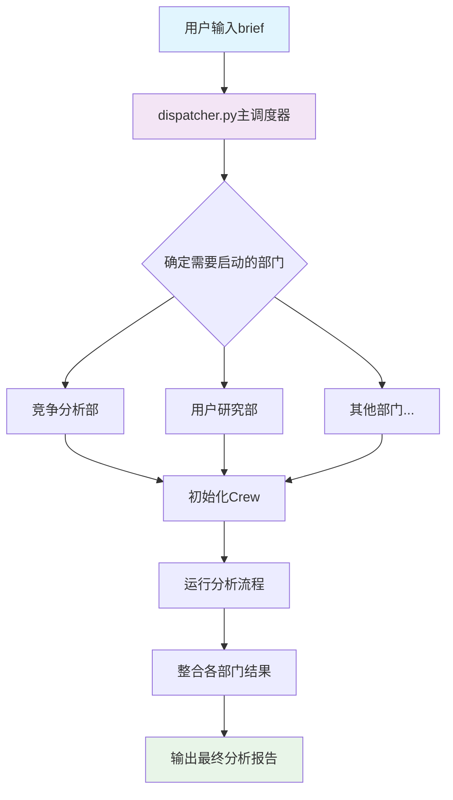
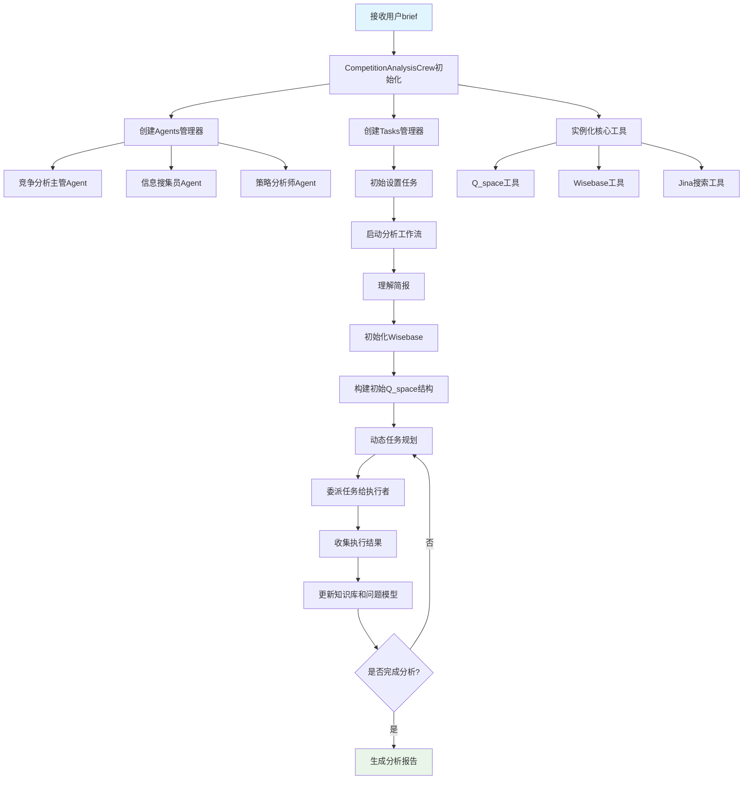
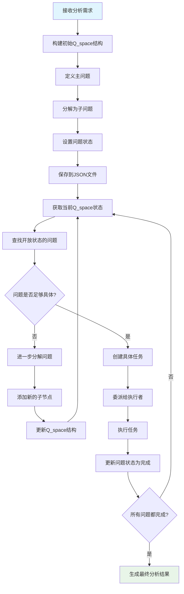
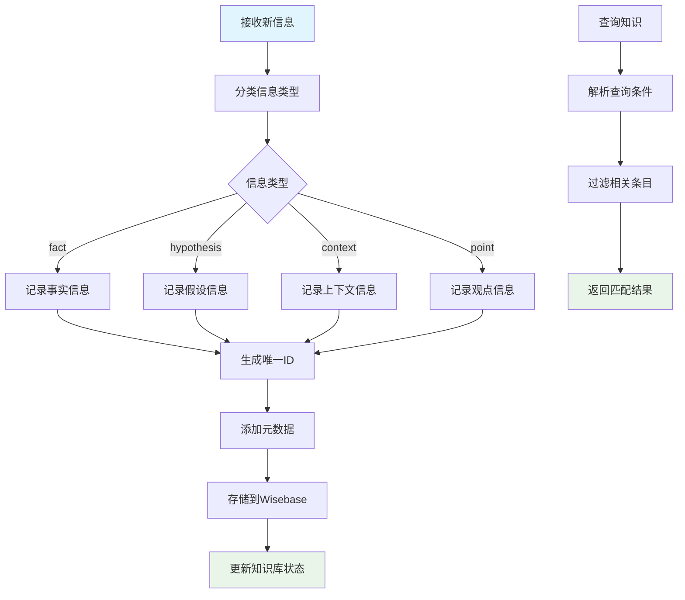
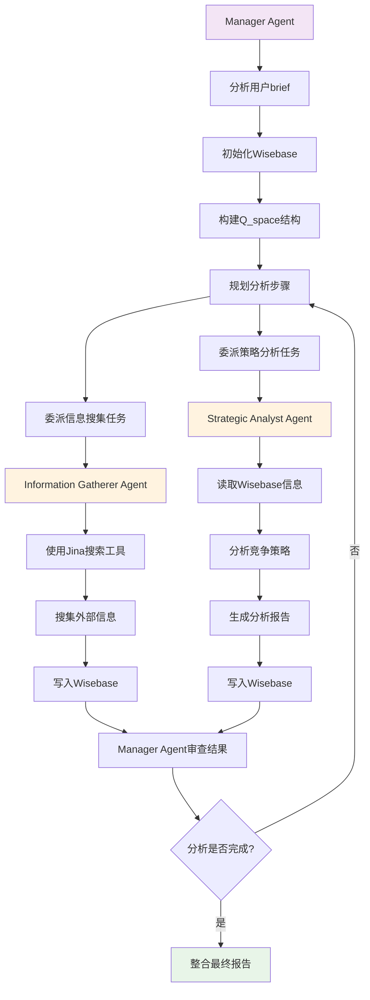
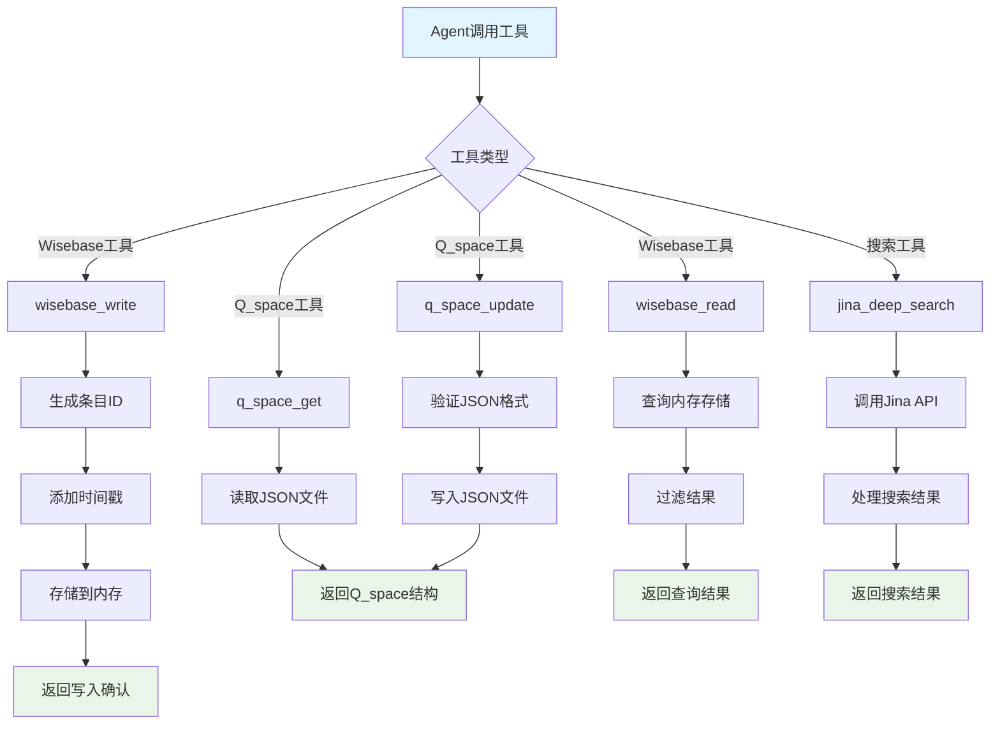
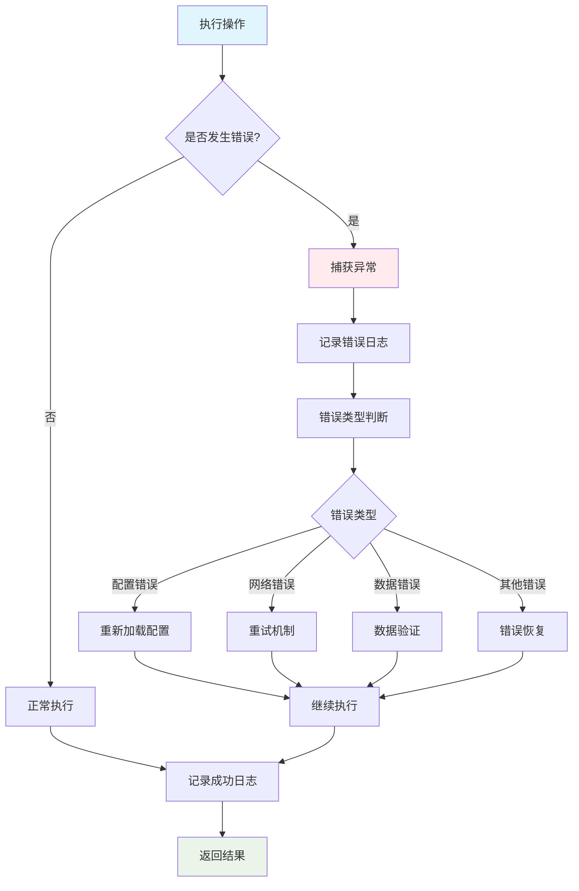

# BlueTown 2.0 项目代码分析文档

## 项目概述

BlueTown 2.0 是一个基于多AI智能体协作的商业咨询和分析平台。它模拟企业内部多个部门并行运作、协同分析的模式，核心优势在于强大的"动态问题建模"能力，支持非线性的图谱式推理。

### 核心特点

- **多部门协作分析**: 将分析任务分发给多个专业部门(Crew)，各自从不同角度进行分析
- **结构化知识沉淀**: 构建共享的结构化知识库(Wisebase)，支持跨部门高效共享信息
- **动态问题建模**: 使用Q_space结构化问题，支持非线性的图谱式推理
- **模块化与可扩展**: 清晰的模块边界，易于扩展新的分析能力和部门

## 项目架构

### 整体架构图

```
用户输入 (brief)
    ↓
dispatcher.py (主调度器)
    ↓
部门层 (Crews)
├── 竞争分析部 (competition_analysis)
│   ├── 管理功能层 (Manager Agent)
│   └── 执行层 (Gatherer Agent, Strategist Agent)
├── 用户研究部 (user_research) - 待实现
└── 其他部门...
    ↓
工具层 (Tools)
├── Q_space工具 (问题建模)
├── Wisebase工具 (知识库)
├── Jina搜索工具 (外部信息获取)
└── LLM配置工具
    ↓
状态管理层 (State)
├── Q_space状态 (问题模型)
└── Wisebase状态 (知识库)
```

### 核心设计理念

1. **部门化组织**: 每个部门(Crew)负责特定领域的分析任务
2. **状态驱动**: 通过Wisebase(知识状态)和Q_space(任务状态)管理分析流程
3. **动态建模**: 问题建模是动态的，根据分析进展不断调整
4. **协作机制**: 部门间通过共享知识库进行信息交换

## 核心模块分析

### 1. 主调度器 (dispatcher.py)

**功能**: 系统的入口点，负责接收用户输入、确定需要调动的部门、初始化并启动相关Crew、管理整体执行流程、整合最终输出。

**关键方法**:
- `determine_crews(brief)`: 根据brief确定需要启动的部门
- `initialize_crews(crew_ids, brief)`: 初始化指定的Crew
- `run_analysis(crews)`: 运行分析流程
- `integrate_results(results)`: 整合各部门结果

**代码特点**:
- 使用命令行参数解析
- 支持调试模式
- 错误处理和日志记录
- 模块化设计，易于扩展新部门

### 2. 竞争分析部门 (src/crews/competition_analysis/)

#### 2.1 Crew管理器 (crew.py)

**功能**: 组装竞争分析部门Crew，负责创建和配置Crew实例。

**核心类**: `CompetitionAnalysisCrew`
- 初始化时接收用户简报
- 实例化核心工具(Q_spaceTool, WisebaseTool)
- 创建Agents和Tasks管理器
- 配置Crew实例

#### 2.2 Agents管理器 (agents.py)

**功能**: 加载和管理竞争分析部门的智能体。

**核心类**: `CompetitionAnalysisAgents`

**包含的智能体**:
1. **竞争分析主管 (competition_manager)**
   - 角色: 竞争分析主管
   - 目标: 理解用户简报，初始化并动态维护部门的问题模型(Q_space JSON)，利用共享知识库(Wisebase)，规划分析步骤
   - 工具: Q_space工具、Wisebase工具
   - 特点: 可以委派任务给其他智能体

2. **信息搜集员 (information_gatherer)**
   - 角色: 信息搜集员
   - 目标: 搜集竞争对手信息、市场数据等
   - 工具: Jina搜索工具、Wisebase工具

3. **策略分析师 (strategic_analyst)**
   - 角色: 策略分析师
   - 目标: 分析竞争策略、市场定位等
   - 工具: Wisebase工具、Q_space工具

**代码特点**:
- 使用YAML配置文件管理智能体配置
- 支持工具包装器，注入crew_id
- 模块化设计，易于扩展新智能体

#### 2.3 Tasks管理器 (tasks.py)

**功能**: 加载和管理竞争分析部门的任务。

**核心类**: `CompetitionAnalysisTasks`

**主要任务**:
1. **初始设置任务 (initial_setup_task)**
   - 描述: 启动竞争分析工作流程
   - 执行者: 竞争分析主管
   - 功能: 理解简报、初始化Wisebase、构建初始Q_space结构

**代码特点**:
- 使用YAML配置文件管理任务配置
- 支持任务依赖和上下文注入
- 动态任务生成能力

### 3. 工具层 (src/tools/)

#### 3.1 Q_space工具 (q_space_tool.py)

**功能**: 与特定Crew的动态问题模型(Q_space) JSON文件进行交互。

**核心方法**:
- `q_space_get(crew_id)`: 获取指定Crew的Q_space结构
- `q_space_update(crew_id, full_json_structure)`: 更新指定Crew的Q_space结构

**Q_space结构**:
```json
{
  "id": "q_root",
  "text": "分析目标实体的竞争格局",
  "type": "main_question",
  "status": "open",
  "children": [
    {
      "id": "q_clarify_scope",
      "text": "明确分析范围和目标",
      "type": "sub_question",
      "status": "open",
      "children": []
    }
  ]
}
```

**代码特点**:
- 支持JSON验证
- 自动创建默认文件
- 错误处理和日志记录

#### 3.2 Wisebase工具 (wisebase_tool.py)

**功能**: 与共享知识库Wisebase进行交互，支持多Crew写入和按来源过滤读取。

**核心方法**:
- `wisebase_write(content, classification, crew_id, metadata)`: 写入知识条目
- `wisebase_read(query, filter_crew_id)`: 读取知识条目

**知识分类**:
- `fact`: 事实类信息，确凿的
- `hypothesis`: 假设，需要求证
- `context`: 上下文信息
- `point`: 观点或洞见

**代码特点**:
- 支持多种内容类型(字符串、字典、列表)
- 元数据支持(来源、置信度、标签等)
- 内存存储，支持查询过滤

#### 3.3 Jina搜索工具 (jina_search_tool.py)

**功能**: 提供深度搜索能力，用于获取外部信息。

**代码特点**:
- 集成Jina AI搜索API
- 支持深度搜索和结果处理

#### 3.4 LLM配置工具 (llm_config.py)

**功能**: 管理LLM配置和实例创建。

**核心方法**:
- `get_llm_instance(streaming)`: 获取LangChain LLM实例
- `create_crewai_llm()`: 创建CrewAI LLM实例

**代码特点**:
- 支持多种LLM提供商
- 配置灵活，支持环境变量覆盖
- 错误处理和重试机制

### 4. 工具函数层 (src/utils/)

#### 4.1 配置加载器 (config_loader.py)

**功能**: 加载和管理全局配置。

**核心方法**:
- `get_config()`: 获取全局配置(单例模式)
- `reload_config()`: 强制重新加载配置

**代码特点**:
- 单例模式，避免重复加载
- 支持环境变量覆盖
- 自动推断项目根目录

#### 4.2 日志配置器 (logging_config.py)

**功能**: 设置和管理日志记录。

**核心方法**:
- `setup_logging(logger_name)`: 设置日志记录器

**代码特点**:
- 支持控制台和文件输出
- 可配置日志级别和格式
- 调试模式支持

#### 4.3 解析工具 (parsing.py)

**功能**: YAML配置文件解析工具。

**核心方法**:
- `load_yaml_config(file_path)`: 加载YAML配置文件
- `save_yaml_config(data, file_path)`: 保存数据到YAML文件

**代码特点**:
- 错误处理和异常捕获
- 支持中文编码
- 自动创建目录

### 5. 状态管理层 (src/state/)

#### 5.1 Q_space状态 (q_space/)

**功能**: 存储各Crew的问题模型状态。

**文件结构**:
- `competition_analysis.json`: 竞争分析部门的问题模型
- `user_research.yaml`: 用户研究部门的问题模型(待实现)

**状态类型**:
- `initial`: 初始状态
- `open`: 开放状态，等待处理
- `pending`: 等待状态，依赖其他任务
- `in_progress`: 进行中状态
- `completed`: 已完成状态

## 配置文件分析

### 1. 全局配置 (config/settings.yaml)

```yaml
# LLM配置
llm:
  provider: openai
  model: gemini-2.0-flash-lite-preview-02-05
  api_base: https://api.claude-plus.top/v1
  temperature: 0.5
  max_tokens: 2000
  timeout: 90

# Wisebase配置
wisebase:
  store_type: file
  file_path: data/wisebase_store

# Q_space配置
q_space:
  base_dir: src/state/q_space
  archive_dir: data/q_space_archive

# 日志配置
logging:
  level: INFO
  format: "%(asctime)s - %(name)s - %(levelname)s - %(message)s"
  file: logs/bluetown.log
```

### 2. 智能体配置 (src/crews/competition_analysis/config/agents.yaml)

**竞争分析主管配置**:
- 角色: 竞争分析主管
- 目标: 理解用户简报，初始化并动态维护部门的问题模型
- 工具: Q_space工具、Wisebase工具
- 指令: 详细的初始化步骤和后续规划流程

**信息搜集员配置**:
- 角色: 信息搜集员
- 目标: 搜集竞争对手信息、市场数据等
- 工具: Jina搜索工具、Wisebase工具

**策略分析师配置**:
- 角色: 策略分析师
- 目标: 分析竞争策略、市场定位等
- 工具: Wisebase工具、Q_space工具

### 3. 任务配置 (src/crews/competition_analysis/config/tasks.yaml)

**初始设置任务**:
- 描述: 启动竞争分析工作流程
- 预期输出: 确认Wisebase和Q_space JSON结构已成功初始化
- 执行者: 竞争分析主管

## 代码质量分析

### 优点

1. **模块化设计**: 代码结构清晰，模块边界明确
2. **配置驱动**: 大量使用YAML配置文件，便于维护和扩展
3. **错误处理**: 完善的异常处理和日志记录
4. **类型提示**: 使用类型注解，提高代码可读性
5. **文档完善**: 详细的注释和文档字符串

### 改进建议

1. **测试覆盖**: 缺少单元测试和集成测试
2. **性能优化**: 可以考虑异步处理提高性能
3. **安全性**: 需要加强输入验证和错误处理
4. **监控**: 可以添加性能监控和指标收集
5. **部署**: 需要容器化部署支持

## 使用指南

### 环境配置

1. 克隆仓库
```bash
git clone https://github.com/yourusername/bluetown-core.git
cd bluetown-core
```

2. 安装依赖
```bash
pip install -r requirements.txt
```

3. 配置环境变量
创建`.env`文件，添加以下配置:
```
OPENAI_API_KEY=your_api_key
OPENAI_API_BASE=https://api.claude-plus.top/v1
OPENAI_MODEL_NAME=gemini-2.0-flash-lite-preview-02-05
DEBUG=True
```

### 基本使用

```bash
# 基本运行
python dispatcher.py --brief "分析亚一黄金的市场机会，综合考虑竞争格局、用户需求、潜在应用场景及品牌沟通策略。"

# 启用调试模式
python dispatcher.py --brief "你的分析需求" --debug
```

### 扩展新部门

1. 在`src/crews/`下创建新部门目录
2. 实现`crew.py`、`agents.py`、`tasks.py`
3. 创建配置文件`config/agents.yaml`、`config/tasks.yaml`
4. 在`dispatcher.py`中添加新部门的初始化逻辑

## 总结

BlueTown 2.0是一个设计精良的多AI智能体协作平台，具有以下特点：

1. **架构清晰**: 采用分层架构，职责明确
2. **扩展性强**: 模块化设计，易于添加新功能
3. **配置灵活**: 大量使用配置文件，便于调整
4. **状态管理**: 完善的状态管理机制
5. **协作机制**: 智能的部门间协作机制

该项目为商业咨询和分析提供了一个强大的AI协作平台，具有很强的实用价值和扩展潜力。

## 核心逻辑流程图

### 1. 整体系统流程



### 2. 竞争分析部门详细流程



### 3. Q_space问题建模流程



### 4. Wisebase知识管理流程



### 5. Agent协作流程



### 6. 工具调用流程



### 7. 错误处理和日志流程


