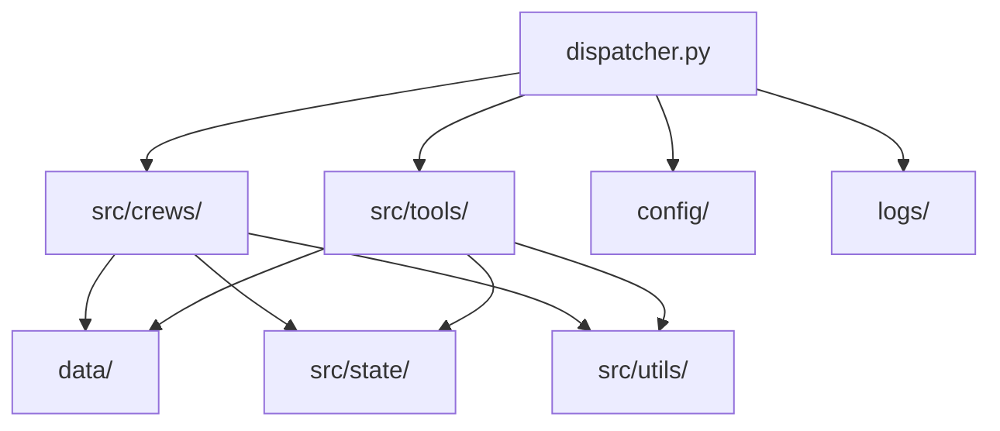

# Bluetown Core 项目深度分析文档

## 目录

1. [项目简介](#项目简介)
2. [整体架构](#整体架构)
3. [目录结构与模块说明](#目录结构与模块说明)
4. [核心功能与数据流](#核心功能与数据流)
5. [配置与环境管理](#配置与环境管理)
6. [关键模块深度解析](#关键模块深度解析)
    - [crews/competition_analysis](#crewscompetition_analysis)
    - [tools 工具集](#tools-工具集)
    - [utils 工具库](#utils-工具库)
7. [数据与状态管理](#数据与状态管理)
8. [日志与调试](#日志与调试)
9. [测试与示例](#测试与示例)
10. [可扩展性与最佳实践](#可扩展性与最佳实践)
11. [潜在改进建议](#潜在改进建议)
12. [结语](#结语)

---

## 项目简介

Bluetown Core 是一个面向智能分析与自动化的 Python 项目，具备灵活的模块化架构，支持多种分析任务、工具集成与数据流管理。项目强调可扩展性、可维护性和高可用性，适合用于竞品分析、知识库检索、自动化任务编排等场景。

---

## 整体架构

项目采用分层架构设计，主要分为：
- **核心调度层**（dispatcher.py）：负责任务分发与流程控制。
- **功能模块层**（src/crews、src/tools）：实现具体业务逻辑与工具能力。
- **数据与状态层**（data、src/state）：存储原始数据、分析结果与中间状态。
- **配置与日志层**（config、logs）：集中管理配置与运行日志。
- **工具与通用库层**（src/utils）：提供通用方法与基础能力。

架构图示意：



---

## 目录结构与模块说明

```
bluetown_core/
  config/                # 配置文件（如settings.yaml）
  data/                  # 数据存储目录
  dispatcher.py          # 核心调度入口
  docs/                  # 项目文档
  examples/              # 示例代码
  logs/                  # 日志文件
  src/
    crews/               # 业务分析与智能体模块
    state/               # 状态与中间结果
    tools/               # 工具集成
    utils/               # 通用工具库
  test_llm.py            # 测试脚本
  requirements.txt       # 依赖管理
  README.md              # 项目说明
```

### 主要模块说明
- **dispatcher.py**：项目主入口，负责任务调度、模块调用。
- **src/crews/**：核心业务逻辑，包含竞品分析、智能体编排等。
- **src/tools/**：各类工具能力，如知识库检索、LLM配置等。
- **src/utils/**：通用工具函数，如配置加载、日志封装、解析工具等。
- **src/state/**：存储分析过程中的状态、结果。
- **data/**：原始数据、外部数据存档。
- **config/**：全局配置文件。
- **logs/**：运行日志，便于追踪与调试。
- **examples/**：用例与测试脚本。

---

## 核心功能与数据流

### 主要功能
- 竞品分析自动化
- 知识库检索与问答
- LLM（大模型）配置与调用
- 任务编排与流程自动化
- 数据状态管理与持久化

### 数据流动
1. **任务入口**：通过 dispatcher.py 接收任务请求。
2. **配置加载**：读取 config/settings.yaml 等配置。
3. **模块分发**：根据任务类型调用 crews/competition_analysis 等业务模块。
4. **工具调用**：如需外部知识库、LLM等，调用 tools/ 下相关工具。
5. **状态更新**：分析结果、过程状态写入 state/ 或 data/。
6. **日志记录**：全流程日志写入 logs/。

---

## 配置与环境管理

- **config/settings.yaml**：全局配置，包含数据库、API、模型参数等。
- **src/crews/competition_analysis/config/**：业务相关的 agents.yaml、tasks.yaml，定义智能体与任务流。
- **requirements.txt**：依赖包管理，便于环境复现。
- **Conda 虚拟环境**：建议在 conda 环境下运行，确保依赖隔离。

---

## 关键模块深度解析

### crews/competition_analysis
- **agents.py**：定义竞品分析的智能体（Agent），包括其能力、行为、交互方式。
- **crew.py**：编排多个 Agent，形成协作分析流程。
- **tasks.py**：定义分析任务、任务分解与调度逻辑。
- **config/agents.yaml**：配置各类 Agent 的参数与能力。
- **config/tasks.yaml**：配置任务流、依赖关系。

#### 典型流程
1. 读取 agents.yaml，初始化各智能体。
2. 读取 tasks.yaml，生成任务流。
3. crew.py 负责调度 agent 执行任务，收集结果。
4. 结果写入 state/competition_analysis.json 或 .yaml。

### tools 工具集
- **jina_search_tool.py**：集成 Jina 检索能力，实现向量搜索、知识库问答。
- **llm_config.py**：大模型参数配置与调用封装。
- **q_space_tool.py**、**wisebase_tool.py**：对接外部知识库，提供检索、存储等能力。

### utils 工具库
- **config_loader.py**：统一加载 YAML/JSON 配置。
- **logging_config.py**：日志格式、级别、输出位置统一管理。
- **parsing.py**：通用解析工具，如文本、数据格式转换等。

---

## 数据与状态管理

- **data/**：存放原始数据、外部数据归档。
- **src/state/**：存储分析过程中的中间状态、最终结果（支持 JSON/YAML 格式）。
- **典型文件**：competition_analysis.json、user_research.yaml 等。
- **作用**：便于断点续跑、结果追溯、数据复用。

---

## 日志与调试

- **logs/bluetown.log**：记录运行过程中的关键信息、异常、调试信息。
- **logging_config.py**：可自定义日志级别、格式、输出方式。
- **调试建议**：结合日志与 state/ 结果文件，快速定位问题。

---

## 测试与示例

- **examples/**：包含 test_llm_config.py 等示例，演示如何调用 LLM、工具等。
- **test_llm.py / test_simple_llm.py**：测试脚本，验证核心功能。
- **建议**：可扩展更多单元测试，提升健壮性。

---

## 可扩展性与最佳实践

- **模块化设计**：新增业务只需在 crews/ 下扩展子模块。
- **配置驱动**：通过 YAML/JSON 配置灵活调整 agent、任务流。
- **工具集成**：tools/ 下可快速集成新工具（如新知识库、API）。
- **状态持久化**：支持多格式（JSON/YAML），便于与外部系统对接。
- **日志与异常处理**：统一封装，便于维护。

---

## 潜在改进建议

1. **完善单元测试**：提升代码健壮性与可维护性。
2. **文档自动化**：集成 docstring、API 文档生成工具。
3. **异常处理优化**：细化异常捕获与提示，提升用户体验。
4. **多环境支持**：支持 Docker 部署、CI/CD 流水线。
5. **性能优化**：分析瓶颈，优化数据流与并发处理。
6. **权限与安全**：敏感数据加密、访问控制。

---

## 结语

Bluetown Core 项目以其模块化、可扩展、易维护的架构，适合多种智能分析与自动化场景。建议团队持续完善文档、测试与自动化工具，提升项目整体质量与协作效率。