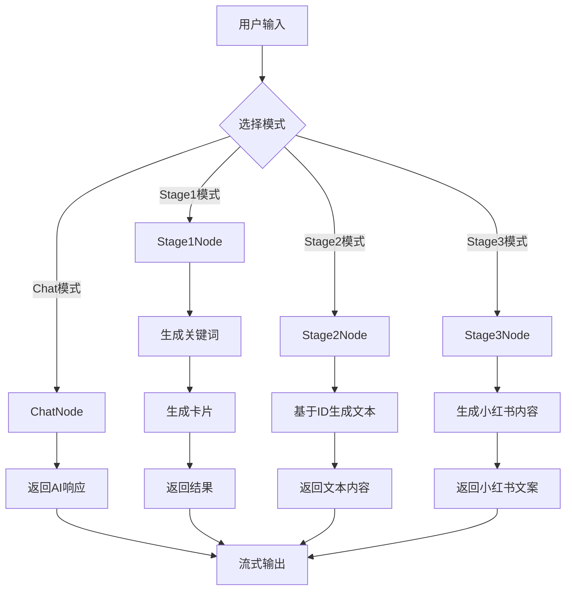
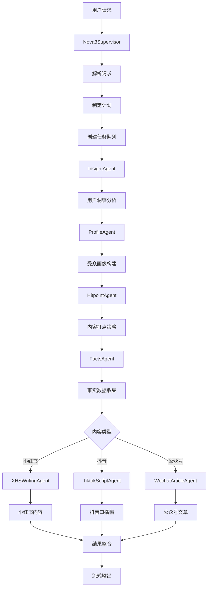
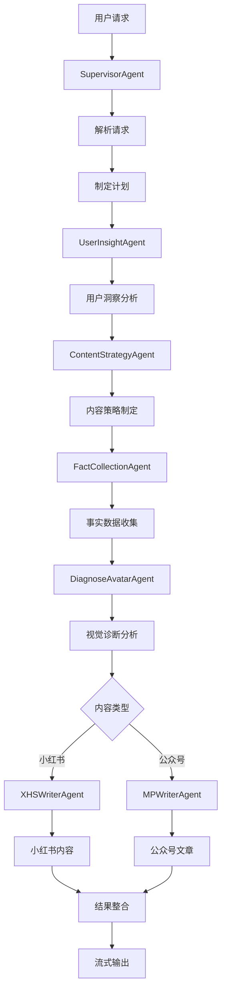
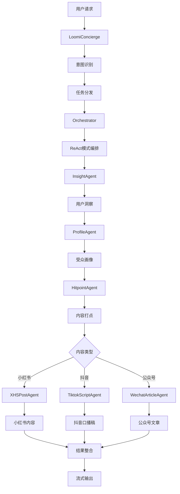

# BlueLab OpenGraph 和 BluePlan Research 项目 Agent 全面分析

## 📋 项目概述

本文档详细分析了两个项目的所有 Agent，包括它们的功能、作用、名称以及协作方式。

- **BlueLab OpenGraph**: 基于 LangGraph 的智能内容生成系统
- **BluePlan Research**: 基于多 Agent 协作的社交媒体内容创作系统

## 🏗️ Agent 架构总览

### 1. 整体 Agent 协作架构

```mermaid
graph TB
    subgraph "BlueLab OpenGraph"
        A1[ChatNode] --> A2[Stage1Node]
        A2 --> A3[Stage2Node]
        A3 --> A4[Stage3Node]
        A4 --> A5[ExampleNode]
    end
    
    subgraph "BluePlan Research"
        B1[Nova3Supervisor] --> B2[InsightAgent]
        B2 --> B3[ProfileAgent]
        B3 --> B4[HitpointAgent]
        B4 --> B5[FactsAgent]
        B5 --> B6[XHSWritingAgent]
        B6 --> B7[TiktokScriptAgent]
        B7 --> B8[WechatArticleAgent]
    end
    
    subgraph "Nova2 架构"
        C1[SupervisorAgent] --> C2[UserInsightAgent]
        C2 --> C3[ContentStrategyAgent]
        C3 --> C4[FactCollectionAgent]
        C4 --> C5[DiagnoseAvatarAgent]
        C5 --> C6[XHSWriterAgent]
        C6 --> C7[MPWriterAgent]
    end
    
    subgraph "Loomi 架构"
        D1[LoomiConcierge] --> D2[Orchestrator]
        D2 --> D3[InsightAgent]
        D3 --> D4[ProfileAgent]
        D4 --> D5[HitpointAgent]
        D5 --> D6[XHSPostAgent]
        D6 --> D7[TiktokScriptAgent]
        D7 --> D8[WechatArticleAgent]
    end
```

## 🔍 BlueLab OpenGraph 项目 Agents

### 1. ChatNode - 通用对话节点

**名称**: `ChatNode` / `simple_chat_node`
**功能**: 通用AI对话处理
**作用**: 
- 处理用户输入的任意消息
- 调用 Claude/OpenAI API 生成响应
- 支持流式输出和会话管理
- 提供智能助手功能

**协作方式**:
- 独立工作，不依赖其他节点
- 通过 AgentState 接收用户输入
- 返回 AI 响应到状态中

### 2. Stage1Node - 第一阶段节点

**名称**: `Stage1Node` / `generate_keywords_node`, `generate_cards_node`
**功能**: 关键词生成和卡片生成
**作用**:
- 根据用户查询生成关键词列表
- 为每个关键词生成内容卡片
- 提供内容创作的初始素材

**协作方式**:
- 接收用户查询和限制参数
- 生成关键词和卡片数据
- 为 Stage2 和 Stage3 提供基础数据

### 3. Stage2Node - 第二阶段节点

**名称**: `Stage2Node` / `generate_text_node`
**功能**: 基于ID的详细文本生成
**作用**:
- 根据选择的ID生成详细文本内容
- 提供深度分析和洞察
- 生成结构化的内容文本

**协作方式**:
- 接收 Stage1 生成的ID列表
- 为每个ID生成详细文本
- 为 Stage3 提供内容基础

### 4. Stage3Node - 第三阶段节点

**名称**: `Stage3Node` / `generate_xiaohongshu_node`
**功能**: 小红书风格内容生成
**作用**:
- 生成小红书风格的文案内容
- 包含标题、正文、标签等
- 适配小红书平台特点

**协作方式**:
- 接收前两阶段的内容
- 生成最终的小红书内容
- 完成整个内容生成流程

### 5. ExampleNode - 示例节点

**名称**: `ExampleNode` / `call_example_agent_node`
**功能**: 示例和测试功能
**作用**:
- 提供示例功能演示
- 用于测试和调试
- 展示基本工作流程

**协作方式**:
- 独立工作节点
- 用于开发和测试阶段

## 🎯 BluePlan Research 项目 Agents

### Nova3 架构 Agents

#### 1. Nova3Supervisor - 主控智能体

**名称**: `Nova3Supervisor`
**功能**: 任务规划和子Agent调度
**作用**:
- 解析用户请求，识别意图和需求类型
- 制定 Smart Plan 执行计划
- 根据计划调度相应的子Agent
- 整合所有Agent的输出结果
- 生成最终的综合报告

**协作方式**:
- 作为主控制器，协调所有子Agent
- 管理任务队列和执行顺序
- 处理错误和异常情况
- 提供流式输出和状态管理

#### 2. InsightAgent - 洞察分析智能体

**名称**: `InsightAgent`
**功能**: 用户洞察分析
**作用**:
- 分析用户想做的领域里的情绪和动机
- 产出深度洞察和用户画像
- 支持并发处理多个profile
- 提供用户行为分析

**协作方式**:
- 接收用户查询和背景信息
- 生成用户洞察报告
- 为其他Agent提供用户分析基础

#### 3. ProfileAgent - 受众画像智能体

**名称**: `ProfileAgent`
**功能**: 受众画像构建
**作用**:
- 构建目标受众的详细画像
- 分析受众特征和偏好
- 提供受众细分信息
- 支持多维度画像分析

**协作方式**:
- 基于 InsightAgent 的分析结果
- 生成详细的受众画像
- 为内容创作提供受众指导

#### 4. HitpointAgent - 内容打点智能体

**名称**: `HitpointAgent`
**功能**: 内容打点和策略制定
**作用**:
- 识别内容创作的关键点
- 制定内容策略和方向
- 提供内容优化建议
- 分析内容效果预测

**协作方式**:
- 基于用户洞察和受众画像
- 生成内容策略和打点
- 为内容创作提供策略指导

#### 5. FactsAgent - 事实收集智能体

**名称**: `FactsAgent`
**功能**: 事实和数据收集
**作用**:
- 收集相关的事实和数据
- 验证信息的准确性
- 提供数据支持
- 生成事实报告

**协作方式**:
- 收集和验证相关信息
- 为内容创作提供事实基础
- 确保内容的准确性

#### 6. XHSWritingAgent - 小红书创作智能体

**名称**: `XHSWritingAgent`
**功能**: 小红书内容创作
**作用**:
- 生成小红书风格的文案
- 包含标题、正文、标签等
- 适配小红书平台特点
- 提供内容优化建议

**协作方式**:
- 基于前序Agent的分析结果
- 生成小红书内容
- 完成内容创作流程

#### 7. TiktokScriptAgent - 抖音口播稿智能体

**名称**: `TiktokScriptAgent`
**功能**: 抖音口播稿创作
**作用**:
- 生成抖音口播稿
- 适配抖音平台特点
- 提供脚本优化建议
- 包含表演指导

**协作方式**:
- 基于前序Agent的分析结果
- 生成抖音口播稿
- 完成脚本创作流程

#### 8. WechatArticleAgent - 公众号文章智能体

**名称**: `WechatArticleAgent`
**功能**: 公众号文章创作
**作用**:
- 生成公众号文章
- 适配微信公众号特点
- 提供文章结构建议
- 包含排版指导

**协作方式**:
- 基于前序Agent的分析结果
- 生成公众号文章
- 完成文章创作流程

#### 9. FakeThinkAgent - 假思考智能体

**名称**: `FakeThinkAgent`
**功能**: 模拟思考过程
**作用**:
- 模拟AI的思考过程
- 提供思考步骤展示
- 增强用户体验
- 展示AI推理过程

**协作方式**:
- 在关键决策点展示思考过程
- 提升用户对AI的理解
- 增强交互体验

#### 10. FileProcessingAgent - 文件处理智能体

**名称**: `FileProcessingAgent`
**功能**: 文件处理和分析
**作用**:
- 处理上传的文件
- 提取文件内容
- 分析文件信息
- 为其他Agent提供文件数据

**协作方式**:
- 处理用户上传的文件
- 提取和分析文件内容
- 为其他Agent提供数据支持

#### 11. ResolverAgent - 解析智能体

**名称**: `ResolverAgent`
**功能**: 内容解析和处理
**作用**:
- 解析复杂内容
- 处理特殊格式
- 提供内容转换
- 支持多种格式处理

**协作方式**:
- 处理复杂内容解析任务
- 为其他Agent提供解析支持
- 确保内容格式正确

#### 12. XHSSearchAgent - 小红书搜索智能体

**名称**: `XHSSearchAgent`
**功能**: 小红书内容搜索
**作用**:
- 搜索小红书相关内容
- 分析热门话题
- 提供趋势分析
- 收集竞品信息

**协作方式**:
- 搜索相关内容和趋势
- 为内容创作提供参考
- 分析市场动态

### Nova2 架构 Agents

#### 1. SupervisorAgent - 监督者智能体

**名称**: `SupervisorAgent`
**功能**: 任务规划和子Agent调度
**作用**:
- 解析用户请求，识别意图
- 制定执行计划
- 调度子Agent
- 整合输出结果

**协作方式**:
- 作为主控制器协调子Agent
- 管理执行流程
- 处理结果整合

#### 2. UserInsightAgent - 用户洞察智能体

**名称**: `UserInsightAgent`
**功能**: 用户洞察分析
**作用**:
- 分析用户需求和动机
- 生成用户画像
- 提供洞察报告

**协作方式**:
- 基于用户输入生成洞察
- 为其他Agent提供用户分析

#### 3. ContentStrategyAgent - 内容策略智能体

**名称**: `ContentStrategyAgent`
**功能**: 内容策略制定
**作用**:
- 制定内容策略
- 确定内容方向
- 提供策略建议

**协作方式**:
- 基于用户洞察制定策略
- 为内容创作提供指导

#### 4. FactCollectionAgent - 事实收集智能体

**名称**: `FactCollectionAgent`
**功能**: 事实和数据收集
**作用**:
- 收集相关事实
- 验证信息准确性
- 提供数据支持

**协作方式**:
- 收集和验证信息
- 为内容创作提供事实基础

#### 5. DiagnoseAvatarAgent - 视觉诊断智能体

**名称**: `DiagnoseAvatarAgent`
**功能**: 视觉内容诊断
**作用**:
- 分析视觉内容
- 提供视觉建议
- 诊断视觉问题

**协作方式**:
- 分析视觉相关内容
- 为内容创作提供视觉指导

#### 6. XHSWriterAgent - 小红书写作智能体

**名称**: `XHSWriterAgent`
**功能**: 小红书内容创作
**作用**:
- 生成小红书文案
- 适配平台特点
- 提供内容优化

**协作方式**:
- 基于策略和事实创作内容
- 完成小红书内容生成

#### 7. MPWriterAgent - 公众号写作智能体

**名称**: `MPWriterAgent`
**功能**: 公众号内容创作
**作用**:
- 生成公众号文章
- 适配平台特点
- 提供文章优化

**协作方式**:
- 基于策略和事实创作内容
- 完成公众号文章生成

### Loomi 架构 Agents

#### 1. LoomiConcierge - 智能接待员

**名称**: `LoomiConcierge`
**功能**: 智能接待和任务分发
**作用**:
- 用户意图识别
- 任务分发和调度
- Notes系统管理
- 会话控制

**协作方式**:
- 作为Loomi架构的主控制器
- 管理用户交互和任务分发
- 协调其他Loomi Agent

#### 2. Orchestrator - 任务编排器

**名称**: `Orchestrator`
**功能**: ReAct模式任务编排
**作用**:
- 任务规划和编排
- 执行监控
- 结果验证
- 流程控制

**协作方式**:
- 基于ReAct模式编排任务
- 监控执行过程
- 验证执行结果

## 🔄 Agent 协作流程图

### 1. BlueLab OpenGraph 协作流程

### 2. BluePlan Research Nova3 协作流程

### 3. BluePlan Research Nova2 协作流程

### 4. BluePlan Research Loomi 协作流程

## 📊 Agent 功能对比表

| 项目 | Agent名称 | 功能类别 | 主要作用 | 协作方式 |
|------|-----------|----------|----------|----------|
| **BlueLab OpenGraph** | ChatNode | 对话 | 通用AI对话 | 独立工作 |
| | Stage1Node | 内容生成 | 关键词和卡片生成 | 为后续阶段提供基础 |
| | Stage2Node | 内容生成 | 详细文本生成 | 基于Stage1结果 |
| | Stage3Node | 内容生成 | 小红书内容生成 | 基于前两阶段结果 |
| | ExampleNode | 示例 | 示例和测试 | 独立工作 |
| **BluePlan Research** | Nova3Supervisor | 控制 | 任务规划和调度 | 主控制器 |
| | InsightAgent | 分析 | 用户洞察分析 | 为其他Agent提供基础 |
| | ProfileAgent | 分析 | 受众画像构建 | 基于Insight结果 |
| | HitpointAgent | 策略 | 内容打点策略 | 基于Profile结果 |
| | FactsAgent | 数据 | 事实数据收集 | 为内容创作提供数据 |
| | XHSWritingAgent | 创作 | 小红书内容创作 | 基于前序分析结果 |
| | TiktokScriptAgent | 创作 | 抖音口播稿创作 | 基于前序分析结果 |
| | WechatArticleAgent | 创作 | 公众号文章创作 | 基于前序分析结果 |
| | FakeThinkAgent | 展示 | 思考过程展示 | 增强用户体验 |
| | FileProcessingAgent | 处理 | 文件处理分析 | 为其他Agent提供数据 |
| | ResolverAgent | 解析 | 内容解析处理 | 处理复杂内容 |
| | XHSSearchAgent | 搜索 | 小红书内容搜索 | 提供市场分析 |

## 🎯 核心协作模式

### 1. 流水线模式 (BlueLab OpenGraph)
- **特点**: 阶段化的内容生成流程
- **优势**: 结构清晰，易于理解和维护
- **适用**: 标准化的内容生成任务

### 2. 主从模式 (BluePlan Research Nova3)
- **特点**: 主控制器 + 专业子Agent
- **优势**: 灵活性强，支持复杂任务
- **适用**: 复杂的多步骤内容创作

### 3. 分层模式 (BluePlan Research Nova2)
- **特点**: 分析层 + 策略层 + 创作层
- **优势**: 逻辑清晰，职责分明
- **适用**: 需要深度分析的内容创作

### 4. 编排模式 (BluePlan Research Loomi)
- **特点**: 智能编排 + ReAct模式
- **优势**: 动态性强，适应性强
- **适用**: 需要灵活调整的任务

## 🚀 总结

### BlueLab OpenGraph 项目特点
1. **简单高效**: 基于 LangGraph 的节点化设计
2. **阶段明确**: 三阶段内容生成流程
3. **易于扩展**: 模块化的节点架构
4. **流式处理**: 支持实时流式响应

### BluePlan Research 项目特点
1. **架构丰富**: 支持多种 Agent 架构模式
2. **功能全面**: 覆盖内容创作的各个环节
3. **协作复杂**: 多 Agent 协作完成任务
4. **扩展性强**: 支持新的 Agent 类型添加

### 共同优势
1. **模块化设计**: 便于维护和扩展
2. **异步处理**: 支持高并发处理
3. **流式响应**: 实时返回处理结果
4. **配置灵活**: 支持多环境配置

这两个项目展示了不同的 AI Agent 设计理念和实现方式，为智能内容生成提供了丰富的技术方案。 
